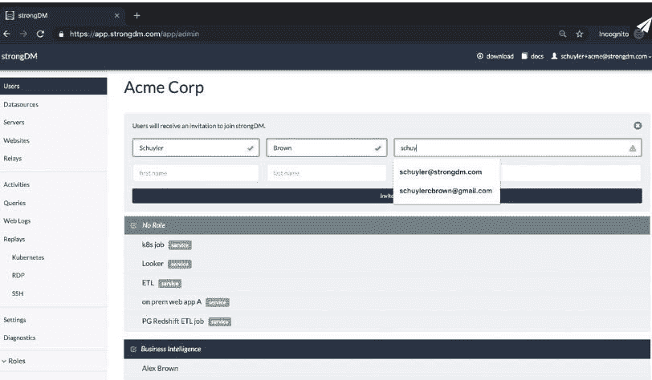

# strongDM 将访问管理扩展为代码工作

> 原文：<https://devops.com/strongdm-extends-access-management-as-code-efforts/>

strongDM 今天宣布，除了增加对云服务提供商提供的命令行接口(CLI)的支持外，它还增加了一个应用编程接口(API)和针对 Go、Java、Python、Ruby 和其他编程语言的[软件开发套件](https://www.strongdm.com/press-release/strongdm-unveils-major-update-to-leading-cloud-infrastructure-access-platform)，用于涉及其基础设施访问管理平台的[单点登录](https://devops.com/?s=single%20sign-on) (SSO)功能。

与此同时，strongDM 将其同名平台与第三方机密管理工具(如 HashiCorp 的 Vault)以及平台(如 PagerDuty 的事件管理平台和 Slack 消息工具)相集成。

访问管理平台现在还可以支持任何内部 web 应用程序和数据库平台，包括 DB2i、CitusDB、Oracle 11g、12c 和 19c、Sybase ASE 和 IQ。

最后，该公司对现有协议进行了增强，包括 Mongo Atlas、基于 SSH 证书的身份验证和 SSH 端口转发，并添加了对 Windows 远程桌面协议(RDP)网络级身份验证(NLA)的支持，以及与 Auth0 和 VMware Identity One 等其他单点登录工具的集成。

公司首席执行官 Elizabeth Zalman 表示，与其他 SSO 不同，strongDM 是从底层开始设计的，旨在整合到开发人员的工作流程中。她说，我们的目标是让开发人员能够像管理代码一样管理代码访问。

一般来说，访问管理通常是开发运维团队要处理的自动化的最后一个阶段。然而，Zalman 说，随着大多数 DevOps 团队现在在家工作以帮助抗击新冠肺炎疫情的传播，寻求自动化访问管理作为管理虚拟专用网络(VPN)软件的替代方法的组织数量急剧增加。

过去，许多 IT 组织都依赖 Microsoft Active Directory (AD)或轻量级目录访问协议(LDAP)来管理访问。作为替代方案，自 2015 年以来，strongDM 一直在为其平台进行论证。该公司最近又筹集了 1700 万美元的资金，并声称有 100 多家客户在生产环境中使用其平台，包括 Peloton、SoFi 和 Betterment。

目前还不清楚 DevOps 团队是否正在扩展他们现有的工作流以包括访问管理。然而，随着 DevOps 团队越来越厌倦使用定制脚本来扩展这些工作流，Zalman 说他们最终会寻找一种更一致的方法来自动化访问管理。做出这一决定的一个主要因素是，即使在疫苗被发现和分发之后，大多数员工也不会像疫情之前那样以同样的数量回到办公室。

与此同时，越来越多的 DevOps 团队开始采用最佳 DevSecOps 实践，这将不可避免地包括访问管理。事实上，作为过渡的一部分，很可能大多数 DevOps 团队会得出结论，目前管理访问的方式已经过时，无法继续。