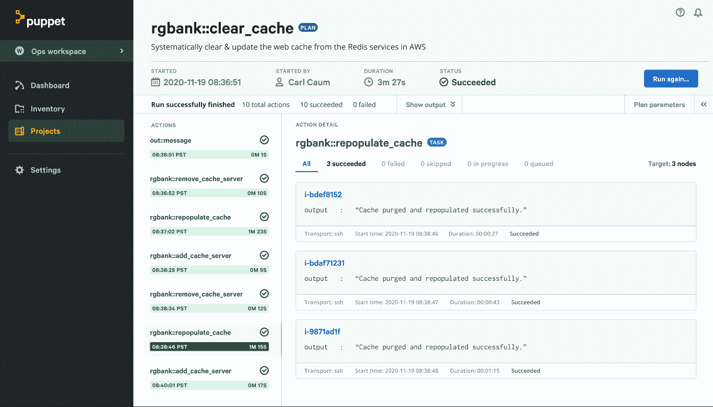

# Puppet 使 IT 自动化更容易实现

> 原文：<https://devops.com/puppet-makes-it-automation-more-accessible/>

Puppet 今天启动了两项工作，让更多的 IT 团队可以访问其 IT 自动化平台。

Puppet Enterprise 平台将公司的旗舰产品 Puppet Enterprise 与公司现有的事件驱动自动化平台 Relay by Puppet 集成在一起。

与此同时，Puppet 发布了 Puppet Connect，这是一个自助服务平台，用于在内部或云中执行任务，无需安装、管理或更新任何代理软件。基于开源 Bolt 编排引擎，Puppet Connect 是一个商业平台，计划于 2021 年初上市。

Puppet CTO Deepak Giridharagopal 表示，Puppet Enterprise Platform 的独特之处在于，它允许具有不同技能和专业知识水平的 it 团队使用相同的平台来自动化 IT 运营。他说，它是第一个在单个平台中支持任务驱动的编排、模型驱动的基础设施(如代码)和应用程序编程接口(API)事件驱动的工作流的平台。他指出，正因为如此，Puppet Enterprise Platform 旨在使组织能够更好地将 It 管理作为团队运动。

该公司还为 Puppet Enterprise Platform 提供了数千个预建自动化模块和数百个 API 集成，可以从 Puppet Forge 资源库下载。

与此同时，Puppet Connect 旨在使 it 团队更容易更一致地构建自助服务门户。IT 团队定期构建自助服务门户来自动执行任务，以帮助减少最终用户提出的服务台请求数量。根据 Puppet 发布的“ [2020 年 DevOps 状况报告](https://www.globenewswire.com/news-release/2020/11/12/2125708/0/en/2020-State-of-DevOps-Report-Finds-Link-Between-Self-Service-Platforms-and-DevOps-Success.html)”显示，63%的受访者至少拥有一个自助式内部平台。Giridharagopal 说，Puppet Connect 使用 Bolt 的编排功能简化了创建自助服务框架的过程。

随着 IT 团队应对更多在家工作的最终用户以限制新冠肺炎的传播，对自动化 IT 任务的兴趣急剧上升。在某些情况下，由于疫情带来的经济衰退，IT 员工的规模已经缩小。不管动机如何，拥有不同技能水平的 IT 员工都需要找到一种更简单的方法来自动化任务。Giridharagopal 指出，Puppet 平台提供了一个更容易访问的抽象层，使 IT 团队能够跨多个平台自动执行任务。

各种规模的 It 团队自动化每项 IT 任务可能还需要一段时间；然而，这些任务越是自动化，它们就越是朝着采用最佳 DevOps 实践的方向前进。这些组织可能不会有意开始采用 DevOps，但是一旦 IT 团队自动化了第一组任务，其他手动任务很快就会自动化。

当然，并不缺少标准化的 IT 自动化框架。在这一点上，对许多 IT 团队来说，更重要的事情是在没有人确切知道新冠肺炎疫情的影响会持续多少年的时候开始。