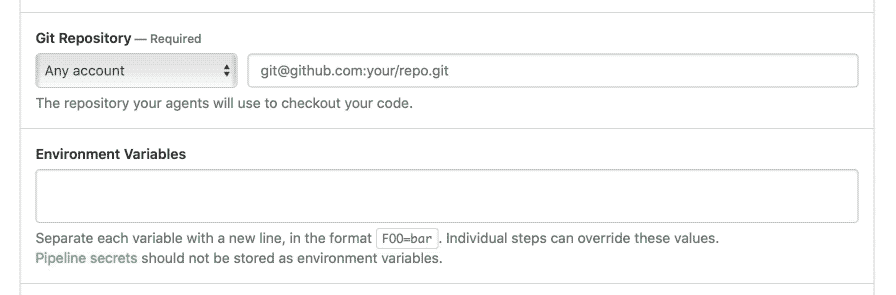

# Buildkite 加强了与 GitHub 的 CI/CD 集成

> 原文：<https://devops.com/buildkite-tightens-ci-cd-integration-with-github/>

Buildkite 已经[加强了与其同名的持续集成/持续交付平台和 GitHub 源代码库之间的集成](https://www.globenewswire.com/news-release/2020/11/19/2130283/0/en/Buildkite-Expands-Integration-with-GitHub-Introduces-New-Workflows.html)。

Buildkite 的高级产品经理 Fred Showell 表示，这种集成将加速使用 GitHub 中的 Buildkite 应用程序的应用程序开发工作。他指出，在创建 Buildkite 管道时，任何连接的 GitHub 帐户都可以被选为来源。

还可以自动创建存储库 webhooks，这样可以更快地从 pull 请求开始 Buildkite 管道上的构建，然后使用 Status application programming interface(API)将构建信息反馈给 GitHub。

使用 Buildkite 的大部分组织是不断更新软件即服务(SaaS)应用程序的软件供应商。这些组织中的大部分通常使用存储在 GitHub 存储库中的软件工件。

虽然 GitHub 继续与其母公司微软保持一致地扩展其 DevOps 功能，但 Showell 表示，有很多机会来扩展 GitHub Actions 等框架的功能，这是一组 API，DevOps 工具可以调用这些 API 来自动化工作流。

总体而言，Showell 指出，随着组织采用云应用程序来推动数字业务转型计划，基于 SaaS 的平台数量将继续增长。他说，其中一些努力现在也在扩展，包括涉及边缘计算倡议的用例，这正在扩大 Buildkite 平台的覆盖范围和范围。

当然，许多企业 IT 组织现在正在将 SaaS 平台提供商采用的许多最佳 DevOps 实践应用到他们自己的应用程序开发工作中。许多这样的组织意识到他们本质上是软件公司，在特定的垂直行业中也制造产品或提供服务。因此，在接下来的几个月中，采用最佳 DevOps 实践的组织数量应该会大幅增加。

这些组织中的大多数已经在尝试管理大量的应用程序。数字化业务转型计划可能会让他们及时淘汰其中一些应用程序，但好的遗留应用程序可能需要维护一段时间，直到已经到位的数字化流程证明有效。很可能，健全的软件开发生命周期管理实践将比以往任何时候都更加相关。

CI/CD 平台提供商之间提供这些功能的竞争[已经非常激烈](https://devops.com/devops-deeper-dive-devops-consolidation-this-way-comes/)。在大量资本的推动下，这些平台的提供商正在扩大其产品范围，以应对预计价值数百亿美元的市场。Buildkite 本身[去年夏天筹集了 2800 万美元的额外资金](https://digitalanarchist.com/videos/featured-guests/lochlan-donald-techstrong-tv)。

现在说 DevOps 平台大战的下一阶段会如何发展还为时过早。然而，很明显，就 DevOps 平台而言，仅仅是跟上发展步伐所需的投资水平就相当可观。