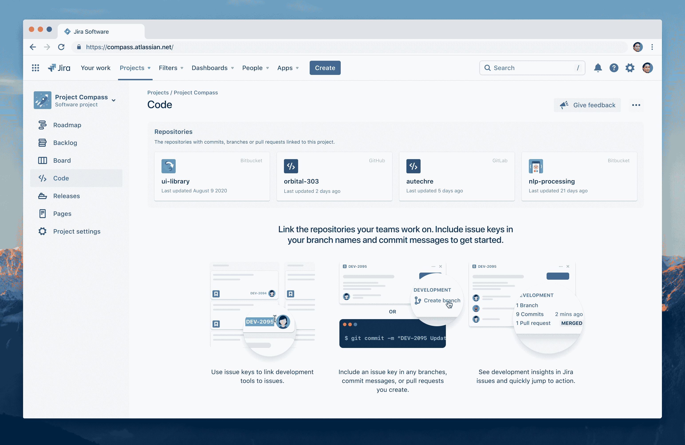

# Atlassian 嵌入了衡量吉拉 DevOps 的指标

> 原文：<https://devops.com/atlassian-embeds-metrics-for-measuring-devops-in-jira/>

Atlassian 今天宣布，它已经为吉拉软件云增加了[四项功能，允许开发人员可视化和衡量跨越](https://www.atlassian.com/blog/devops/new-devops-metrics) [DevOps 工作流](https://devops.com/?s=DevOps%20workflows)的进展。

Atlassian 的 DevOps 产品负责人 Suzie Prince 表示，组织不必购买和部署单独的工具来跟踪 DevOps 指标，Atlassian 正在将这些功能整合到一个已经广泛用于管理应用程序开发项目的平台中。

吉拉软件云标准版增加的两项功能是吉拉的代码，这使得可以从吉拉软件云内查看吉拉的 Bitbucket、GitHub、GitLab 或 Git Integration 中最近活跃的存储库，以及吉拉的部署，这使得可以类似地实时查看任何持续集成/持续交付(CI/CD)平台上的任何部署处于哪个阶段。

吉拉软件云的高级版获得了跟踪部署频率和周期时间的工具，以提供更多关于应用程序开发团队在整体 DevOps 熟练程度方面如何成熟的见解。

Prince 指出，这些工具消除了对分析工具的需求，否则组织使用的每个 DevOps 平台都需要这些工具。吉拉软件云还公开了一个 REST 应用编程接口(API)，DevOps 团队可以通过它将 Atlassian 平台与其他 DevOps 工具集成在一起。

将由每个组织来决定他们可能想要如何利用吉拉软件云内出现的见解。然而，Prince 说，大多数 IT 团队应该找出薄弱环节，以便有机会指导 DevOps 团队如何改进。

当然，随着最近几个月应用程序开发项目的加速，人们更加关注改进，这主要归功于对数字业务转型的日益关注。在新冠肺炎疫情带来的经济衰退迫使 IT 团队做出艰难的权衡之际，各种规模的组织都在努力实现应用程序开发投资的最大化。当然，当需要对一个项目进行优先排序时，度量标准是至关重要的。

与此同时，Prince 指出，许多团队正试图将 DevOps 工具链中包含的工具和平台数量保持在绝对最低水平，以限制成本和最小化复杂性。许多 DevOps 团队多年来一直使用吉拉软件来管理应用程序开发项目，因此 Prince 表示，这些新功能是公司项目管理软件的逻辑扩展。

当然，最好的度量标准是那些自动显现出来的。没有一个项目经理喜欢纠缠开发人员将数据输入项目管理应用程序。驻留在 DevOps 平台上的数据越多，就越能自动填充到项目管理应用程序中，所有参与者都会越高兴。毕竟，我们的目标是在问题成为明天的主要问题之前，尽可能多地避免这些问题。