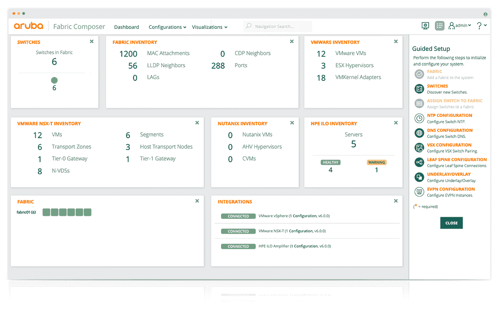

# aruba 致力于集中式网络管理

> 原文：<https://devops.com/aruba-aims-to-centralize-network-management/>

惠普企业(HPE)的一个部门 Aruba 发布了[编排软件](https://blogs.arubanetworks.com/spectrum/the-shift-is-on-from-data-centers-to-centers-of-data/)，该软件使得在数据中心、扩展园区和网络边缘集中管理[网络](https://devops.com/category/blogs/it-as-code/infrastructure-networking/)交换机成为可能。

此外，Aruba 正在为其产品组合增加一个由五个 1/10/25/40/100 GbE 交换机组成的系列，这些交换机旨在部署在数据中心或网络边缘。

最后，Aruba 正在为 HPE ProLiant DL 和 DX 服务器以及 SimpliVity、Nimble、Synergy、Cray Shasta、Cray ClusterStor、SAP HANA、VMware 和 Nutanix 平台提供集成。

Aruba 产品管理副总裁 William Choe 表示，Aruba Fabric Composer 还可以与 HPE·格林莱克(HPE 提供的一种托管服务)结合，代表客户远程管理 HPE 服务器。

Choe 说，Aruba Fabric Composer 基于图形界面，旨在使 it 通才能够提供任何类型的交换机。目标是通过使 IT 团队能够集中管理交换机来降低网络的总成本，而不管它们是数据中心、园区还是边缘计算环境。

随着边缘计算的兴起，分布式计算环境中使用的网络交换机的数量也在增加。IT 团队面临的挑战是，他们无法轻松地一次性派遣人员在远程位置物理配置交换机，因为大多数 IT 员工都在家中工作，以帮助抗击新冠肺炎疫情的传播。

Choe 补充说，Aruba Fabric Composer 旨在通过 VMware 控制台访问，消除了以零敲碎打的方式管理企业网络的需要。

可以说，网络管理的集中化早就应该实现了。太多的 IT 组织仍然通过每个机箱的命令行界面(CLI)来管理每台交换机。这不仅使管理大型网络变得繁琐，而且还造成了僵化的 it 环境，无法灵活地响应应用程序环境的快速变化。当许多组织试图加快部署推动数字化业务转型计划所需的应用程序时，传统的联网方法正在阻碍 IT 的现代化。

还有其他网络设备提供商致力于集中管理交换机。然而，在疫情带来的经济衰退期间，it 组织是否优先考虑网络管理的集中化还有待观察。但是增加网络带宽是绝对必要的，所以证明网络升级的一个方法就是降低运营成本。

作为这项工作的一部分，许多组织也开始使用应用程序编程接口(API)和覆盖层(如服务网格)以编程方式管理网络底层，将网络运营与最佳开发运维实践相融合。不管采用哪种方法，由专门的专家团队管理网络的时代正在消逝。