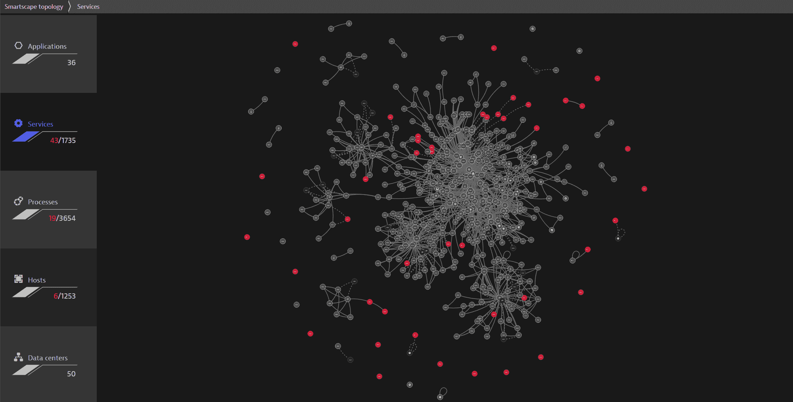

# Dynatrace 将安全模块添加到可观察性平台

> 原文：<https://devops.com/dynatrace-adds-security-module-to-observability-platform/>

Dynatrace 今天宣布[将增加一个模块，为其](https://www.businesswire.com/news/home/20201208005329/en/Dynatrace-Enters-the-Cloud-Application-Security-Market)[可观察性](https://devops.com/?s=observability)平台提供持续运行时应用程序自我保护 (RASP)功能。

Dynatrace 应用程序安全模块利用现有的 Dynatrace 跟踪和人工智能(AI)技术来实时检测威胁，然后应用适当的策略来自动保护应用程序。

Dynatrace 首席产品官 Andreas Lehofer 表示，随着基于高度动态微服务的应用的兴起，将公司平台扩展到应用安全领域的时机已经到来。他说，相比之下，通常不会对单片应用程序进行太多的更改，以证明向应用程序性能管理(APM)平台添加安全模块是合理的。

Lehofer 说，Dynatrace 应用程序安全模块还被设计为通过只显示与实际运行的代码有关的警报来减少误报。Lehofer 说，竞争对手的 RASP 平台将检测模块，并开始生成关于库的警报，这些库可能存在于应用程序环境中，但实际上并没有被使用。

他补充说，与 Smartscape 拓扑映射和 PurePath 工具配合使用的 Dynatrace 应用安全模块用于分析代码，也使 DevSecOps 团队能够更好地了解微服务之间的依赖关系。

DevSecOps 的 Dynatrace 方法的核心是其用于应用程序工具的 OneAgent 软件，该软件收集数据并将其反馈给可观测性平台，该平台包括一个名为 Davis 的人工智能(AI)引擎。Lehofer 说，随着 Dynatrace 应用程序安全模块的不断发展，IT 组织应该期待 Dynatrace 将人工智能功能更广泛地应用于应用程序安全。

DevSecOps 团队自动修复发现有重大安全问题的应用程序的能力取决于他们在部署应用程序后回滚应用程序的能力。他指出，目前大多数 IT 组织仍然必须在应用程序部署后手动回滚。

从长远来看，人工智能会在多大程度上促进发展还不清楚；然而，识别漏洞的过程越自动化，自动修复就越容易。

与此同时，随着 Dynatrace 等平台的可观察性功能扩展到应用程序安全领域，组织通过采用添加到现有 APM 平台的模块来采用最佳 DevSecOps 实践应该会变得更加容易。

当然，Dynatrace 认为基于微服务的应用将增加其可观测性平台的采用。从历史上来看，由于成本的原因，IT 团队倾向于只使用 APM 来装备他们最关键的应用程序。然而，随着 IT 环境在微服务时代变得更加复杂，能够观察分布式计算环境中存在的所有依赖性的平台现在变得至关重要。扩展该平台以包括应用程序安全性进一步扩展了投资可观察性平台的经济案例。

大多数组织可能还需要一段时间才能达到需要持续可观察性的 DevSecOps 成熟度级别，但是随着应用程序安全性的责任继续向左转移，应用更多自动化只是时间问题。