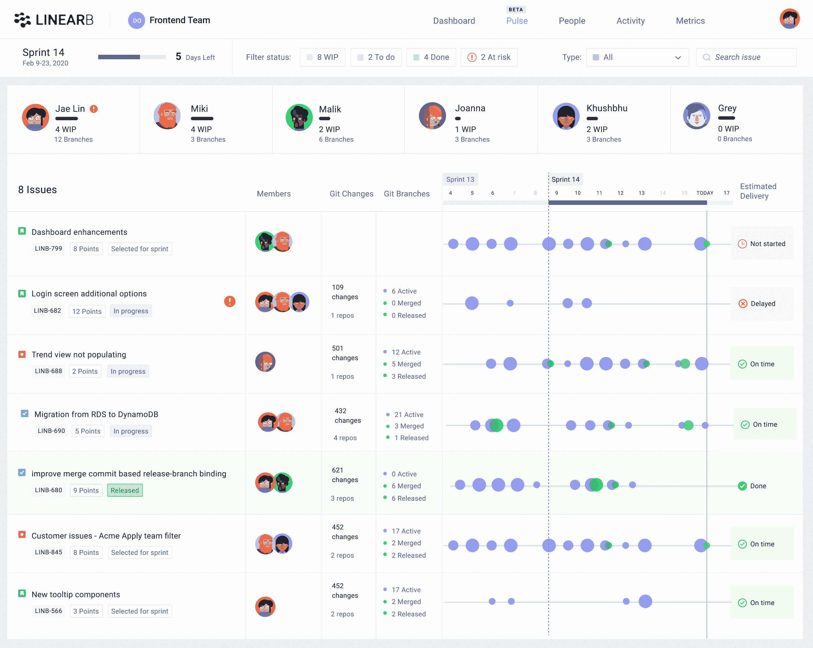

# LinearB 希望自动化开发运维项目管理

> 原文：<https://devops.com/linearb-looks-to-automate-devops-project-management/>

LinearB 今天发布了一个同名工具，它可以自动构建和可视化详细的进度时间表，而不需要开发团队将数据重新输入到一个单独的[项目管理](https://devops.com/?s=project%20management)应用程序中。

公司首席执行官 Ori Keren 表示，DevOps 团队在管理软件开发项目时发现最令人沮丧的问题是收集跟踪任何给定项目进度所需的数据，而这些数据中的大部分已经驻留在正在使用的 DevOps 工具中。他说，LinearB 自动化了 DevOps 团队以前花费数小时收集的数据的收集和显示。

Keren 指出，这种方法可以更容易地使用 LinearB 提供的仪表板中的指标，近乎实时地确定哪些团队和项目需要额外的帮助，添加周期时间跟踪等指标也可以使 DevOps 领导更容易向业务高管证明这些投资。

Keren 表示，DevOps 领导还可以更好地了解 DevOps 团队实际上是如何运作的，从而更容易预测和消除项目延迟，在高风险代码被纳入生产环境之前进行补救，消除瓶颈，并确保 DevOps 团队的重点仍然是最高优先级的任务。

LinearB 利用 DevOps 工具提供的应用编程接口(API)来收集关于任何给定项目状态的元数据。然后，LinearB 采用机器学习算法来构建和关联这些数据，与需要手动输入数据的项目管理应用程序相比，让 DevOps 领导者更准确地了解项目的状态。鉴于应用程序开发项目的更新速度，项目管理应用程序中的许多数据在输入后不久就过时了。

项目经理还经常花费大量时间试图鼓励开发运维团队的各个成员更新驻留在那些项目管理应用程序中的数据。

当这些 DevOps 团队的许多成员现在在家工作以抗击新冠肺炎疫情的传播时，Keren 指出手动收集这些数据从未有过这么大的问题。

虽然许多开发运维团队正在采用价值流管理工具来优化开发运维工作流，但 Keren 补充说，这些工具中的大部分并没有在足够精细的级别上收集数据，从而为开发运维领导提供足够的软件交付智能，以近实时地对开发运维工作流产生有意义的影响。

总的来说，Keren 说大多数 DevOps 团队过于关注代码行数或提交次数等指标。诸如周期时间之类的指标更能表明开发运维团队的生产力。

尚不清楚从 DevOps 工具中自动提取指标的能力会如何影响项目经理的角色。至少在理论上，他们应该能够花更多的时间帮助 DevOps 领导主动识别问题，而不是纠缠 DevOps 团队填写报告。

不管项目经理的角色如何演变，有一件事是肯定的，那就是 DevOps 团队的大多数成员都乐意看到尽可能多的过程自动化。