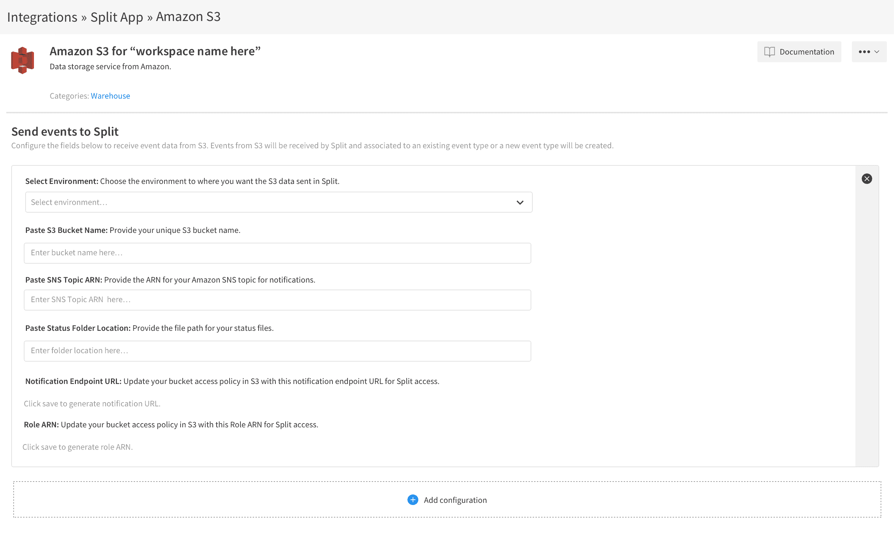

# 分裂与 AWS 的联盟，以促进功能标记的采用

> 原文：<https://devops.com/split-allies-with-aws-to-advance-feature-flagging-adoption/>

Split 今天宣布，它已经将管理功能标记的同名平台与亚马逊的简单存储服务整合在一起，作为 T2 简化向应用程序添加新功能的过程的一部分。

公司首席技术官 Pato Echagü表示，功能标记最具挑战性的方面之一是为开发团队提供一种访问测试这些功能所需数据的方法。与亚马逊 S3 的集成现在将使 Split 能够以拼花文件的形式从亚马逊 S3 每分钟接收数百万个客户事件。

Echagüe 说，这种能力将使我们有可能在几分钟内获得足够的统计相关数据来分析一个功能是如何被采用的。他指出，以前，软件工程师必须花费数小时来手动配置分割功能标志管理平台，以接收数千兆字节或数兆兆字节的数据。与亚马逊 S3 的集成使得近实时分析万亿字节的数据成为可能。

Split 明年还计划将功能标志数据发送到亚马逊 S3，在那里它可以与其他类型的数据结合起来，这些数据可以通过第三方应用程序进行分析。

Echagü补充说，最终目标是让产品和工程团队更容易以更好地与产品路线图保持一致的方式，更快地协作迭代新功能和能力

随着组织投资于数字业务转型计划，以更好地吸引在家工作的最终用户来抗击新冠肺炎疫情的传播，对特征标记的兴趣一直在上升。特性标记功能使这些组织可以更容易地测试新功能，而不必让每个 ens 用户都接触到最终可能没有足够吸引力的功能，以包括在应用程序中。

当然，许多 DevOps 工作流中已经采用了特征标记。Echagü说，然而，Split 提供了一个平台，旨在使 DevOps 团队和应用程序所有者更容易根据最终用户的反馈合作推出功能，而不管 DevOps 平台应用程序开发团队使用什么。

随着 IT 变得越来越复杂，Echagü指出，对于组织来说，拥有一致的变更管理方法比以往任何时候都更加重要。他说，许多 IT 组织最终解决的大部分问题通常与应用程序的最新变化有关。

毫无疑问，随着组织开始更多地依赖数字流程，组织将希望对添加到这些平台的功能更有信心。因此，许多在 DevOps 工作流环境中没有太多工作经验的应用程序所有者仍然希望能够控制向应用程序添加哪些功能。

不管特性标记的方法是什么，到目前为止，所有相关人员都应该清楚，这种功能将在应用程序开发和部署中发挥更大的作用。