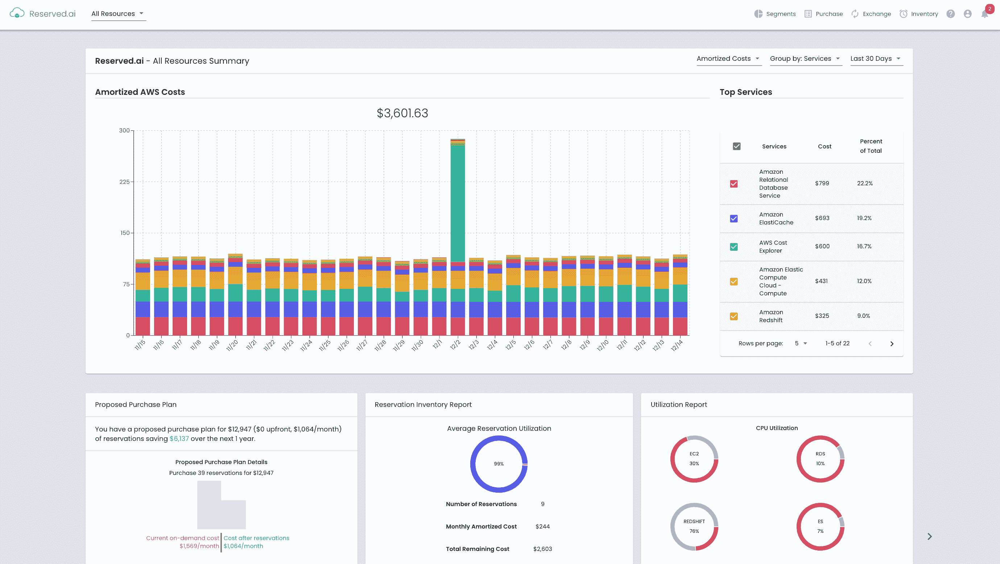

# Reserved.ai 应用机器学习来控制云成本

> 原文：<https://devops.com/reserved-ai-applies-machine-learning-to-rein-in-cloud-costs/>

Reserved.ai 增加了一个新的[人工智能](https://devops.com/?s=artificial%20intelligence) (AI)工具，可以更准确地预测云计算工作负载，并控制云支出。该公司表示，其[采购计划工具](https://blog.reserved.ai/purchase-planner-release/)使用机器学习来优化云计算工作负载，根据其生成的预测自动购买云储备实例。

Purchase Planner 利用机器学习算法 Reserved.ai 来监控和预测组织何时应该在公共云上以最佳方式保留实例。这些预测基于客户当前的应用工作负载需求，以及人工智能平台对未来几个月预留实例的总体需求的估计。

购买计划工具目前在亚马逊网络服务(AWS)上可用，并且还计划在本季度为微软 Azure clouds 提供支持谷歌云平台(GCP)的公共测试版。

Reserved.ai 首席执行官 Aran Khanna 表示，Purchase Planner 使 Reserved.ai 能够自动购买 AWS 云上的保留实例。如果出于任何原因，这些保留的实例不需要，Khanna 说 Reserved.ai 将从客户那里买回它们。

鉴于公共云上对保留实例的需求日益增长，Khanna 表示，转售这些实例可以最大限度地降低公司的财务风险。

过去，许多 IT 组织过度调配其云资源，以降低按需购买云实例的成本。在新冠肺炎疫情带来的经济衰退之后，Khanna 表示，更多的 IT 团队正试图通过减少他们根据当前云基础架构消耗预计需要的保留云实例的数量来优化他们的云成本。卡纳说，实现这一目标需要大量的猜测，而机器学习算法可以更准确地计算这些猜测。

Khanna 说，Reserved.ai 平台提供了额外的好处，只需要 15 分钟就可以安装，只需要最少的基础设施。

容量优化作为一门 IT 学科已经存在了几十年。然而，在云时代，随着开发人员启动虚拟机，IT 组织无法了解容量利用率和云计算成本。现在，财务团队要求 IT 团队至少要最大限度地提高工作负载的运行数量，同时更准确地预测云成本。云支出的任何实际减少都是次要的好处。如今的挑战是，大多数云优化工作都依赖于 IT 团队的手动工作，而且他们经常无法跟上云的快速变化。

了解云计算的真实成本在未来几个月将变得更加重要，因为越来越多的组织希望比较在云上运行一种类型的工作负载与另一种类型的工作负载的成本。只有当 IT 团队可以依赖能够近实时分析这些成本的人工智能平台时，今天获得这些成本的可见性才是可行的。否则，当 IT 团队意识到有机会降低成本时，这个机会已经被另一个组织抓住了。

无论 IT 团队在未来几个月如何控制云成本，目标都应该是在不增加预算的情况下最大限度地增加可以运行的工作负载数量。毕竟，如今大多数组织都专注于尽可能充分地利用现有的云投资。