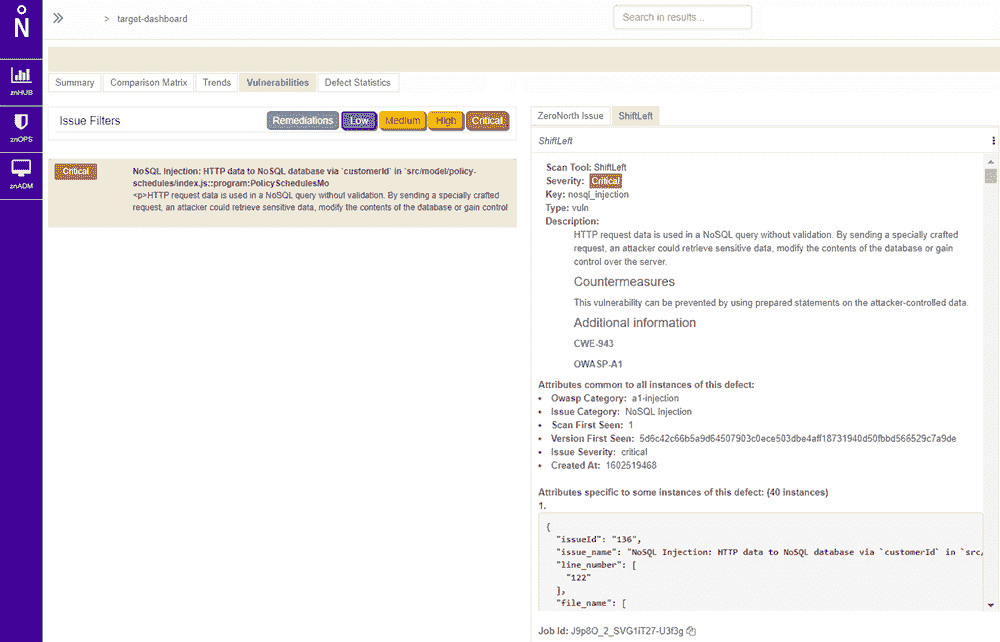

# 2021 年，流程编排将成为 DevSecOps 的重要推动者

> 原文：<https://devops.com/orchestration-emerges-as-crucial-devsecops-enabler-in-2021/>

随着 DevSecOps 最佳实践在 2021 年的不断发展和成熟，[安全协调](https://devops.com/?s=security%20orchestration)正在成为[应用安全的深度防御方法的基石。](https://devops.com/?s=application%20security.)

DevSecOps 假设组织将把应用程序安全性的责任进一步转移给开发人员。如果这个假设是正确的，那么开发人员显然需要访问一系列代码分析工具来实现这个目标。他们面临的挑战是在 DevSecOps 工作流中整合来自多个供应商的工具。在开发过程的不同阶段，使用[静态应用程序安全工具](https://devops.com/?s=SAST) (SAST)与[动态应用程序安全工具](https://devops.com/?s=DAST) (DAST)可能是有意义的，后者在应用程序部署之前对其进行压力测试。

毫不奇怪，这些工具的提供商开始与安全编排引擎提供商结盟。例如，最近[将 SAST 工具提供商 ShiftLeft](https://www.zeronorth.io/press-releases/zeronorth-and-shiftleft-integrate-to-empower-developers-to-improve-application-security-at-the-speed-of-devops/) 加入了可以通过其软件即服务(SaaS)平台协调的安全工具列表。

ZeroNorth 的产品营销总监 Joanne Godfrey 说，采用 DevSecOps 的组织正在标准化两到三种安全工具。Godfrey 说，这降低了过度依赖单一工具发现漏洞的风险。没有单一的安全工具可以及时发现每个可能的漏洞，因此 DevOps 团队必须努力将多种安全工具集成到他们的工作流中。

开发人员在编写代码时需要能够识别漏洞的工具。他们还应该构建测试，以便在将漏洞合并到更大的构建中之前主动标记这些漏洞。然而，新的漏洞总是不断被发现，对于昨天被认为是安全的容器构建来说，突然需要尽快更新是很常见的。开发运维团队还需要保护部署应用构建的运行时和主机，这通常需要与通常负责管理平台安全和开发运维的安全团队进行更多协作。

尽管需要密切合作，但开发人员和网络安全团队之间的文化差异通常很大。虽然人们对 DevSecOps 最佳实践很感兴趣，但是当有交付期限要满足时，开发人员并不总是优先考虑应用程序安全性。这通常会导致安全问题在应用程序开发过程的后期才得到解决，或者更糟糕的是，在应用程序部署到生产环境中之后，作为更新的一部分才得到解决。

随着应用程序开发的加速，弥合开发人员和安全团队之间的鸿沟势在必行。人手不足的网络安全团队根本跟不上应用程序构建、部署和更新的速度。将更多应用程序安全责任转移给开发人员的需求与日俱增。

现在的挑战是，IT 领导者需要实践他们所宣扬的，并为开发人员提供保护其应用程序所需的工具和过程，而不是简单地发表一篇空洞的 DevSecOps 说教。