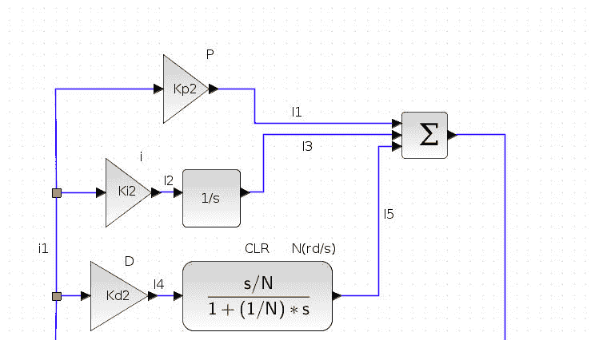

# DARPA 招募 GrammaTech 将人工智能应用于逆向工程代码

> 原文：<https://devops.com/darpa-enlists-grammatech-to-apply-ai-to-reverse-engineer-code/>

美国国防高级研究计划局(DARPA)已经将一份研究合同授予 GrammaTech 公司(T1 ),开发低代码技术，这将使最终用户能够利用人工智能(AI ),而无需原始软件开发商的干预。

GrammaTech 的人工智能工具被称为 ReMath，旨在通过从系统和嵌入式软件中的现有二进制文件中自动推断高级数学表示来简化应用程序更新。该工具目前正在开发中。

GrammaTech 的研究副总裁阿列克谢·罗吉诺夫(Alexey Loginov)博士表示，[开发](https://devops.com/?s=sofware)团队花费大量时间使用诸如反汇编器、调试器和反编译器等低级工具来手动分析二进制文件。罗吉诺夫说，ReMath 将通过恢复机器语言并将其转换成最终用户可以直接操作的表示来加速逆向工程过程。

Loginov 指出，目标是让开发人员自由开发新软件，而不是不断更新已经部署的软件。Loginov 补充说，这种方法最终会减少组织的应用程序和软件开发项目的积压。

ReMath 项目是授予 GrammaTech 的一系列 DARPA 合同中的最新一个。总的来说，该公司正在努力通过一种识别代码漏洞的[静态应用安全测试(SAST)工具来应用人工智能来推进 DecSecOps。ReMath 项目专注于将人工智能应用于用例，例如工业控制系统。Loginov 说，这些系统可以受益于允许没有编码专业知识的领域专家自己维护和更新它们。](https://devops.com/grammatech-discovers-vulnerabilities-in-third-party-code/)

Loginov 说，GrammaTech 正在积极研究的其他 DARPA 项目包括自动识别软件库中现有工件的预输入功能。Loginov 说，这种能力将使开发人员更容易在 GitOps 流程的上下文中重用代码，而不会无意中引入额外的错误。

在未来，随着更多可靠的代码进入生产环境，人工智能对软件开发的潜在影响可能是深远的。在接下来的几年中，首次尝试进入这些环境的代码的百分比应该会大大增加。这应该能够通过持续集成/持续交付(CI/CD)平台更可靠地交付应用程序代码。

随着软件开发变得更加高效，当前开发人员短缺的状况也应该得到缓解，并开放资源来启动更多的应用程序开发项目。Loginov 说，软件工程师将能够把更多的时间和精力放在流程创新上，而不是花时间在没有差异化价值的手工任务上。

与此同时，在未来几个月，开发人员应该会看到一系列具有人工智能功能的开发工具。这些工具都不可能很快消除对开发人员的需求；然而，随着机器学习算法和其他形式的人工智能应用于软件开发，今天编写代码所涉及的许多繁重工作可能会大幅减少。