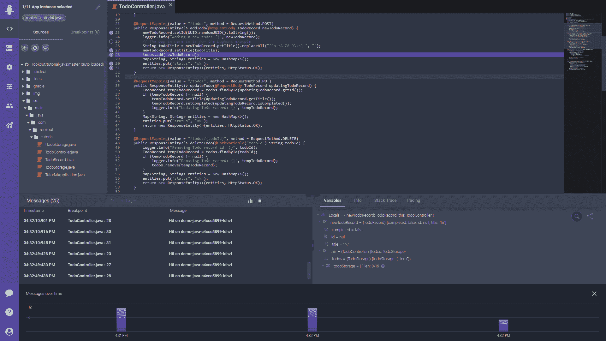

# Rookout 工具现在调试第三方代码

> 原文：<https://devops.com/rookout-tool-now-debugs-third-party-code/>

Rookout 今天透露，它已经扩展了与它的[同名的调试工具](https://www.globenewswire.com/news-release/2021/01/19/2160836/0/en/Rookout-gives-developers-X-Ray-vision-into-other-people-s-code-for-rapid-debugging.html)，以包括第三方应用程序。

Rookout 的首席执行官沙哈尔·福格尔说，如今大多数组织都在构建严重依赖第三方开发的代码或模块的应用程序。Fogel 说，Rookout 现在可以在将代码整合到更大的应用环境之前对其进行分析和调试。

Fogel 说，这一点至关重要，因为 DevOps 团队可能遇到的许多操作问题都可以追溯到由 IT 组织以外的人编写的有缺陷的代码。他说，这项新功能将减少 DevOps 团队试图推断问题根源所花费的时间。

Fogel 说，许多 IT 组织错误地认为，在他们的环境中运行的所有代码都经过了持续集成/持续部署(CI/CD)环境。实际上，开发人员以方便的名义将代码直接部署到生产环境中并不少见。然而，并非所有代码都是由开发人员编写的。许多开发人员错误地认为他们从存储库中下载的代码经过了适当的审查和调试。

Fogel 说，Rookout 现在可以调试开源代码和由第三方编写或出现在应用部署平台上的专有代码。Rookout 收集局部变量、函数参数、跟踪数据、调用堆栈和其他相关数据，并可以识别具体代码行的问题。对第三方代码的支持已经扩展到调用堆栈级别，使开发人员能够看到代码执行如何在他们自己的代码和第三方代码之间流动。

随着应用程序的更多责任转移到开发人员身上，组织需要为他们提供工具来分析应用程序及其运行的平台。除了更快地构建应用程序之外，DevOps 的主要理论优势之一是开发人员可以构建更具弹性的应用程序，因为他们最终有责任修复应用程序在生产中部署后出现的任何问题。实际上，当开发人员无法看到不是他们自己编写的代码时，这是很难实现的。

Fogel 说，展望未来，将会有更多的第三方代码在生产中运行，因为开发人员会重用直接从注册表下载的容器中封装的应用程序代码。

开发人员对其应用程序代码的负责程度目前因组织而异。然而，如果有合适的工具和足够的时间，大多数开发人员更愿意调试他们自己编写的代码和他们包含的任何代码，即使这些代码是由别人编写的。然而，这需要更多的时间来构建和测试应用程序。当然，如果开发人员在生产环境中部署应用程序后，遇到较少的需要开发人员调试应用程序的事件，这种权衡是值得的。