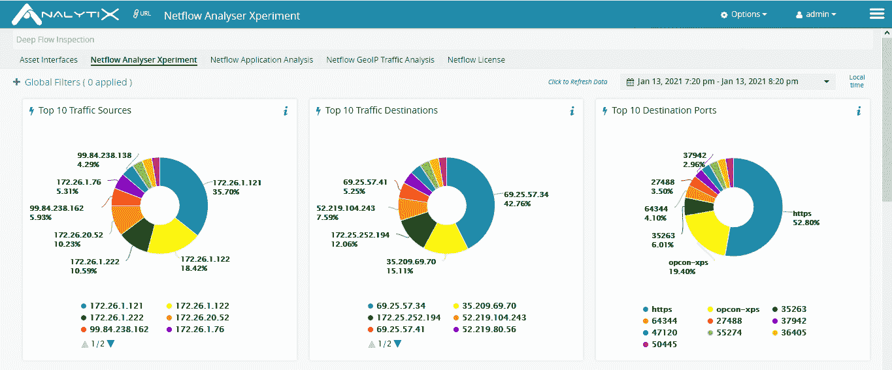

# OpsRamp 将 AIOps 延伸到网络

> 原文：<https://devops.com/opsramp-extends-aiops-reach-to-the-network/>

OpsRamp 今天宣布其支持人工智能的 IT 运营管理( [AIOps](https://devops.com/?s=AIOps) )平台现在具有[分析网络流量和通信流量的能力](https://www.globenewswire.com/news-release/2021/01/21/2161951/0/en/OpsRamp-Expands-Network-and-Collaboration-System-Monitoring-as-More-Companies-Encourage-Work-From-Home.html)。

OpsRamp 的产品管理副总裁 Ciaran Byrne 表示，新的分析功能将使 it 团队能够将 OpsRamp 已经在服务器和存储系统上跟踪的 IT 事件与跨公司网络移动的多种类型的流量相关联。

OpsRamp 基于软件即服务(SaaS)平台，可简化 IT 对 AIOps 的采用，而无需构建和维护自己的管理平台或在自己的基础设施上安装 AIOps 平台。

OpsRamp 没有购买一个单独的平台来分析网络流量，而是增加了一个 OpsRamp 网络流监控模块，用于使用思科开发的[网络流协议](https://www.cisco.com/c/en/us/products/ios-nx-os-software/ios-netflow/index.html)来分析数据包，以及一个 OpsRamp 统一通信监控模块，用于分析语音和协作数据。

OpsRamp NetFlow 提供跨广域网(wan)的网络延迟的实时诊断。它根据网络流量利用率生成警报，并通过识别影响服务的来源、目的地、协议和应用程序来洞察网络利用率模式。

OpsRamp 统一通信以类似的方式工作，显示关于影响 Zoom 或 Microsoft 团队等的流量模式的警报和见解。

Byrne 说，随着越来越多的员工远程工作，分析网络流量的需求变得更加迫切。Byrne 说，网络性能下降会对整体应用体验产生重大影响。

Byrne 说，像微软团队这样的通信和协作平台构成了特别棘手的挑战，因为它们很少或根本没有向 IT 团队提供对流量的可见性。

目前还不清楚网络和其他 It 运营是否会融合，以及融合到什么程度，但随着 AIOps 平台变得更加易于访问，跨多个基础设施类别关联 IT 事件的能力将稳步提高。虽然这可能不会很快导致 IT 角色的整合，但它应该会提高团队可以实现的协作水平。

与此同时，人工智能将对 IT 环境的管理方式产生深远的影响。通过使用机器学习，花在“作战室”进行根本原因分析的时间可以大大减少。随着算法浮出水面，IT 团队将能够更好地主动解决问题，以免它们对应用性能和用户体验产生重大影响。It 团队完全信任 AIOps 平台可能需要一段时间，但在不久的将来，IT 专业人员将避免为没有此类平台的组织工作。对于 IT 专业人员来说，在没有 AIOps 平台的情况下保持复杂的应用程序环境运行几乎是不可能的。

当然，过渡到任何类型的新 IT 管理平台都是一项艰巨的任务。然而，随着 AIOps 平台的不断发展，管理它的总成本也应该下降，因为领导证明这些工具的成本是合理的。