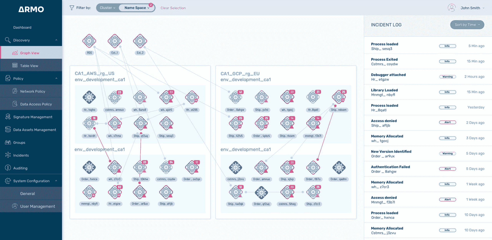

# ARMO 旨在简化微服务安全性

> 原文：<https://devops.com/armo-aims-to-simplify-microservices-security/>

ARMO 本周秘密推出了一个平台，以保护云原生工作负载并提高可见性。ARMO 工作负载结构技术将代码附加到由[微服务](https://devops.com/?s=microservices)调用的内存中，以支持通过云服务应用网络安全策略。

公司首席执行官 Shauli Rozen 表示， [ARMO 工作负载结构](https://www.prnewswire.com/news-releases/armo-emerges-from-stealth-with-4-5-million-to-infuse-visibility-control-and-security-into-every-cloud-native-workload-301216137.html#:~:text=TEL%20AVIV%2C%20Israel%2C%20Jan.,seed%20funding%2C%20from%20Pitango%20First.)旨在使 IT 组织能够在 [DevSecOps](https://devops.com/?s=DevSecOps) 工作流的背景下更容易地实施零信任架构。

Rozen 刚刚筹集了 450 万美元的种子资金，他说 ARMO 的方法消除了部署和管理代理软件、容器侧柜或运行时应用程序自我保护(RASP)软件的需要，以在不可避免地将成为分布在企业 IT 环境中的数千个微服务上执行安全策略。

Rozen 说，这种更精简的方法允许在云或内部 IT 环境中部署集中式管理平台，以应用限制哪些微服务可以相互通信的策略。Rozen 说，这种方法将确保只有使用持续集成/持续交付(CI/CD)平台开发的微服务才被允许与其他微服务进行通信。

Rozen 补充说，已经提供了与多个 CI/CD 平台的集成。

Rozen 说，这种方法允许将策略应用于微服务，而不管它们是如何构建的。他说，这种能力至关重要，因为开发者正在使用从 Python 和 Java 到容器的一切来构建微服务。Rozen 说，许多微服务也经常被替换，这使得更新任何相关的代理软件成为 DevOps 的一个重大挑战。考虑到微服务之间的所有现有依赖关系，整体应用环境的安全性取决于众所周知的最薄弱环节。ARMO 工作负载结构使开发人员能够在每次将微服务部署到生产环境中时添加少量代码来实施安全策略。

Rozen 说，作为简化 it 组织应用这些策略的努力的一部分，ARMO 提供了一套预先构建的策略，组织可以立即应用，此外还可以随着时间的推移创建自己的策略。Rozen 补充说，在许多情况下，IT 团队根本没有制定这些策略所需的时间或专业知识。

微服务的构建和部署速度如此之快，以至于网络安全团队几乎不可能跟上。ARMO 工作负载结构为网络安全团队提供了一种集中管理安全策略的方法，否则这些策略将由开发人员作为代码来实施。Rozen 说，它为这些网络安全政策如何在通常相互依赖的微服务中实施提供了一定程度的可观察性。

如今，大多数组织都认识到，显然需要将应用程序安全性的责任进一步转移给开发人员。面临的挑战是找到一种切实可行的方法来实现这一目标，并且不会对应用程序的开发速度产生负面影响。实现这一目标的关键是找到一种方法来应用微服务安全策略，尽可能减少对现有开发运维工作流的影响。