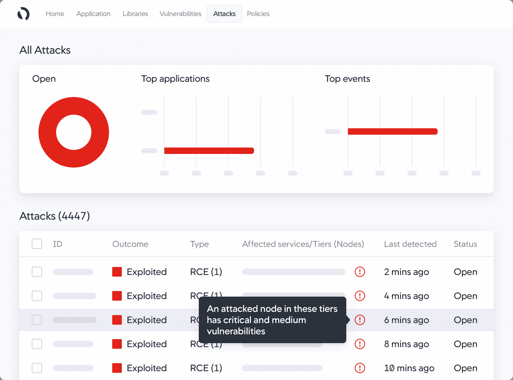

# AppDynamics 与思科合作保护应用运行时

> 原文：<https://devops.com/appdynamics-partners-with-cisco-to-secure-application-runtimes/>

[AppDynamics](https://www.appdynamics.com/) 今天发布了它的代理软件，这是它提供的可观察性平台的一部分，[现在有能力](https://www.businesswire.com/news/home/20210204005304/en/Cisco-AppDynamics-Delivers-Industry-First-Solution-for-Strengthening-Security-Posture-Against-Threats-While-Achieving-Peak-Application-Performance)执行[应用安全](https://devops.com/?s=application%20security)政策。

AppDynamics 与母公司思科的安全业务部门合作开发的思科安全应用产品可以检测攻击，识别应用行为的偏差并自动阻止攻击。

AppDynamics 的区域首席技术官 Gregg Ostrowski 表示，目标是让使用 AppDynamics 监控和观察其 it 环境的 IT 团队更容易采用 DevSecOps 最佳实践。Ostrowski 说，实际上，IT 团队现在可以在 AppDynamics 的现有投资上为应用程序运行时提供安全性。

Ostrowski 说，AppDynamics 方法提供了与思科安全工具轻松集成的额外好处，以改善 DevOps 和网络安全团队之间的合作。他补充说，与应用程序拓扑相关的安全细节使得以识别任何安全事件的实际业务相关性的方式共享上下文变得更加容易。

随着组织加快数字业务转型计划，Ostrowski 表示，采用 DevSecOps 最佳实践的需求变得更加迫切。Ostrowski 说，这些类型项目的风险水平明显高于前几代应用程序。

虽然大多数组织都意识到需要更高的应用程序安全性，但对于如何最好地实现这一目标仍存在争议。人们普遍认为开发者需要更多地参与进来。然而，众所周知，将应用程序安全性的责任转移到左边通常会以牺牲开发人员的生产力为代价。AppDynamics 正在为可能已经依赖其应用性能管理(APM)平台的 IT 团队提供支持，以执行网络安全团队定义的政策。

当然，首先仍然需要为开发人员提供编写更安全代码所需的工具。争论的焦点是，在应用程序部署到生产环境后，开发人员需要在多大程度上参与网络安全管理过程。

可以说，目标应该是让两个团队以一种不需要不断开会和更新的方式完成各自的任务。在发现漏洞的情况下，安全团队确定漏洞代表的威胁级别至关重要。否则，对该漏洞的补救将只是开发人员已经在进行的一长串修补程序中的又一项。

不管采用哪种方法，现在有无数种方法可以提高应用程序的整体安全性。实际上，随着应用程序的构建和部署，IT 组织用来保护网络边界的纵深防御方法现在也可以应用于应用程序安全。最大的挑战与其说是找到提高应用程序安全性所需的工具，不如说是定义可以一致地应用最佳实践的过程。