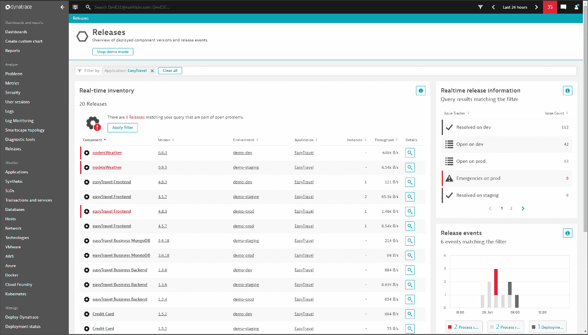

# Dynatrace 扩展了可观察性平台的范围

> 原文：<https://devops.com/dynatrace-extends-reach-of-observability-platform/>

Dynatrace 本周更新了其 [observability](https://devops.com/?s=observability) 和软件智能平台，作为扩大其在现代企业 IT 环境中影响力的努力的一部分。

在在线 [Dynatrace Perform 2021](https://www.dynatrace.com/perform-2021/) 会议上宣布，该公司的同名平台现在可以[从 Kubernetes 和 Red Hat OpenShift 以及](https://www.businesswire.com/news/home/20210208005223/en/Dynatrace-Enhances-Infrastructure-Monitoring-Capabilities-With-Native-Log-Support-for-Kubernetes-and-Multicloud-Environments)亚马逊网络服务、谷歌云平台和微软 Azure 云平台捕获日志。

此外，Dynatrace 正在增加对开源日志数据框架的支持，如 Fluentd 和 Logstash。现在可以通过 Dynatrace 日志查看器集中查看这些日志，使 IT 团队能够搜索、分析和分段实时和历史日志数据。

Dynatrace 还在 [Keptn](https://keptn.sh/) 的基础上增加了一个[云自动化模块](https://www.businesswire.com/news/home/20210210005222/en/Dynatrace-Adds-Cloud-Automation-Module-to-Its-Software-Intelligence-Platform)，这是一个开源工具，用于自动化可观测性工具的配置，编排代码测试和质量检查。Keptn 由 Dynatrace 创建，并在云本地计算基金会(CNCF)的支持下得到发展。

该公司还推出了一个[软件智能中心](https://www.businesswire.com/news/home/20210209005357/en/Dynatrace-Launches-Software-Intelligence-Hub)，以便更容易地访问 500 多个预配置的集成，以及无需编写代码即可创建集成的访问工具。

Dynatrace 还宣布，它已经将之前推出的[应用安全模块](https://devops.com/dynatrace-adds-security-module-to-observability-platform/)扩展到[，现在包括对 Node.js 应用的支持](https://www.businesswire.com/news/home/20210210005213/en/Dynatrace-broadens-cloud-application-security-coverage-for-Kubernetes-and-Node.js)。此外，该模块还能够对使用其代理软件的应用程序实施安全策略，并提供扩展功能来检测 Kubernetes 集群漏洞。

最后，Dynatrace 在其数字体验模块中增加了[会话回放](https://www.businesswire.com/news/home/20210209005358/en/Dynatrace-Announces-Session-Replay-for-Native-Mobile-Applications)功能，使 IT 团队能够获得移动应用体验。

Dynatrace 产品管理高级副总裁 Steve Tack 表示，该公司正在迅速增加对云原生应用程序中广泛采用的平台和技术的支持，为 IT 团队提供单一平台，通过该平台他们可以管理单片和基于微服务的应用程序。

随着微服务的兴起，IT 环境变得越来越复杂，如果没有某种类型的可观察性平台，就难以管理。从历史上看，对成本的担忧限制了 IT 团队对应用性能管理(APM)平台的使用，如 Dynatrace，仅用于其最关键的整体应用。现在很明显，要有效管理现代 It 环境，需要能够关联从应用和基础设施捕获的日志和遥测数据的可观测性平台。

作为这项工作的一部分，Dynatrace 现在除了提供代理软件之外，还从其他来源收集数据。这些数据然后被输入到一个可观察性平台，Dynatrace 已经用戴维斯人工智能引擎进行了增强，以通过采用机器学习算法来识别异常和其他潜在问题。

目前还不清楚 It 团队在多大程度上完全信任任何人工智能引擎提出的建议。然而，随着 Dynatrace 等平台从 IT 环境中收集更多数据，人工智能模型往往会变得越来越准确。事实上，与其他拥有人工智能能力的 IT 团队相比，没有人工智能能力的 IT 团队可能很快就会处于明显的劣势。

与此同时，对可观察性优势的争夺继续加剧，因为现有的 APM 平台提供商(如 Dynatrace)希望抢先于一批初创公司对手，所有这些公司都承诺以更低的成本获得更高的 IT 环境可见性。现在的挑战是确定实现什么级别的可见性，以及总成本是多少。