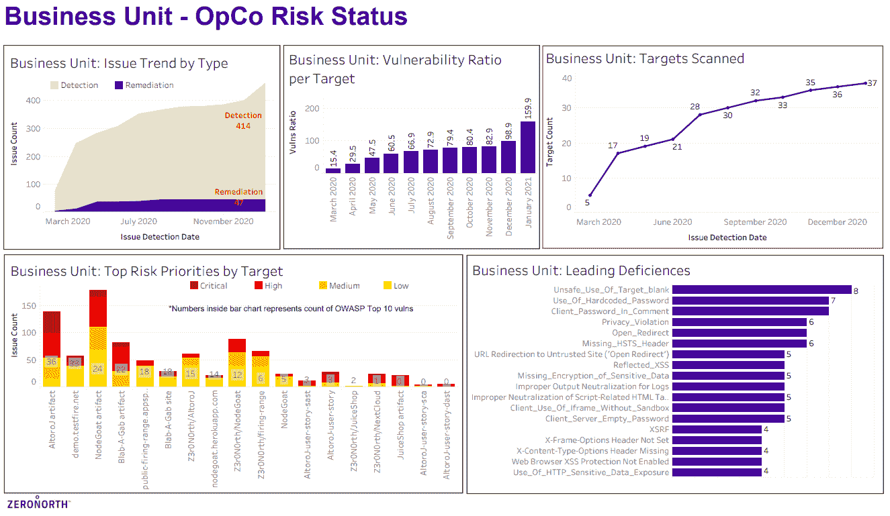

# ZeroNorth 添加分析应用程序以推进 DevSecOps

> 原文：<https://devops.com/zeronorth-adds-analytics-app-to-advance-devsecops/>

ZeroNorth [今天在其](https://www.zeronorth.io/press-releases/zeronorths-new-advanced-appsec-analytics-empower-organizations-to-make-informed-strategic-risk-and-operational-decisions/)[平台上增加了一个高级应用安全风险分析](https://devops.com/zeronorth-extends-devsecops-orchestration-reach/)模块，用于编排开发安全流程。

ZeroNorth 首席执行官约翰·沃拉尔表示，该分析工具提取了各种安全工具生成的漏洞数据，为开发人员和网络安全专业人员提供了评估应用环境安全性的单一真实来源。

ZeroNorth 平台旨在使 IT 组织能够在更大的 [DevSecOps](https://devops.com/?s=DevSecOps) 工作流环境中协调多个漏洞扫描工具，并可以对大型安全数据池进行分析。沃拉尔说，这些数据可以在特定群体的背景下查看，如业务部门或特定的应用程序开发和部署团队，或者在为企业带来最多收入的应用程序的背景下查看。

此外，高级 AppSec 风险分析模块将显示检测到的漏洞类型和最常遇到的漏洞，按重要程度排序，以及检测到/补救的漏洞类型和数量的其他趋势，如每个特定扫描器发现的漏洞数量和重要程度。它还跟踪扫描的应用程序和实体、每个应用程序/实体检测到的漏洞数量以及风险最高的应用程序/实体。

沃拉尔说，有了这些分析数据，it 团队就可以更容易地确定工作的优先顺序和重点，此外还可以确定可能需要额外网络安全资源和培训的业务领域。沃拉尔指出，IT 领导还可以获得顶级应用程序安全风险的快照视图，以更好地评估组织的整体安全状况。

沃拉尔补充说，高级 AppSec 风险分析模块还将揭示软件开发生命周期(SDLC)背景下跨多个应用程序的漏洞补救瓶颈。从长远来看，沃拉尔表示，ZeroNorth analytics 应用程序收集的数据也将为该公司创造一个将机器学习算法应用于 DevSecOps 的机会。

总体而言，沃拉尔表示，实现 DevSecOps 的唯一可行途径是促进开发者和网络安全团队之间的更多合作。沃拉尔说，让这些团队在需要分析的安全数据方面达成共识是至关重要的第一步。

在组织内采用 DevSecOps 最佳实践仍处于早期阶段，但是，很明显，软件开发人员和网络安全团队之间缺乏凝聚力，无法确定哪些漏洞是造成功能障碍的主要原因。网络安全团队倾向于在不提供太多上下文的情况下创建应用程序中发现的漏洞的长列表。然后，开发人员需要自行权衡何时解决漏洞，还是专注于编写额外的代码来满足应用程序交付期限的要求。开发人员认真对待潜在的漏洞，但一天只有这么多时间来编写代码。

不管公平与否，开发人员越来越需要对应用程序的安全性负责。挑战——也是机会——是找到一种方法，通过帮助 DevOps 和 DevSecOps 团队更好地意识到哪些任务应该在什么时候优先化，从而使整个 DevSecOps 工作流更少争议。