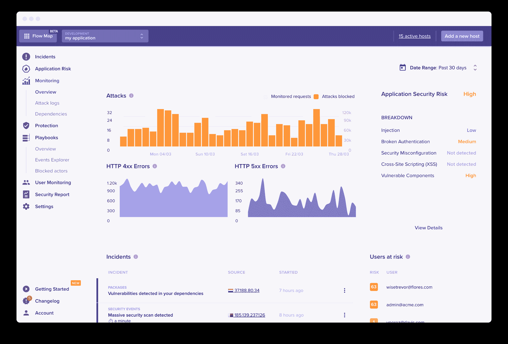

# 融合可观测性和发展的数据狗

> 原文：<https://devops.com/datadog-to-meld-observability-and-devsecops/>

Datadog 计划在收购应用安全平台提供商 Sqreen 和工具提供商 Timber Technologies 之后，扩大其提供的安全和可观察性服务的范围，该工具名为 Vector，用于收集和规范日志数据。

Datadog 产品和社区副总裁 Ilan Rabinovitch 表示，Vector 可以从内部和云环境中收集、丰富和转换日志和其他可观察性数据，从而更容易通过数据管道将数据路由到任何需要的地方。

Sqreen 是软件即服务(SaaS)平台的提供商，该平台使用嵌入在应用程序中的 web 应用程序防火墙(WAF)支持的[运行时应用程序自我保护](https://devops.com/?s=rasp) (RASP)功能来检测、阻止和响应应用程序级攻击。

Rabinovitch 表示，随着 it 的不断发展，很明显，组织正在寻求采用 DevSecOps 最佳实践，这将需要可以嵌入应用程序的安全工具，以及提供有关整体 IT 环境的更多上下文的可观察性工具。Rabinovitch 说，考虑到需要分析大量数据来确定 IT 环境安全威胁的潜在范围，这种情况尤为重要。

Datadog 平台已经被广泛用于监控云计算环境。整个行业都在努力通过实现可观察性来将监控提升到一个新的水平，这种可观察性应用分析来提供更多的上下文。然而，Rabinovitch 说，要呈现这种情况，需要使用 Vector 规范整个管道的数据。

当然，矢量工具同样适用于尚未采用安全技术的开发运维工作流。现在的目标是通过打破由 it 和安全管理工具创建的各种数据孤岛，使由开发人员、IT 运营团队和安全专家组成的 IT 团队更容易协作。

现在判断 DevSecOps 的崛起会对 It 组织内部的角色产生什么影响还为时过早。Rabinovitch 说，大多数组织将继续雇用一系列能够与 IT 通才更密切合作的专家。Rabinovitch 补充说，管理它正变得相当于建造谷仓，因为它需要社区中拥有不同技能的成员在一定时间内聚集在一起完成特定的任务。

也不清楚 It 组织是否将可观察性视为独立于监控的独特能力，或者他们是否将可观察性简单地视为现有工具的下一个逻辑扩展。这个问题的核心是关于是否需要单独获得可观测性平台，作为取代现有监测工具的努力的一部分，或者这些工具是否会随着时间的推移而发展，以提供可观测性能力。

无论前进的道路如何，很明显，由微服务、容器和无服务器计算框架组成的现代 it 环境日益增加的复杂性将迫使这一问题出现。