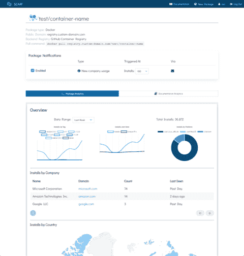

# Scarf Gateway 跟踪开源软件的使用

> 原文：<https://devops.com/scarf-gateway-tracks-open-source-software-usage/>

Scarf 今天退出 stealth，推出了一个网关，使个人或组织更容易跟踪开源软件的使用情况。

Scarf 的创始人 Avi Press 表示, [Scarf Gateway](https://www.businesswire.com/news/home/20210303005188/en/Scarf-Shifts-Open-Source-Power-Dynamics-With-Launch-of-the-Scarf-Gateway) 是一项在线服务，开源软件的提供商可以通过它重定向来自各种存储库和注册表的下载。这一额外的步骤为这些实体提供了关于使用其软件的个人和组织类型的数据和见解。

在筹集初始种子资金后，Press 表示，Scarf Gateway 将使开源软件的开发者更容易利用多个存储库来分发他们的代码，因为他们不会过度依赖单个存储库提供商共享的指标。

如今，大多数注册中心只提供软件包的下载次数。Scarf Gateway 将按版本、平台、位置、公司和云环境等属性提供对下载的洞察。

大多数提供[开源](https://devops.com/?s=open%20source%20)软件的组织在使用该软件的组织签约获得商业支持之前，并不清楚他们的产品是如何被使用的。随着对他们的软件如何被使用有了更多的了解，这些提供商除了推广他们的商业服务之外，还能够更主动地收集反馈。

Press 说，许多开源项目维护者很难区分添加或修复什么功能，仅仅是因为他们不太了解他们的软件是如何被使用的。

更精细地跟踪使用情况的能力出现在[开源货币化和补偿的紧张局势上升的时候](https://devops.com/open-source-advocates-want-share-in-wealth/)。在许多情况下，开源软件提供商正在改变他们许可软件的方式，以阻止云服务提供商收获他们工作的大部分好处。初创公司通常由风险资本家资助，他们将软件作为开源代码提供，以努力建立基于其支持服务优势的客户基础。云服务提供商发现，他们可以利用这些供应商创建的代码来推出自己的服务。这些云服务提供商可能会为项目贡献代码，但初创公司通常不会享受任何经济利益。

许多个人贡献者并不为赞助他们贡献的公司工作，他们也希望为他们的努力获得报酬。对 2020 年积极参与开源项目的 4，440 名开发者的调查发现，超过一半(54%)的受访者表示，他们认为个人应该为他们对开源项目的贡献获得报酬。云服务提供商 Digital Ocean 进行的调查发现，目前只有 14%的受访者付费。

现在说追踪开源软件的使用会有什么影响还为时过早。许多使用开源软件的个人可能更喜欢他们目前的匿名级别。如果参与，其他人可能会更多地参与项目。然而，不管喜欢与否，大量的开源社区想知道他们的努力在多大程度上产生了实际影响。