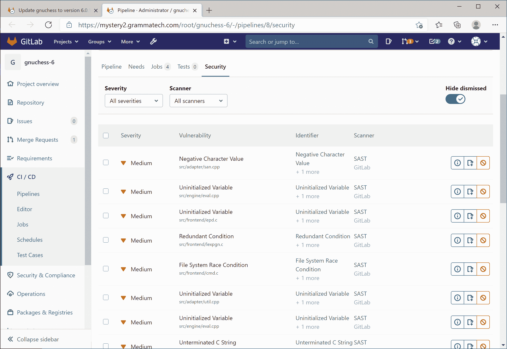

# GrammaTech 与 GitLab 合作推进 DevSecOps

> 原文：<https://devops.com/grammatech-allies-with-gitlab-to-advance-devsecops/>

GrammaTech 今天宣布[与 GitLab](https://www.businesswire.com/news/home/20210304005179/en/GrammaTech-Announces-GitLab-Partnership-for-CodeSonar-SAST-Product) 合作，将其 GrammaTech CodeSonar 静态应用安全测试(SAST)工具与 GitLab Ultimate DevSecOps 平台集成。

GrammaTech 首席产品官 Vince Arneja 表示，与 GitLab 等持续集成/持续交付(CI/CD)平台的集成至关重要，因为它使安全扫描能够在任何代码被合并的时候自动运行。Arneja 说，这种能力减少了每次扫描的代码量。

Arneja 指出，GrammaTech 正在与多个 CI/CD 平台和集成开发环境(IDE)提供商合作，以简化在应用程序开发过程中为扫描代码创建多个点的过程。

与此同时，GitLab 正在提供自己的工具，用于在软件开发生命周期中分析工件。Arneja 说，GrammaTech 工具可以通过 GitLab 提供的最高级别来分析更深层次的代码。

最终，目标是使开发人员能够在应用程序开发生命周期中尽早发现安全缺陷。Arneja 说，这些缺陷发现得越晚，修复起来就越昂贵。

开发人员自然倾向于推迟安全扫描，因为他们要赶在应用程序截止日期之前完成。这种做法产生了问题；要分析的代码越多，扫描的时间就越长。更频繁地扫描少量代码通常更有效。否则，开发人员可能会被需要在应用程序开发过程的后端解决的大量安全缺陷修复所淹没。自动化安全扫描允许组织以一种不依赖于开发人员记住启动扫描的方式，朝着采用 DevSecOps 最佳实践的方向前进。

大多数开发人员并没有故意忽略安全问题——只是现有的发现这些缺陷的手动过程效率低下。

自动扫描还提供了一个额外的好处，即在代码审查之前就简化了常见安全缺陷的发现，从而为解决更复杂的问题创造了更多的时间。

应用程序开发团队也面临着减少应用程序部署后需要修复的错误总数的压力。随着部署的应用程序数量稳步增加，开发人员会发现他们花在修复 bug 上的时间比写新的应用程序代码还要多。

大多数组织在拥抱 DevSecOps 的征途上并没有走多远。然而，随着在 DevOps 工作流中集成各种扫描工具变得越来越容易，沿着 DevSecOps 成熟度曲线向上移动的组织的数量应该会增加。随着最近对软件供应链的一些高调攻击，围绕采用 DevSecOps 最佳流程的紧迫感无疑增加了。

从长远来看，可能很快就会有一天，安全性被视为代码在被允许提升之前需要通过的众多质量保证门之一。与此同时，在任何应用程序开发的前端进行一盎司的网络安全预防肯定要比过晚应用几磅的网络安全治疗更有价值。