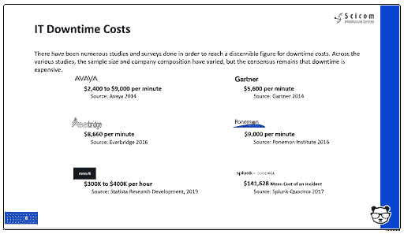
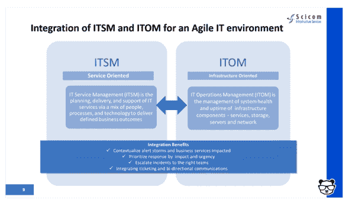
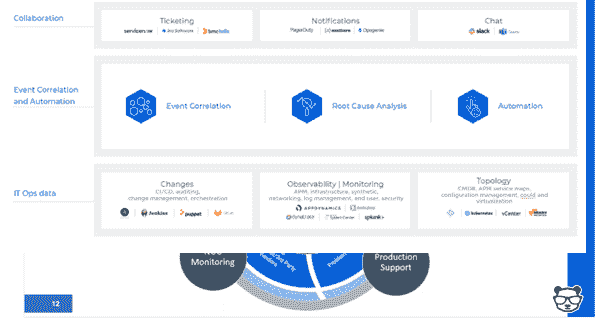

# 如何消除事故低效

> 原文：<https://devops.com/how-to-eliminate-incident-inefficiencies/>

在当今复杂、动态的 IT 环境中，分散的 IT 运营、 [NOC](https://devops.com/?s=NOC) 、DevOps 和 [SRE](https://devops.com/?s=SRE) 团队和工具的激增是必然的，并且通常被认为是必要的。这导致了一个不可避免的事实，即当事件发生时，通常最大的挑战是这些团队之间的协作，以了解发生了什么并解决问题。在这一关键阶段，效率低下会对每次事故给企业造成的损失产生巨大影响。

我最近(虚拟地)与 Scicom 的客户服务副总裁 Sid Roy 坐在一起，更深入地了解 IT 领导者如何更有效地评估这些低效之处并消除它们。

## IT 事故的成本

当被问及一分钟的停机成本时，分析师和供应商可能会提供不同的答案，但他们或多或少都在同一数量级上，每分钟几千美元。平均每月发生五起重大事故，平均需要六个小时来解决问题，这样一年下来就可以轻松达到数百万美元。

这些成本的三个主要驱动因素是:

**人员和团队成员成本:**这包括全职员工(fte)、顾问和其他团队参与处理事故时的管理费用。对于许多组织来说，这可能包括离岸事件响应团队。

**IT 事故的直接和间接成本:**这包括您的基础设施或资本支出，如用于监控、日志和事件管理、通知、票据、协作等的软件许可证。

**IT 事故的业务影响:**这是最具挑战性和最难以预测的可变成本之一，也是三大驱动因素中最高的。它包括由于重大事故造成的收入损失/延迟或减少，以及由于品牌或商誉影响造成的利润或损失。它还包括当业务的其他部分所依赖的关键服务降级或不可用时，它们所遭受的低效率。

## 分散的团队放大了挑战

事件数量、复杂性和吞吐量显然会影响处理这些事件所需的人数和时间，并且随着所需资源的堆积，通常会增加间接成本。为了节省这数百万美元的成本，您需要能够协作并降低 MTTR。如上所述，这成为敏捷 IT 环境中的一个挑战。为了帮助简化操作，团队需要开始询问和回答几个关键问题:

*   您是否有关键服务的最新地图？
*   它们是否按业务重要性(收入、客户数量、供应链中的其他支持服务)进行优先排序？
*   这些应用程序的上游和下游依赖关系是什么？
*   您是否确定了环境中的主要基础架构和应用程序元素？
*   您是否与这些系统的所有者保持一致？
*   您是否实时了解基础架构和应用程序正在发生的变化？
*   你有监控漏洞吗？
*   哪些监控工具为您提供了最佳价值？

回答这些问题需要克服人员、流程和工具团队之间的分散性——本质上是整合 ITSM 和 ITOM，以享受组织内上下文全栈可见性和简化流程的好处。

## 事件响应的正确组合

我们刚刚讨论的人员、流程和工具的正确组合是什么？这里有两个主要的指导方针:

*   建立重大事故管理团队——理想情况下，从您现有的员工中挑选。这个团队包括三个重要角色:
    *   事故经理/事故响应指挥官。这是一个指定的角色，负责宣布一个重大事件，并对其负责。从本质上讲，他们的工作是阻止收入和成本的流失。
    *   NOC/监控团队。这是你的前线防御。当事情在晚上发生或在白天发生时，他们是用“玻璃上的眼睛”捡起来的人——24/7。此外，他们还负责通过双向通信为事故指挥部报告和创建全面的态势感知。
    *   生产支持团队。该团队实际上实施所需的更改并执行补救措施。
*   部署事件关联和自动化工具，支持事件管理团队。这些工具是关键，允许您的团队执行所需的操作。
    *   首先，通过使用机器学习和人工智能(ML/AI ),将您的监控和可观察性工具创建的警报与数量大幅减少的高级别、富有洞察力的事件相关联。通过吸收和理解拓扑来源，为这些事件添加上下文。这创造了必要的全栈可见性和态势感知。
    *   然后，使用 ML 和 AI 来确定这些事件的根本原因，包括将它们与来自您的变更工具(CI/CD、流程编排、变更管理和审计)的数据流相关联，以确定您的环境中是否有任何变更导致了这些事件。
    *   最后，尽可能多地自动化流程，将您的 IT 运营团队从耗时的手动任务中解放出来。通过与协作工具集成，您还可以实现上述双向通信。