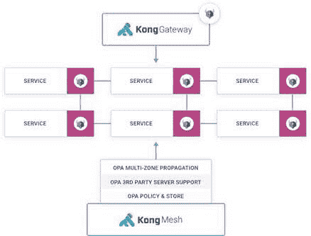

# 孔将业务网与 OPA 相结合

> 原文：<https://devops.com/kong-integrates-kuma-service-mesh-with-opa/>

Kong，Inc .今天宣布对 Kong Mesh 进行更新，该更新基于开源的库马服务 Mesh 之上，增加了对开放策略代理(OPA)软件的支持，使 DevOps 团队能够将合规性作为代码进行管理。

库马和 OPA 都是在云本地计算基金会(CNCF)的支持下开发的。与其他服务网格产品不同，库马提供了运行在 Kubernetes 平台上的基于微服务的应用程序和部署在虚拟机上的整体应用程序之间的连接。

除了增加对 OPA 的支持， Kong Mesh 的 [1.2 版本还增加了跨多个区域操作的全局和远程控制平面之间的认证机制。该功能扩展了库马发现服务(KDS)以支持多种身份验证机制。](https://konghq.com/blog/kong-mesh-1-2)

最后，Kong 增加了对联邦信息处理标准(FIPS)的支持。

与谷歌和 IBM 为 Kubernetes 环境开发的 Istio [服务网格](https://devops.com/?s=service%20mesh)一样，库马也是基于开源的特使代理软件。然而，相比之下，库马不仅重量更轻，而且旨在跨越云原生和传统应用程序环境。

Kong 首席技术官 Marco Palladino 表示，随着组织开始在零信任计算环境中采用库马，OPA 支持将是这两类工作负载的重大进步。Palladino 说，随着 DevSecOps 流程扩展到包括将合规性作为代码进行管理，OPA 将提供一种可编程的机制，以确保政策不仅得到正确实施，而且还可以很容易地进行审计。

总的来说，由[孔](https://digitalanarchist.com/videos/featured-guests/marco-palladino-techstrong-tv)、 [VMware](https://digitalanarchist.com/videos/featured-guests/pere-monclus-techstrong-tv) 和其他人领导的提升服务网格对话以更广泛地解决应用程序连接的努力正在进行中。服务网格的核心是提供大规模集成数百个应用程序编程接口(API)的方法。它还在网络层之上提供了一个抽象级别，使得跨异构网络环境连接应用程序变得更加容易。

Kong 正在为一种轻量级的方法做准备，这种方法可以跨越多个平台，具有高度的可扩展性。因此，第三方供应商和 IT 团队可以在他们认为合适的时候向库马添加扩展。

帕拉迪诺说，最终，将云计算带到下一个层次的时候到了。如果所有组织最终都只是将单一应用程序提升并转移到公共云，那么提升 IT 状态的机会将会丧失。

当然，就服务网格的采用而言，现在还为时尚早。如今，大多数组织都依赖 API 网关、代理软件或入口控制器来管理 API。尚不清楚服务网格可以在多大程度上消除对某些现有应用程序连接中间件的需求。

无论最终选择哪种方法，很明显，随着基于微服务的应用程序得到更广泛的部署，应用程序连接将需要不同的方法。然而，单片应用程序并没有消失。在某些情况下，一个单片应用程序可能会被分割成一个更小的微服务集，但不太可能每个现有的单片应用程序都会很快适应该架构。