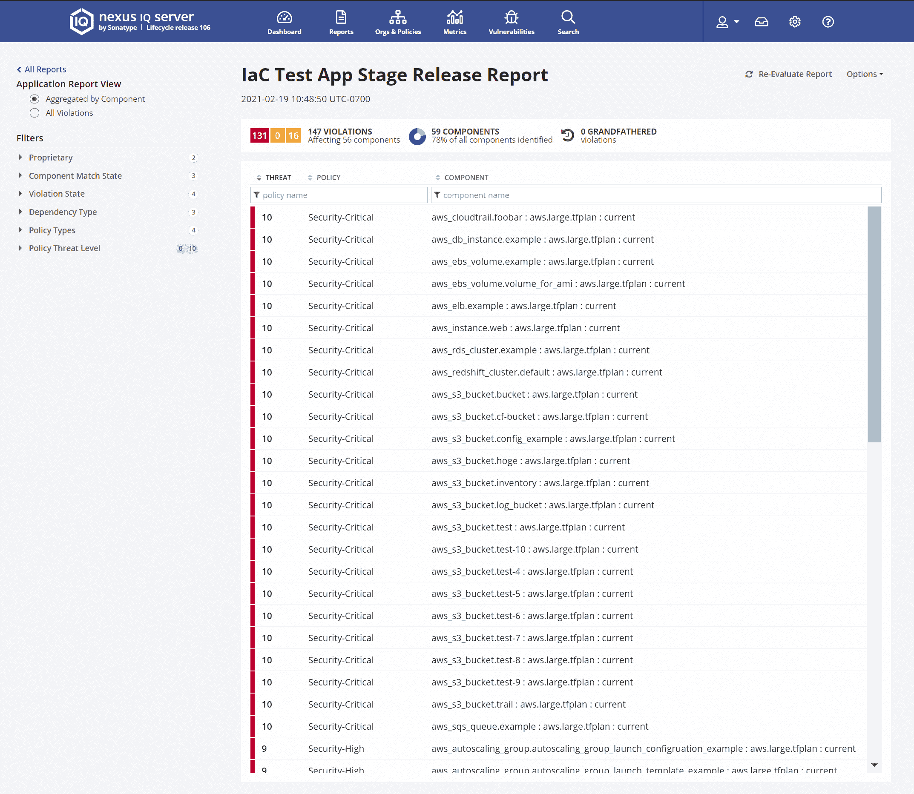

# Sonatype 收购 MuseDev 增加代码分析

> 原文：<https://devops.com/sonatype-acquires-musedev-to-add-code-analysis/>

Sonatype 今天透露，除了更新其 Nexus 平台以发现软件供应链中的漏洞之外，它还收购了 muse dev T1，这是一家提供 T2 代码分析工具 T3 的公司。

Muse 在每次发出 pull 请求时都会分析代码，这使得开发人员在提交代码之前就能更容易地发现和解决问题。Muse 集成了 24 个针对 GitHub、GitLab 和 Bitbucket 存储库的预配置代码分析器。然后，作为自动化代码审查的一部分，它分析每个表面缺陷的拉请求，并包括过程间信息流分析和线程安全问题分析，以及修复任何发现的缺陷的指导。

除了增加对 Muse 的支持，[最新版的 Nexus platform](https://www.globenewswire.com/news-release/2021/03/16/2193834/0/en/Sonatype-Unveils-Full-Spectrum-Software-Supply-Chain-Management-Platform.html) 还集成了 NueVector 的容器防火墙以及一套工具，用于识别和指导如何解决开发人员使用开源 Terraform 软件以编程方式管理基础设施时经常出现的错误配置问题。

最后，Sonatype 添加了一些工具，为各种项目附带的开源许可条款的含义提供更好的指导，同时为从 Bintray 和 JCenter 迁移的组织创建自己的社区，现在这些工具已经过时了。

Sonatype 首席技术官 Brian Fox 表示，希望 Muse 能够创造一个机会，在开发人员分析代码时向他们介绍完整的 DevSecOps 产品组合。大多数开发人员都对优化和保护他们的代码非常感兴趣。Fox 指出，他们更喜欢自己实现目标，而不是在代码提交给由更大的 DevOps 团队管理的存储库后才被告知有问题。

去年，Nexus 平台上增加了一个[高级开发包](https://devops.com/sonatype-advances-open-source-code-quality-and-security/),使得暴露易受威胁的代码中的依赖性变得更加容易。它应用机器和深度学习算法来自动识别和阻止基于域名仿冒和恶意代码注入的软件供应链攻击。福克斯说，总体而言，这些工具使开发者能够控制第三方开放源代码、第一方源代码、基础设施代码和容器化代码。

Sonatype 声称它现在拥有财富 100 强中 70%的客户，并支持着 2000 多个商业工程团队。2020 年，它声称看到了 Nexus repository 安装的 35%的年增长率，现在有近 1500 万开发人员使用了超过 250，000 个实例。

总的来说，还不清楚在采用 DevSecOps 最佳实践方面取得了多少进展。然而索纳塔。正在为将 DevSecOps 工具直接交付给开发人员来解决软件供应链安全问题提供一个案例。在最近一些涉及软件供应链的高调违规事件之后，这种方法可能很快就会获得更多的关注。毕竟，尽管目前应用程序开发团队的领导者提供了各种鼓励，但是没有什么比向开发人员提供一套工具，使他们能够按照自己的方式实现目标，而不是要求他们遵循 DevOps 管理团队规定的一套过程更有效的了。