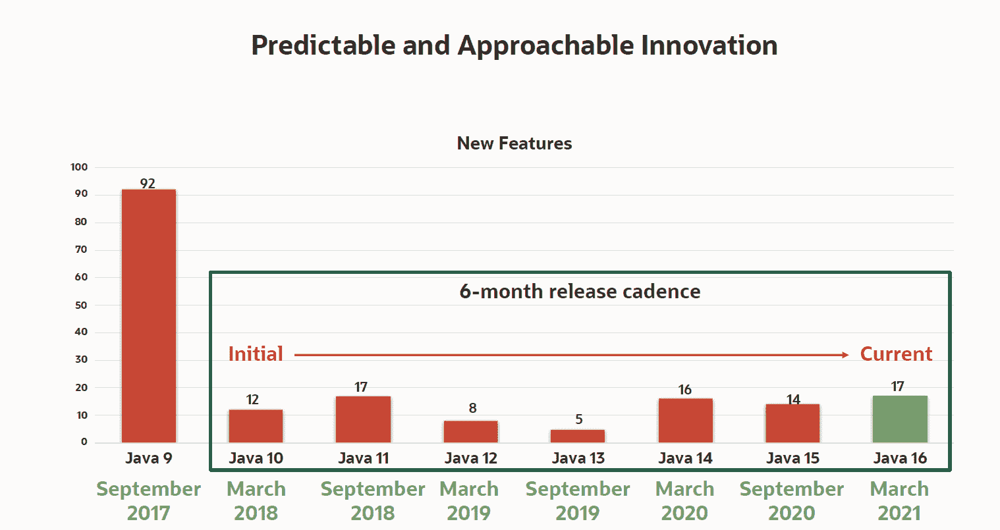

# 甲骨文更新 Java 开发平台

> 原文：<https://devops.com/oracle-updates-java-development-platform/>

甲骨文今天宣布推出 Java 16，它为软件开发套件增加了 17 项增强功能，目前每六个月更新一次。

甲骨文公司负责 Java 平台开发的副总裁 Georges Saab 说，虽然大多数 Java 开发团队仍在使用 Java 8 或更早版本的平台，但预计他们中的许多人将很快向前发展，因为更新将以更小的增量提供，更容易测试和审查。

与此同时，Oracle 承诺提供不会频繁更新的 Java 长期发布版本。虽然有许多组织急于尽快利用新功能，但萨博指出，也有许多组织更重视稳定性而不是创新。

最新版本增加了对实例和记录的最终模式匹配的支持，以及 Java 14 中预览的其他语言增强。萨博表示，开发者还可以使用打包工具来发布自包含的 Java 应用程序，这将使其更容易在现代 it 环境中部署。

现在可用的附加功能包括 Vector 应用程序编程接口(API)、外部链接器 API (JEP 389)和外部内存访问 API，它们都可以在孵化器中使用，以及作为预览版提供的密封类功能。

萨博说，总的来说，许多组织不倾向于更频繁地更新 Java 的主要原因之一是，他们在更高抽象层次上使用 Java 所依赖的框架仍然是针对旧版本优化的。然而，随着 Java 更新以更加模块化的方式交付，这些框架的提供者将更容易跟上步伐。

目前还不清楚 It 团队在多大程度上使用 Java 来构建基于微服务的下一代应用。然而，VMware 最近发布的一项调查发现，95%的受访者已经使用了基于 Java 的开源 Spring 框架来封装应用程序(65%)或计划这样做(30%)。

在最初开发了四分之一个世纪之后，Java 仍然是构建企业应用程序所依赖的主流编程语言。在许多情况下，缺乏为 Kubernetes 平台构建 Java 应用程序的工具是采用云原生平台的一个重要障碍。然而，在过去的六个月中，用于在 Kubernetes 集群上构建和部署 Java 应用程序的工具数量有所增加。

尽管在 Kubernetes 平台上构建和部署应用程序的替代平台越来越多，但重新培训大批 Java 开发人员的意愿却很低。大多数开发人员将依赖他们已经了解的编程工具，尤其是在为企业构建任务关键型应用程序时。这可能意味着这些应用程序中的一些可能不会像它们可能的那样快，但是，考虑到风险的程度，总会有一种倾向于安全而不是遗憾的自然趋势。