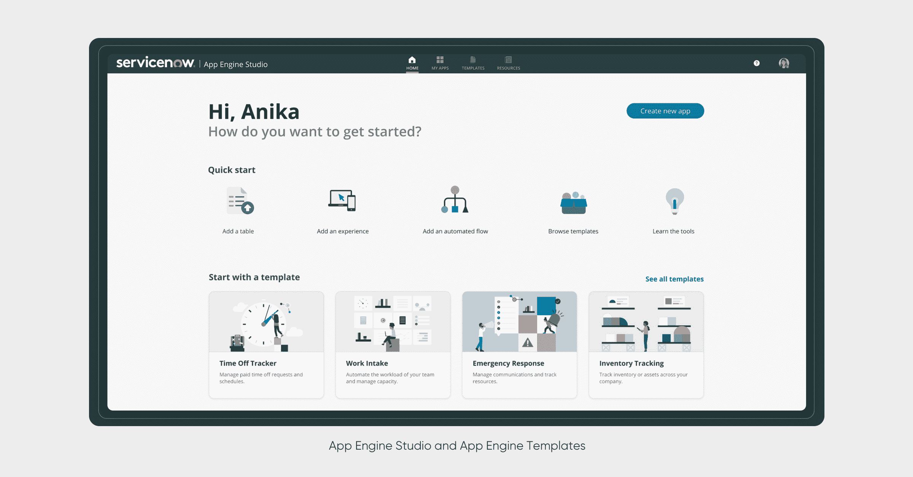

# ServiceNow 向平台添加低代码工具

> 原文：<https://devops.com/servicenow-adds-low-code-tool-to-platform/>

ServiceNow 今天为其 Now 平台提供了一个名为 [Quebec](https://www.servicenow.com/lpwbr/now-platform-quebec-release-countdown--get-ready-to-upgrade-with-ease.html) 的更新，增加了一套低代码应用开发工具。

ServiceNow 的 IntegrationHub 总经理兼平台产品管理副总裁 Marcus Torres 表示，Creator Workflows 工具利用平台中现有的 App Engine 和 IntegrationHub 功能，使最终用户和专业开发人员都可以使用名为 App Engine Studio 的可视化开发工具更快地构建定制应用程序。还包括一组提供一组预构建工作流的模板。

Torres 说，目标是使开发应用程序变得更容易，否则将无法构建这些应用程序，因为使用现有工具的专业开发人员根本没有时间。

魁北克发布的软件即服务(SaaS)平台也用于 IT 运营管理(ITOM)，以 ITOM 预测 AIOps 的形式添加人工智能(AI)功能，在潜在问题变成重大问题之前将其浮出水面。现在也更容易设置 ServiceNow 提供的虚拟代理来启用对话式人工智能，并且现在 ServiceNow 门户中内置了人工智能搜索功能。ServiceNow 通过最近对 Loom Systems 和 Attivio 的收购获得了这些能力。

最后，ServiceNow 增加了流程优化和员工优化模块，以及一个将自助服务功能扩展到第三方门户的参与信使模块，以及一个通用请求工具，该工具使代理能够跨部门协作和转移票证，同时让员工了解其票证的状态。

由于对数字业务转型的普遍热情在新冠肺炎疫情之后加速，对低代码工具构建应用的依赖显著增加。然而，组织遇到的挑战是，低代码工具可以构建相对简单的应用程序。然而，随着应用程序的不断发展，开发手段可能需要下降到更低的抽象层次来解决更复杂的问题。ServiceNow 的 Creator Workflows 工具旨在为开发团队提供这一选项。

总的来说，ServiceNow 正在为在许多 IT 组织已经用来管理 IT 的相同平台上构建应用程序提供理由。许多组织已经利用 ServiceNow 构建的工作流来扩展其核心平台，以解决各种用例，例如人力资源应用程序。低代码工具的添加将使 it 团队更容易创建应用程序来解决他们组织特有的用例。

当然，如今对于低代码和无代码工具来说，并不缺少选择。IT 团队将需要决定在何种程度上特定于平台的低代码工具是有意义的，而不是采用低代码工具来构建可以在任何地方部署的应用程序。然而，不管前进的道路如何，显然需要部署的应用程序的数量正在与日俱增。