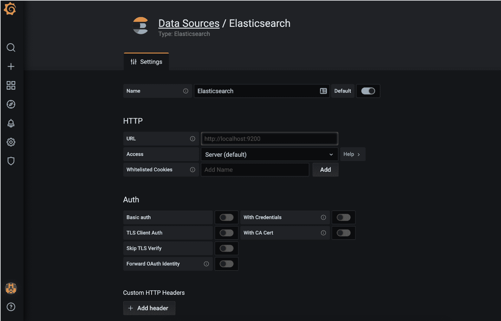

# Grafana 实验室在可观察性方面与 Elastic 保持一致

> 原文：<https://devops.com/grafana-labs-aligns-with-elastic-on-observability/>

Elastic 和 Grafana Labs 已经[联合创建了一个插件](https://www.businesswire.com/news/home/20210304006113/en/Elastic-and-Grafana-Labs-Partner-on-the-Official-Grafana-Elasticsearch-Plugin)，通过这个插件，在 DevOps 工作流中使用 Elasticsearch 的 DevOps 团队将能够调用一个由 Grafana Labs 管理的基于 Prometheus 的监控平台。

Grafana Labs 首席执行官 Raj Dutt 表示，两家公司都在投入工程资源来构建和维护基于开源 Prometheus 软件的服务插件，该插件正迅速成为 DevOps 环境中可观测性的事实标准。Dutt 说，这种扩大使用的主要原因之一是 Grafana Labs 不需要 DevOps 团队将数据移动到中央存储库中进行分析。

Dutt 补充说，总的目标是消除“隧道视野”,这种“隧道视野”是依赖于只可视化一组狭窄指标的工具时产生的。

Grafana Labs 提供的云平台是基于开源的 Grafana 可视化工具。可视化 Elasticsearch 数据的主要工具是基于开源的 Kibana 工具。然而，Grafana 是基于 Kibana 的一个分支，所以这个插件代表了将这两个开源社区拉近的努力。随着合作关系的发展，两家公司计划在包括更多聚合、更广泛的查询语言支持和对节省空间的构造(如汇总)的支持方面进行合作。

Grafana Labs 提供了一个云服务，可以聚合来自部署在集群和服务器上的多个 Prometheus 实例的数据。尤其是 Prometheus，随着组织开始部署同样基于开源软件的 Kubernetes 集群，它获得了很大的吸引力。Kubernetes 和 Prometheus 都是在云计算本地计算基金会(CNCF)的支持下开发的。

一旦 DevOps 团队最初使用 Prometheus 来监控 Kubernetes，他们就会频繁地扩展部署来监控其他平台。这种转变导致许多专有监控工具提供商扩展了他们使用的数据，以包括 Prometheus 在本地捕获的指标。Grafana Labs 声称，它有超过 1000 个客户，包括彭博、摩根大通、易贝、PayPal 和索尼，全球共有超过 65 万个 Grafana 的活跃安装。为 Elasticsearch 支持付费的 Elastic 现有客户包括思科、易贝、高盛、微软、梅奥诊所、美国宇航局、纽约时报、维基百科和威瑞森。

目前还不清楚 Grafana 和 Kibana 有一天最终会在多大程度上重新融合，但很明显这两个项目将会有相当数量的交叉授粉。与此同时，DevOps 团队应该能够选择他们喜欢的开源可视化框架和 Elasticsearch。

从长远来看，很明显，对提供更多上下文的[可观察性](https://devops.com/?s=observability)平台的更高评价将推动企业 it 团队目前所依赖的所有监控工具之间的整合浪潮。作为过渡的一部分，企业 IT 团队甚至可以标准化一套可视化工具，这样就不需要掌握不同的用户界面。毕竟，真正实现可观察性的唯一方法是通过一组工具，使呈现所需的上下文更容易使用。