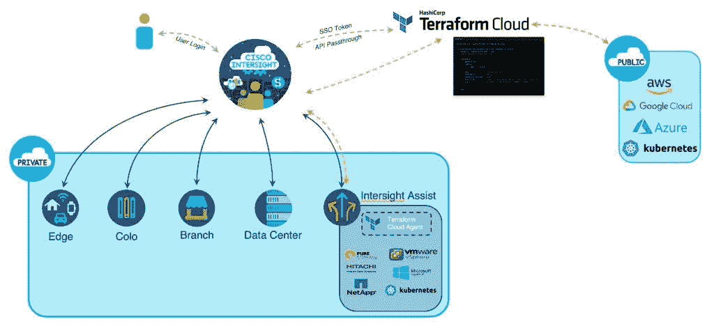

# 思科依靠 HashiCorp 将基础设施作为代码进行管理

> 原文：<https://devops.com/cisco-leans-on-hashicorp-to-manage-infrastructure-as-code/>

HashiCorp 和思科今天宣布推出基于 HashiCorp Terraform 云业务软件的 Terraform 思科 Intersight 服务。

Cisco Intersight 是一个 IT 运营管理平台，支持 IT 团队管理混合云计算环境中的 IT 基础设施。开源 Terraform 工具已经成为在云中以代码形式供应基础设施的主导工具，并且越来越多地出现在内部 IT 环境中。

hashi corp Terraform Cloud Business 是 terra form 的一个实例，它已经扩展到包括企业 IT 组织通常需要的一些附加安全和治理功能。

近年来，随着许多 IT 团队选择将其服务器与其网络设备一起部署，Cisco 已经显著扩大了其在内部 IT 环境中的存在。像所有其他内部 IT 环境提供商一样，思科一直在努力将其管理框架扩展到公共云，以帮助促进混合云计算的发展。

在疫情之前，大多数公共云和内部 IT 环境都是相互隔离管理的。然而，随着疫情带来的经济衰退，越来越多的 IT 团队试图集中管理 IT 平台，作为降低 IT 总成本的持续努力的一部分。与 HashiCorp 的多年联盟填补了思科管理产品组合中的一个主要漏洞，因为 Terraform 日益成为提供 IT 基础设施即代码的事实标准。

思科云和计算软件产品管理负责人 Vijay Venugopal 表示，与 HashiCorp 的联盟将使其有可能在整个管理组合中提供 Terraform 支持，随着时间的推移，这些支持将继续通过添加人工智能(AI)功能的机器学习算法得到增强，也称为 [AIOps](https://devops.com/?s=AIOps) 。Venugopal 补充说，该平台已经被 6，000 家客户用来管理 600，000 多台服务器，主要运行在内部 IT 环境中。

尚不清楚混合云计算控制权之战最终会如何收场。虽然思科等内部平台提供商正在利用现有的管理框架来管理部署在公共云上的工作负载，但这些平台的提供商现在正将其触角伸向内部 IT 环境。当然，思科认为大多数组织更愿意扩展现有框架来实现这一目标，而不是淘汰和替换现有的 IT 基础设施来采用云服务提供商的替代框架。

无论组织最终决定如何在混合云时代管理 it，很明显，借助 Terraform 等工具，开发人员正在对 IT 基础架构进行更直接的控制。将 Terraform 整合到一个更大的 IT 管理框架中，为弥合开发人员和 IT 运营团队之间的鸿沟提供了一个机会，这两个团队过去一直依赖可视化工具来提供基础架构。现在面临的挑战是，随着 IT 环境的管理变得越来越复杂，要找到一种方法让开发人员和 IT 管理员(他们的编程专业知识水平各不相同)更紧密地合作。