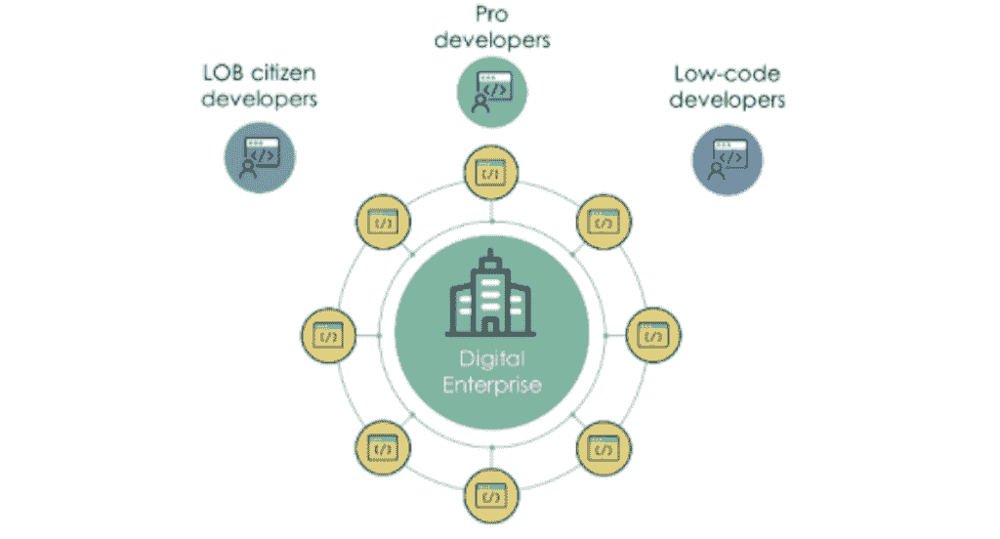
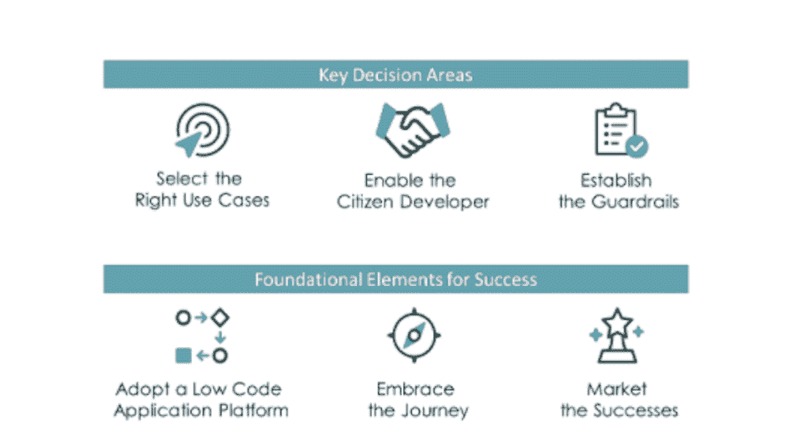

# 公民发展计划:选择正确的用例

> 原文：<https://devops.com/citizen-development-program-selecting-the-right-use-cases/>

新冠肺炎·疫情迫使我们采用新的工作方式，这需要一个真正的数字企业。数字企业要求我们以前所未有的速度为我们的日常任务和流程提供应用。我们的传统开发资源——我们的专业开发人员——以及传统的专业代码开发环境根本无法满足我们业务线的需求。

低代码应用平台的快速采用和使用更容易获得的“低代码开发人员”的能力，通过提高 IT 组织的应用交付速度，部分地缩小了供需差距。但是速度只是战斗的一半。因为我们的应用程序开发团队(pro 和/或 low code)可能太专注于应用程序本身，他们可能不完全理解围绕该应用程序的更大的上下文、他们试图数字化的业务流程或如何与流程所有者联系以获得这种理解。我们在应用交付方面变得更快，但不一定更敏捷。当我们将应用程序开发推到边缘时，真正的业务敏捷性就来了；到我们的业务线，到“[公民开发者](https://devops.com/?s=citizen%20developers)的手中。”

现在，让我们都深吸一口气，暂停片刻，接受公民发展不是满足我们所有数字化需求的灵丹妙药——也不是应用无政府状态的开始。如果组织在三个关键领域做出好的决策:1)为公民发展选择正确的用例；2)扶持和授权我们的公民开发者；以及 3)建立保护我们组织的公民发展护栏。

在探讨关键决策之前，有必要注意一些成功的公民发展项目中一致的要素:

*   **采用低代码应用平台(LCAP)**–lcap 有利于 it 开发人员(专业人员和低代码人员)，但对普通开发人员至关重要。向您的业务线教授 Java 就是所谓的分布式开发模型——这是一篇完全不同的文章。
*   **拥抱旅程**–公民发展计划对 IT 组织和业务部门来说都是一个学习过程。开始时集中精力，从经验中学习，调整方法，扩大范围。
*   **营销成功**—通过向公司讲述成功案例和经验教训来提高对该计划的认识非常重要——要坦诚、清晰。人们对成功的项目感觉良好，并团结在它们周围。

## 为公民发展选择正确的用例

我们希望建立公民开发者和公民开发者计划，以取得成功，这意味着将业务需求与公民开发者技能相匹配。
我们需要回答以下关于业务需求的问题。

*   哪些业务用例非常适合我们的 LCAP？
*   哪些技术要求非常适合我们的 LCAP？哪些技术要求不是？
*   我们企业中的哪些类型的应用程序非常适合公民开发？
*   是否有业务线/部门从授权给公民开发者中比其他人受益更多？
*   是否存在需要解决的特定风险、合规性、安全性和法律( [RSCL](https://en.wikipedia.org/wiki/Regulatory_compliance) )要求？
*   对于某些用例，是否需要考虑其他核心企业系统？
*   是否有遗留技术和/或技术债务应该成为目标？
*   潜在的投资回报是什么？我们多快能开始实现投资回报？

这些问题的答案不是二进制的。这些问题，以及其他每个公司特有的问题，提供了一个过滤器来审查——并可能评分——用例，以确定是否适合公民发展计划。

与选择正确的用例同样重要的是找到正确的公民开发者。我们需要回答以下关于任何潜在公民开发者的问题。

*   我们会有不同类别的分布式/市民开发者吗？这些类别是否基于技能水平、组织和/或访问权限？
*   我们是否已经确定了一个好公民开发者的资质和态度特征？
*   我们将如何招募和激励开发人员加入该计划？
*   我们对 citizen developer 经理的价值主张是什么？为什么他们会支持分配部分资源来构建应用程序？

在公民开发项目的早期阶段，最成功的项目倾向于优先考虑合适的开发人员而不是合适的用例。与尝试“高价值”用例的“低适应”开发人员相比，“高适应”开发人员交付“中等价值”用例是更好的选择。早期胜利很重要。

在本系列的第二部分中，我们将探索如何支持和授权我们的公民开发者。我们现在已经确定了正确的用例以及正确的公民开发者，所以让我们为他们的成功做好准备。

* * *

本文是三部分系列文章的第一部分，提供了关于从公民发展计划中传递商业价值的真实见解。