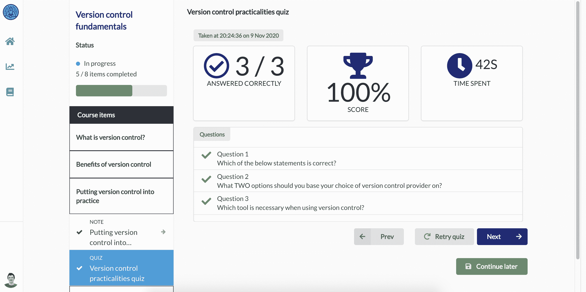

# Salesforce 开发人员的开发运维技能不断提高

> 原文：<https://devops.com/survey-shows-increased-devops-skills-among-salesforce-developers/>

在最近由 Gearset 主办的在线[Salesforce devo PS 未来峰会](https://gearset.com/summit-2021/)的 521 名与会者的[调查](https://gearset.com/assets/newsroom/press-releases/salesforce-devops-survey-2021.pdf)中，Gearset 是一家为 sales force 开发人员提供[持续集成/持续交付](https://devops.com/?s=CI%2FCD) (CI/CD)平台的供应商，调查发现不到一半(47%)的受访者现在每周至少发布软件多次，另有 29%的人每周或每两周发布软件一次。

超过一半的受访者(52%)还指出，他们现在可以在不到一小时的时间内部署软件。

Gearset 首席执行官 Kevin Boyle 表示，该调查表明，在 Salesforce 软件即服务(SaaS)平台上构建应用程序的开发人员的 DevOps 成熟度水平正在迅速提高。在新冠肺炎疫情之后，许多组织采用 SaaS 平台来加速他们的数字业务转型计划，而不是从头开始构建整个应用程序。

然而，调查受访者提到的最大好处不是更快发布应用程序的能力，而是应用程序质量的提高(77%)，其次是生产力的提高(69%)和协作的增强(46%)。列举的其他好处包括自动化降低了复杂性；敏捷性提高；更可靠的版本，节省时间和成本。

总体而言，调查发现源代码控制、CI/CD、单元测试、变更监控以及元数据和数据备份是已采用的最广泛实施的 DevOps 功能。在接下来的 12 个月中，受调查者采用最多的功能包括 CI/CD、静态代码分析和沙盒数据播种。

调查受访者表示，他们采用 DevOps 的最大障碍是启动时间，其次是采用源代码控制的困难和感觉到的陡峭的学习曲线。Boyle 指出，对于许多采用 Salesforce 的组织来说，采用 DevOps 最佳实践时的威胁因素仍然相当高。

最近，Gearset 增加了一个免费的培训平台，称为 [DevOps Launchpad](https://gearset.com/assets/newsroom/press-releases/devops-launchpad.pdf) ，它采用游戏化技术，使开发者更容易获得 DevOps。涵盖的主题包括版本控制基础知识、Git 分支策略和 Salesforce 备份。

Gearset 的客户包括 McKesson、Zillow、Traction on Demand、Intercom、Accenture、IBM 和 Johnson & Johnson。目前还不清楚小公司对 DevOps 的欣赏程度有多高。但是，随着作为 Salesforce 平台扩展部署的自定义应用程序数量的增加，显然用于构建和部署应用程序的手动流程将无法扩展。Salesforce 平台本身是使用一组对象和表独特构建的，这些对象和表通常会引导组织采用为该环境构建的 DevOps 平台。但是，可以使用 DevOps 平台来构建和部署应用程序，该平台是为构建和部署可能需要跨多个平台的应用程序而设计的。这些应用程序将在应用程序编程接口(API)级别与 Salesforce 平台集成。

不管定制应用程序是如何构建和部署的，很明显 Salesforce 平台正在企业 it 环境中得到更广泛的应用。每个 DevOps 团队都需要确定如何在其整体 DevOps 战略的背景下最好地集成这些平台。