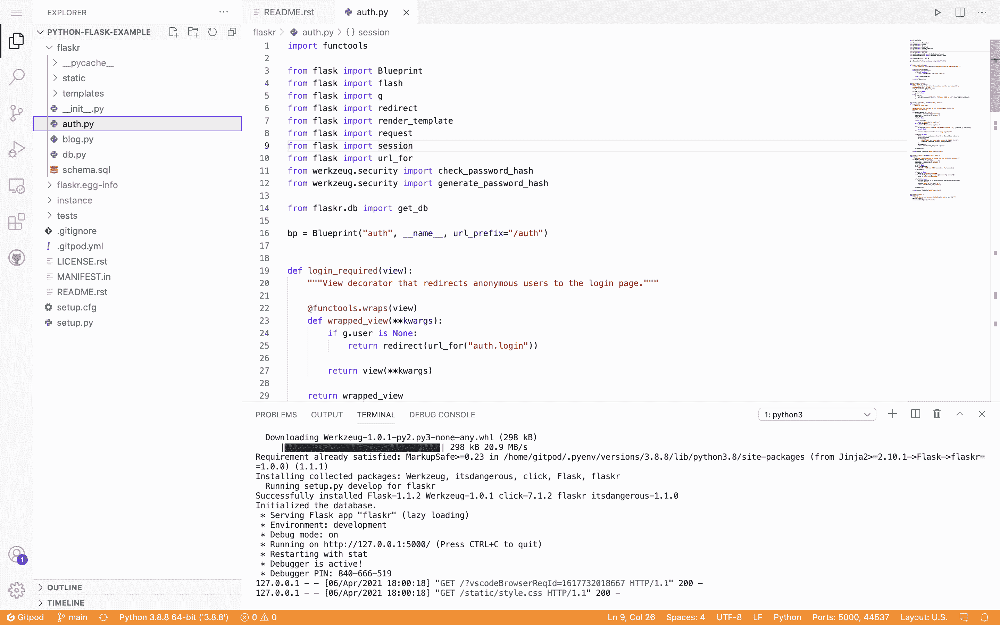

# Gitpod 改进开发自动化工具

> 原文：<https://devops.com/gitpod-revamps-dev-automation-tool/>

Gitpod 今天宣布，除了让 Microsoft VS Code 成为其编辑代码的默认工具之外，它还为其同名开源工具更新了仪表板，用于自动化开发环境的部署。

此外，Gitpod 还支持 sudo 特权和 Docker 映像，使用一个高级用户名称空间来映射和限制对工作负载的访问，使用一个内置的 Supervisor 功能。

Gitpod 首席执行官 Sven Efftinge 刚刚筹集了 1300 万美元的额外资金，他说，现在很明显，在可预见的未来，开发人员将在任何地方工作，对一种工具的需求变得更加明显，这种工具可以在办公室以外的本地机器上自动设置开发人员环境。

Gitpod 声称，现在有超过 350，000 名开发人员使用其工具，该工具在每台开发人员机器上创建一个 Kubernetes pod，以部署一个完整的应用程序开发环境，包括[集成开发环境](https://devops.com/?s=IDE) (IDE)、插件、编译器、构建工具、代码生成器、数据库和应用程序服务器。Gitpod [利用持续集成/持续交付(CI/CD)平台中提供的版本控制系统](https://devops.com/gitpod-allies-with-gitlab-to-automate-setting-up-dev-environments/)作为配置应用程序开发环境的唯一来源。

总体目标是消除开发人员设置应用程序开发环境的时间浪费，以便他们可以在自己的机器上编写代码。这种方法还使得开发人员可以更容易地在同一个应用程序开发环境中协作，而不管他们的物理位置在哪里。

Efftinge 表示，Gitpod 为 DevOps 团队提供了一个工具，可以跨任何 Git 存储库自动设置开发环境，相当于 GitHub 最近推出的 Codespaces 工具。Efftinge 指出，大多数开发人员从事的项目跨越了多种类型的存储库，而不是只拥有一个存储库的能力。

这个过程的自动化也使得开发环境与生产环境的协调变得更加简单。代码在第一次部署时不能在生产环境中工作的原因之一是，本地开发环境是以不能准确反映生产环境的方式手动配置的。当开发人员在多个项目上工作时，这个问题会变得更加棘手，例如，涉及使用不同存储库构建的独立微服务。

随着新冠肺炎疫情和多个数字业务转型计划的加速，人们自然更加关注自动化和开发人员的工作效率。在可预见的未来，大多数开发人员将在办公室外工作。当然，大多数开发人员多年来一直在办公室外编写代码。现在的挑战是让开发团队尽可能高效地开发应用程序，无论他们身在何处。事实上，现在开发团队已经变得更加分散，无论在哪里找到开发人员，组织都更愿意雇佣他们。

当然，消除低效的手动任务，例如维护开发环境，将是使那些开发人员有可能在没有亲自见过他们的同事的情况下，随着时间的推移，导航多个应用程序开发项目的先决条件。