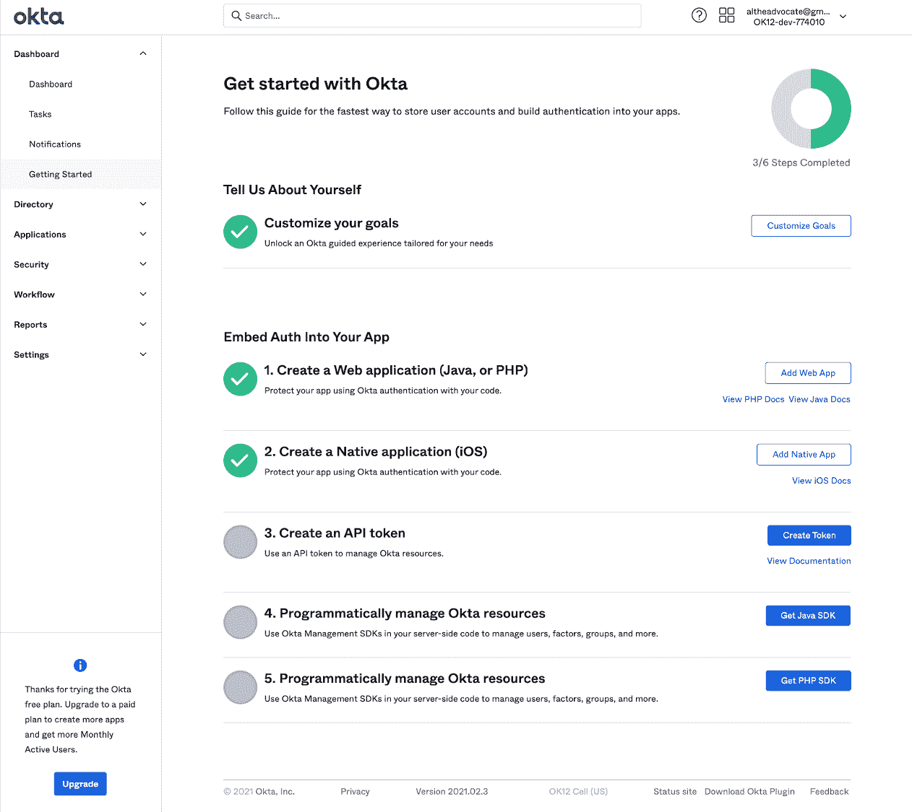

# Okta 为 AppSec 服务添加免费开发者版

> 原文：<https://devops.com/okta-adds-free-developer-edition-to-appsec-service/>

Okta 本周降低了采用 DevSecOps 最佳实践的门槛，推出了一款[Okta Starter Developer Edition](https://www.businesswire.com/news/home/20210406005365/en/The-New-Okta-Developer-Experience-Secure-Applications-APIs-and-Infrastructure)，使开发人员能够将 Okta 认证、授权和用户管理功能免费嵌入到应用程序中，每月活跃用户可达 15，000 人。

Okta 的开发者权益负责人 Randall Degges 表示，开发人员对身份管理的兴趣正在上升，这是一种实现零信任倡议的方法，可以更好地保护应用程序环境。Degges 指出，Okta 不需要嵌入和维护身份验证和授权本身，而是让开发人员调用应用编程接口(API)来访问按需提供这些功能的服务。

Degges 说，Okta Starter Developer Edition 是在一次在线活动中宣布的，它减少了开发人员在寻求将身份管理功能(如多因素身份验证)嵌入他们的应用程序时遇到的摩擦。例如，开发人员可以访问增强的文档和示例应用程序，以及与 Kong、Heroku 和 Terraform 平台和工具的新集成，以及与多个持续集成和持续交付(CI/CD)平台的集成。

Degges 说，总的来说，将责任转移给开发人员的速度要快得多，因为开发人员对安全性的重视程度现在要高得多。Degges 指出，身份管理功能只是开发人员现在可以作为 DevOps 工作流的一部分调用的另一个 API。

Okta Starter Developer Edition 紧随[宣布收购 Auth0](https://securityboulevard.com/2021/03/okta-acquisition-of-auth0-signals-devsecops-shift-left/) 之后，auth 0 是一家认证和授权服务提供商，可以轻松嵌入到应用程序中。然而，这笔 65 亿美元的交易预计要到夏天才能完成。

与此同时，Okta 正在推进 Okta Starter Developer Edition，最终可能会创建一个大型应用程序池，随着应用程序规模的扩大，有一天这些应用程序将付费使用 Okta 服务。一个组织部署的应用程序越多，每月的活跃用户就越有可能超过 15，000 人。

与此同时，涉及数字业务转型计划的实验水平可能会提高。开发人员将能够向他们通常持怀疑态度的网络安全同行证明，在应用程序部署到生产环境之前，他们的问题已经得到解决。

尚不清楚访问最初免费的身份管理服务可能会对采用 DevSecOps 最佳实践产生什么影响。在许多情况下，开发人员会利用 Okta 这样的服务来满足需求。他们对该服务如何适应更大的 DevSecOps 工作流的评价可能不是很高。

尽管如此，应用程序的安全状况在未来的几个月和几年里应该会有所改善。事实上，一些开发人员可能会选择更新目前不满足零信任要求的现有应用程序，以利用可通过 API 调用的身份管理服务。或者，也可以决定用调用服务的 API 来替换对他们来说难以维护和更新的身份验证功能。不管前进的道路如何，开发人员和网络安全团队之间的历史性分歧似乎最终正在缩小。