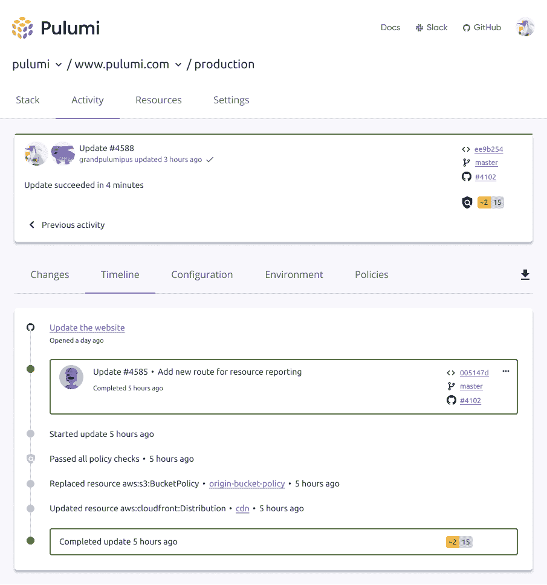

# Pulumi 转向自动化云基础架构供应

> 原文：<https://devops.com/pulumi-moves-to-automate-cloud-infrastructure-provisioning/>

Pulumi 今天宣布，它正在扩大其自动化雄心的范围，以便更容易安全地提供云基础设施即代码。

Pulumi 首席执行官 Joe Duffy 表示，[云工程平台](https://www.businesswire.com/news/home/20210420005463/en/)使 DevOps 团队能够使用 Pulumi 包来创建可重用的组件，以自动化 IT 基础架构供应，这种方式可以嵌入到使用 Pulumi 公开的应用程序编程接口(API)的工作流和应用程序中。Duffy 指出，IT 团队可以用他们选择的编程语言定义一个 Pulumi 包。

云工程平台现在通常在微软 Azure cloud 上提供，而预览版则在谷歌云平台上提供。对亚马逊网络服务(AWS)的支持计划在今年晚些时候推出。

该平台本身基于 Pulumi 3.0 版，这是一个开源工具，开发人员以前使用它来管理基础设施代码。Pulumi 还提供了一个工具，可以将其工具与十几个持续集成/持续交付( [CI/ CD](https://devops.com/?s=CI%2FCD) )平台集成。

Duffy 说，这种能力，加上对集成测试能力和基于身份管理代码合规性的工具的现有支持，为 IT 团队提供了一种更全面的方法来管理代码基础设施。

如今，大多数云资源都是由开发人员使用开源工具(如 Terraform)直接提供的。组织遇到的问题是，开发人员容易犯配置错误，然后被网络犯罪分子利用。Pulumi 提出了一种替代方法来提供基础设施即代码，这种方法可以更容易地使用测试工具验证配置，同时通过包括对安全访问标记语言(SAML)和单点登录(SSO)功能的支持来限制谁可以访问基础设施资源。

尚不清楚企业 It 组织将以何种速度转向能够以更强大的方式将基础架构作为代码进行管理的平台。对于云安全问题并不十分了解的开发人员通常会使用 Terraform 等工具，在很少甚至没有监管的情况下提供基础设施即代码。云资源错误配置通常会导致端口大开，网络犯罪分子现在利用工具来扫描这些类型的错误配置。

Duffy 指出，Pulumi Packages 为 IT 团队提供了一种对供应过程进行更多控制的方式，使用经过审查的可重用组件，而不会影响开发人员加速云资源的速度。

随着组织在最近一些高调的违规事件后更加关注软件供应链，出现更多关于如何调配云基础架构的问题只是时间问题。组织对云安全的许多担忧并不源于平台本身。相反，正是在共享云安全责任模式下调配基础架构所采用的流程导致了如此多的漏洞。许多开发人员认为云服务提供商正在保护配置，但后来发现验证这些配置是他们的责任。与此同时，安全团队无法跟上云基础架构资源调配的速度。

希望有一天，DevSecOps 最佳实践能够利用自动化一劳永逸地解决这个问题。挑战在于以一种普通开发人员能够接受和接受的方式找到实现该目标的最佳方式。