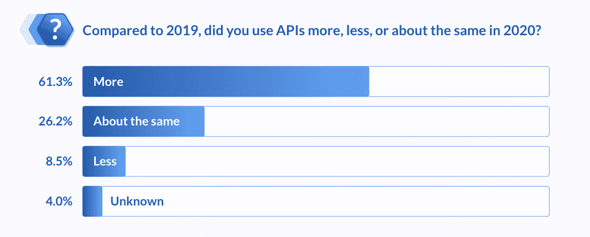
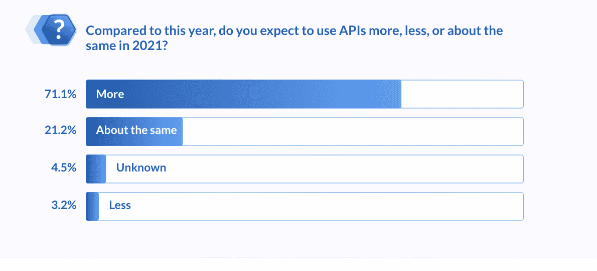

# RapidAPI 筹集 6000 万美元支持领先 API 平台的开发者成长和燃料扩张

> 原文：<https://devops.com/rapidapi-raises-60m-to-support-developer-growth-and-fuel-expansion-of-leading-api-platform/>

随着 API 优先的数字化转型成为所有行业的首要举措，新的融资支持公司加速增长

旧金山——2021 年 4 月 21 日—[RapidAPI](https://rapidapi.com/),一个让开发者和企业能够找到、连接和管理成千上万个 API 的下一代 API 平台，今天宣布它已经在 C 轮融资中筹集了 6000 万美元。此次融资由 Green Bay Ventures 牵头，包括新投资者 Stripes。现有投资者包括 Andreessen Horowitz、DNS Capital、M12(微软的风险基金)、Viola Growth 和 Grove Ventures，为 RapidAPI 筹集的资金总额达到 1.225 亿美元。

 **这笔投资是在 RapidAPI 高速增长的一年之后进行的，疫情推动了创纪录数量的开发者和公司使用 RapidAPI 平台来推进他们的数字计划，并加快他们的软件和服务向市场的交付。

**在 API 爆炸式增长、API 项目联盟、云计划加速以及微服务推动的推动下，企业纷纷转向 RapidAPI 来实现基础设施的现代化，以便在当今数字化破坏的环境中保持竞争力。**

****最近的融资将用于支持新开发人员涌入平台、领先的 API 提供商加入公共市场以及 API 平台的扩展，包括 [RapidAPI 的企业中心](https://rapidapi.com/enterprise)以服务于快速增长的企业客户群。****

******RapidAPI 创始人兼首席执行官 Iddo Gino 表示:“随着 API 成为所有行业数字化转型工作的基石，我们已经看到了向 RapidAPI 等 API 平台和工具的根本转变，这些平台和工具旨在应对当今复杂、多云、多服务和多 API 环境的现实。“RapidAPI 的下一代平台专为现代软件开发而构建，在整个开发生命周期中提供统一的体验，允许数百万开发人员连接数千个 API 和微服务。”******

******Gino 补充道:“在过去的一年中，我们在我们的平台上进行了大量投资，通过 2 月份收购 Paw 增加了 API 测试和 API 设计。额外的资金将使我们能够继续构建一个灵活的 API 平台，该平台具有所需的特性和功能，为开发人员和组织提供一个与组织现有软件开发环境相集成的灵活平台，使其更容易找到、连接和管理 API。”******

******开发人员采用、产品创新和企业牵引的一年******

******最近的报告，包括第二次年度 [RapidAPI 开发者调查报告](https://rapidapi.com/developer-survey/)，表明开发者对 API 的依赖在疫情期间加速，并将在 2021 年继续增加。事实上，根据调查，61%的开发人员在 2020 年使用的 API 比 2019 年更多，71%的人计划今年使用更多。******

************

****************

****这一趋势在 RapidAPI 平台的使用中也很明显。在过去的 12 个月里，RapidAPI 在其平台上经历了显著的增长。RapidAPI 在市场上拥有近 300 万名开发人员，在这一年中增加了超过 75 万名新开发人员。此外，现在市场上有超过 35，000 个 API，比去年同期翻了一番。RapidAPI 继续每月添加 1，000 多个新 API，提供来自供应商的 API，包括 Microsoft、IBM、Twilio、SendGrid、Nexmo、Crunchbase 等。****

****2020 年，付费 API 订阅量也在增加，该平台新增了 12，000 名 API 订阅用户。另一个显著增长的领域是团队的 [RapidAPI。RapidAPI for Teams 使开发人员能够创建一个私有工作空间，以便在团队内部共享和协作内部 API 和微服务。今天，RapidAPI 上有超过 55，000 个团队。](https://rapidapi.com/teams)****

****RapidAPI 还发现使用 RapidAPI Enterprise Hub 的企业数量有所增加，RapidAPI Enterprise Hub 是其市场的白标版本，使开发团队、合作伙伴和客户能够发现并连接到内部 API 和外部 API 订阅。在过去的一年里，RapidAPI 使使用 RapidAPI 平台的公司数量增加了一倍多，包括金融服务、保险、电信和酒店行业的财富 500 强企业。****

****最后，该公司扩展了其 API 平台，添加了大量来自网关集成的新功能和特性，以支持 Kafka 等新型 API 和新产品，如 Paw 的 [RapidAPI Testing](https://rapidapi.com/products/api-testing/) 和[RapidAPI Design](https://rapidapi.com/products/api-design/)，****

****快速通过数字****

*   ****300 万开发者已经注册了 RapidAPI 市场****

*   ****目前市场上有超过 35，000 种 API，每周都会增加 X 种。****

*   ****万亿以上的 API 调用通过市场****

*   ****企业客户数量翻了一番:RapidAPI 企业客户包括金融服务、电信、制造和酒店行业的财富 500 强客户****

*   ****筹集了 6000 万美元的 C 轮融资****

*   ****迄今已筹集 1.225 亿美元****

****了解更多信息****

*   ****Iddo Gino 的头像、团队照片和其他支持该公告的视觉材料可在此处获得。****

*   ****阅读更多信息 [RapidAPI 企业中心](https://rapidapi.com/products/enterprise-hub/)****

*   ****查看 [RapidAPI 开发者调查](https://rapidapi.com/developer-survey/)****

*   ****注册参加我们最近的网络研讨会:选择 API Hub 而不是开发者门户的八大理由。****

****关于 RapidAPI****

****RapidAPI 是世界上最大的 API 市场，数百万开发人员使用它来查找、测试和连接数千个 API——所有这些都只需一个帐户、API 密钥和 SDK。对于企业组织，RapidAPI 提供了 [RapidAPI Enterprise Hub](https://cts.businesswire.com/ct/CT?id=smartlink&url=https%3A%2F%2Frapidapi.com%2Fenterprise&esheet=52345350&newsitemid=20201209005371&lan=en-US&anchor=RapidAPI+Enterprise+Hub&index=7&md5=b46bc9d0879988ef537220e2cd80f28c) ，这是一个市场的白标版本，使公司的开发人员、客户和合作伙伴能够找到、管理和连接数百个内部 API 以及外部 API 订阅。******