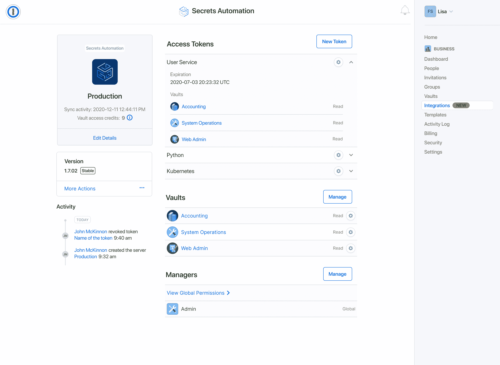

# 1Password 扩展了加密功能，实现了机密管理的自动化

> 原文：<https://devops.com/1password-extends-encryption-to-automate-secrets-management/>

1Password 本周在其产品中添加了一个 [Secrets Automation](https://www.prnewswire.com/news-releases/1password-launches-secrets-automation-and-makes-acquisition-to-protect-infrastructure-secrets-301267859.html) 平台，使 IT 组织能够更轻松地加密、管理和编排凭据、应用编程接口(API)令牌、密钥和证书。

此外，该公司透露，它已经收购了 SecretHub，一个单独的秘密管理工具的提供商。收购条款没有披露。

1Password 的高级产品经理卡森·布朗(Carson Brown)表示，SecretHub 团队现在将专注于开发 1Password Secrets 自动化平台，该平台基于 1Password 之前开发的加密技术。

最后，1Password 本周还宣布了与 GitHub 的联盟，在未来的某一天，它将使 DevOps 团队能够使用 SecretsHub 来加密用于访问源代码库的秘密。1 除了用 Go、Node 和 Python 编写的客户端库之外，Password 已经提供了与 HashiCorp Vault、Terraform、Kubernetes 和 Ansible 的集成。

1 用于管理和保护密码的 Password 平台已经被全球 80，000 多家企业使用。Brown 说，Secrets Automation 平台现在将公司的核心加密技术延伸到了最佳实践领域。

现在仍然处于 DevSecOps 最佳实践采用周期的早期，但是很明显最初的焦点将是秘密管理。在最近涉及软件供应链的高调违规事件之后，现在对秘密管理的审查越来越多。网络罪犯越来越擅长扫描暴露为纯文本的秘密。组织面临的挑战是，开发人员在构建应用程序时，倾向于为了方便而复制机密，在应用程序部署到生产环境后，他们经常忘记删除这些机密。

作为回应，许多 IT 团队在过度限制和过度宽松的访问控制之间摇摆不定，这些访问控制很少得到一致的实施。

布朗指出，当然，现在审计人员开始将所有这些未加密的机密列为违规也只是时间问题。Brown 指出，一套基于秘密自动加密的 DevSecOps 最佳实践以一种对应用程序开发人员透明的方式消除了这些合规性顾虑。

目前还不清楚是由 DevOps 团队来领导自动加密秘密，还是由网络安全团队来领导。无论哪个团队承担责任，随着平台数量的增加，需要跟踪的秘密数量会不断增加。手动跟踪所有这些秘密不再可行。Brown 说，集中机密管理是重新控制 IT 环境的第一步。

当组织开始他们的开发合作之旅时，秘密管理可能并不总是首先想到的。然而，事实证明，随着高级业务和 it 领导审查他们的整个软件供应链，保护机密很可能成为首要任务。毕竟，一旦组织对软件的依赖性变得明显，他们很快就会意识到他们的知识产权中有多少是一个被窃取的凭据。