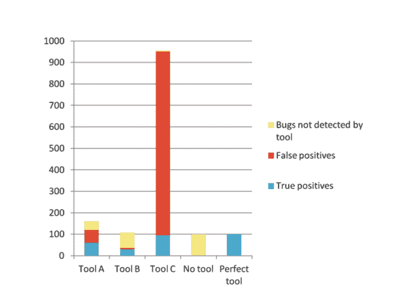

# 防止误报使左移位脱轨

> 原文：<https://devops.com/prevent-false-positives-from-derailing-shift-left/>

静态应用安全测试(SAST)工具旨在平衡误报(不正确的警告)和漏报(遗漏的漏洞)，这主要是因为更深入的分析需要更多的时间和计算资源。这两者在面临越来越短的产品交付里程碑任务的开发人员中是短缺的。

因此，虽然 SAST 供应商认为真正的肯定是对真正缺陷的正确检测，而假肯定是对不存在的错误的警告，但这很少被开发人员使用。对他们来说，真正重要的是 SAST 工具的输出是否有用和可行。例如，根据缺陷的性质、用户的角色、应用程序运行的平台和部署的环境，开发人员对 SAST 扫描结果的解释有很大的差异。

例如，[缓冲区溢出](https://securityboulevard.com/?s=buffer+overrun)的真实肯定结果，从安全角度来看，这是最臭名昭著的 C/C++缺陷之一。在应用程序开发的早期阶段，修改代码来修复这样的错误几乎总是有意义的。无论如何，开发人员正在积极地修改代码，所以修复代码几乎不会带来额外的开销。然而，如果在应用程序部署之后发现了相同的缺陷，那么就很难决定它是否值得修复。

这是因为修复一个真正的 bug 的成本可能会超过修复它的收益，而“纠正”一个误报的收益可能会超过不去管它的成本。由于只能依靠 SAST 工具给出狭隘的技术答案，人类必须解释并确定应该对哪些静态分析结果采取行动。

考虑下图中不同 SAST 工具的假设比较。工具 A 具有良好的召回率(即，识别真实缺陷的能力)和精确度(即，排除假阳性的能力)，这导致找到许多具有合理数量的假阳性的真实缺陷。工具 B 精度高但召回率差，导致误报率低但漏报率较高(未检测到的安全漏洞)。工具 C 精度差，但召回率高，导致检测到所有可能的错误，但也有非常多的误报。

假想 SAST 工具的召回率和精确度的比较。

开发人员讨厌误报，因为它们引入了不必要的工作和延迟。这进而对工具的设计、配置和使用方式产生了不成比例的影响。如果在报告 40 个实际缺陷和 10 个误报的工具 A 和报告 50 个实际缺陷但有 50 个误报的工具 B 之间进行选择，用户几乎总是更喜欢前者，即使它发现的实际缺陷更少。这是完全可以理解的——用户被要求权衡直接的具体负面影响(花在查看误报上的时间)和无形的潜在未来正面影响(可能不会出现的漏洞)。

然而，如果将更早发现这 10 个错误(即通过避免成品中昂贵和潜在危险的错误)所节省的时间和风险与评估额外的 40 个警告为假阳性所需的时间相抵消，那么很快就会发现配置 B 更经济。对于通过测试的安全漏洞来说尤其如此，这可能会产生昂贵的后果。

由于 DevOps 管道中的警告数量可能会阻碍最大限度地利用 SAST 工具，尤其是在项目早期，当它提供最大好处时，组织应该考虑以下技术来增加开发人员对警告的关注:

*   **过滤和关注:**解析从工具界面查看的数据，关注对项目最重要的内容，并指派开发人员按优先级顺序修复关键问题。
*   **标记并延迟:**降低优先级，或者将状态更改为“稍后”，例如，基于一些对项目不太重要的条件的所有警告或警告的子集。
*   **止血:**使用上面的技术暂时推迟现有的警告，重点是修复代码变更或新代码开发时引入的新缺陷。

尽管它总是会产生一些误报，但 SAST 通过确保在编写代码时消除安全和编程漏洞，而不是在测试阶段(修复这些漏洞的成本要高得多)来帮助将安全性进一步左移。过滤和区分警告的优先级是两种有效的技术，可以确保开发人员不会把婴儿和洗澡水一起倒掉。