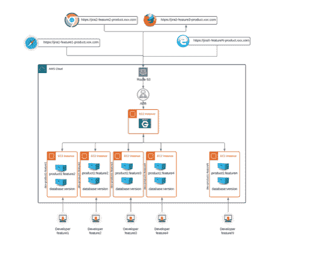
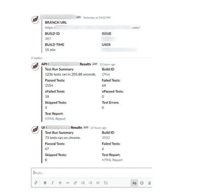
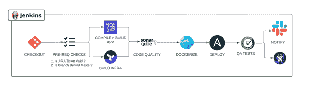
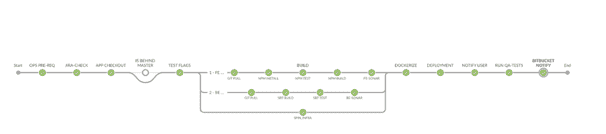
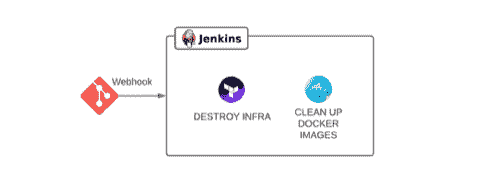

# 实现随需应变的特征环境

> 原文：<https://devops.com/implementing-an-on-demand-feature-environment/>

不久前，LeanTaas 的开发人员实现了一个随需应变的特性环境。这是支持更快上市战略的协作努力的结果。迁移到随需应变的特性环境会为组织带来更大的灵活性、有效性、质量和更好的底线。通过仔细的实现，任何开发团队都可以从这个练习中受益。

有了随需应变的特性环境，您可以轻松地测试特定的特性，而不会中断已经在进行的开发活动。设置环境可以提供几个好处，并增强产品发布的整体效果。在这里，我们将通过我们采取的步骤来实现这一点。

首先，我们决定在我们的开发实践中提出一些标准和变化:

### 命名规格

每个 Git 分支名称都应该以相关的吉拉票证开头，并包含该分支用途的详细信息。我们用环境 URL、自动化 QA 测试结果和产品经理评论更新了吉拉票证。

**语法:**

| ***<JIRA _ 机票> - <简称 _ 标题> - <产品 _ 名称>。<域名>。com*** |

例如，**LT-123-demo-product1.xxxx.com**

在这种情况下， **LT-123** 是吉拉票， **demo** 是简称， **product1** 是产品名， **xxxx** 是域名。因此，我们的特性分支 URL 将可以在**https://lt-123-demo.product1.xxxx.com、**访问，内部名称将是 **dev-product1-lt-123-demo、**，开发人员可以使用它来 ssh 和调试问题(如果有的话)，并在他们检查日志时引用(如果必要的话)。

此外，遵循固定的命名模式有助于我们在面向前端的服务器环境(我们使用 NginX)中编写正则表达式，这有助于将请求代理/路由到部署在 AWS EC2 实例中的各个特定于功能的运行时环境。

如果你使用 NginX，你可以使用下面的 **regex** 来实现:

| 服务器名~^(？<featurebranch>。+)\-product1\。xxxx\。com $；</featurebranch>设置$featurebranch 开发-产品 1-$featurebranchproxy _ pass https://$ feature branch； |

### 数据和微服务依赖性

为了让环境在它自己的隔离状态下工作，它需要一个数据集存储在它自己的数据库中。因此，我们的团队提出了一个自动化脚本，用于生成该要素实例所需的匿名样本数据集。我们将这些数据以及其他所需的工件打包成特定产品的[金色亚马逊机器映像(AMI)](https://github.com/aws-samples/aws-golden-ami-pipeline-sample) 。为了便于引用，我们将这个自定义 AMI ID 存储在 AWS 系统管理器(SSM)参数存储中，以便我们的 Terraform 脚本在生成 EC2 实例时可以使用这个引用。

一旦特定于功能的实例出现，我们意识到它不能与我们的其他微服务(如身份验证、授权或通知)很好地配合。他们无法区分真实的产品实例和短暂的特定功能实例。因此，我们必须在我们的内部请求中添加一个额外的头，并增强这些其他微服务，使其能够意识到这个额外的头，以便它们能够准确地响应特定于功能的实例。谈到消息服务的使用，每个特性分支都有自己的 SQS 队列，它遵循内部主机名的相同命名约定。平台服务依赖于相同的标准来确保这些功能分支无缝工作。

### 自动化/手动质量检查和预防性维护审查

现在，特定于特性的实例已经在它自己的隔离环境中运行，并且有了自己的数据集，它为 QA 团队和 PM 团队提供了一个功能齐全的平台，可以以隔离的方式广泛测试新特性。有了这个游乐场，我们的生产力就有了改变。它有助于并行化迭代周期。每个特性都开始得到自己的反馈，并朝着终点前进；基本上是在自己的泳道游泳。

### 成本考虑

到目前为止，一切顺利。特定于功能的应用程序实例已经启动并运行，开发迭代正在进行。但是这些实例的寿命有多长？我们不想让他们永远跑下去；我们还想考虑这样一个事实，即并不是每个新特性最终都会发布。那么，我们如何处理这种情况呢？我们希望将这些实例终止操作无缝地连接到开发人员的工作流中。我们是这样解决这个问题的:

*   删除功能分支本身后，立即删除与功能分支相关的基础架构。
*   通过结合使用 AWS Cloud Watch 事件和 Lambda，每天晚上停止 EC2 实例，每天早上启动它们。
*   自动删除活动时间超过七天的要素分支。我们后来提供了一个额外的特性；跳过一些特性分支的标志，因为有时我们会结束复杂的变更或需要更多时间的修补。

### 通知

我们使用 Slack，所以我们决定在每次创建特性环境时发送 Slack 通知，并将测试结果作为一个线程附加到同一个 Slack 消息中。

我们还决定使用 AWS 标签，并维护 branch_owner(开发人员姓名)、branch_status(与吉拉同步，以指示开发中、质量保证中、预防性维护审查、代码审查等。)并标记 EC2 实例。我们还发送了一份包含活动分支数量的每日报告，这有助于我们的日常维护，也提供了一个对准备发布的特性的快速概览。

为了实施 [CI/CD 管道](https://devops.com/?s=CI%2FCD)，我们创建了一个新的 Jenkins 管道，它能够执行一些先决条件检查、代码质量检查、将应用程序构建到 Docker 容器中、使用 Terraform 加速基础架构并使用 Ansible 将 Docker 容器部署到新创建的基础架构中、针对功能环境运行自动化测试并在 Slack 中发送通知，以及使用构建 URL 和测试结果更新吉拉票证。

*我们管道的示例截图*

一旦我们的特征环境被认证，那么在其他开发人员和工程领导执行合并代码审查之前，提交一个 pull 请求以合并到 Master 中，然后，最终，合并到 Master 中。一旦特征分支被合并到主分支中，它就会通过 webhook 被删除。

现在，针对主分支构建代码，并部署到主环境中以确保完整性。我们使用自动和手动检查、回归测试、内部渗透测试和性能测试来执行又一轮 QA。一旦这些都通过了，Docker 映像就最终被提升为产品。

按照这些步骤无缝地实现随需应变的环境将有助于任何组织采取同样的步骤来实现更高效的过程。如果您能够将这些步骤应用到您的工作流中，您的度量标准将会得到指数级的提高。