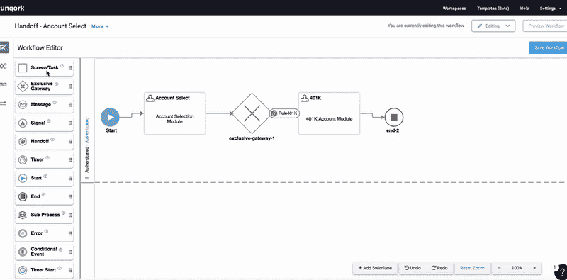

# Unqork 扩展自动化无代码 SDLC 平台

> 原文：<https://devops.com/unqork-extends-automated-no-code-sdlc-platform/>

Unqork 今天宣布，它已经扩展了一个用于管理软件开发生命周期(SDLC)的无代码平台，除了添加时间点回滚功能外，还包括自动记录应用程序编程接口(API)和数据模型更改的能力。

Unqork 的战略和工程负责人 Ken Gavranovic 表示, [Unqork 2021.5](https://content.unqork.com/press/2021_5) 还增加了一系列仪表盘，用于监控应用依赖关系、服务日志、修订、日志和[指标](https://devops.com/?s=metrics)。

最后，Unqork 正在添加工具来分析、测试和调试配置，同时使工作流能够订阅事件，并添加对发布候选的搜索功能。

Gavranovic 说，Unqork 旨在为 IT 团队提供一套可视化工具，通过这些工具，他们可以管理 SDLC 流程，而不必构建和维护由不同产品组成的平台，然后集成这些产品。他补充说，目标是减少维护应用程序开发环境所需的团队总规模，使组织能够分配更多的时间和资源来构建应用程序。

API 的 auto documentation 是在 IT 组织向构建和部署基于微服务的应用程序过渡时开始采用大量 API 的时候添加的。Gavranovic 说，除了使重用 API 变得更容易，Unqork 现在还确保这些 API 的文档总是最新的。

Gavranovic 指出，与此同时，Unqork 现在提供了一种基于集成在平台中的数据存储来自动记录数据模型变化的方法。该功能使组织能够以最小的摩擦将治理功能隐式地添加到工作流中。

随着组织寻求加快应用程序的开发速度，以支持多种数字业务转型计划，Gavranovic 表示，越来越多的组织开始意识到他们现有的流程过于复杂和繁琐，无法实现这一目标。Gavranovic 补充说，Unqork 基于组成平台的所有模块共享的数据存储，除了实现可重用性，还使 Unqork 更容易部署和管理。

此外，Gavranovic 还指出，随着时间的推移，复杂的过程只会增加开发团队的整体倦怠率。他补充道，如今，如果不要求开发人员在复杂的应用开发环境中游刃有余，就很难雇佣和留住他们。Gavranovic 说，最终，最优秀的人才将会迁移到那些让他们尽可能容易地编写代码的组织。

尚不清楚 It 组织在未来几个月将在多大程度上重新审视他们构建软件的方式，但随着他们中的更多人意识到业务现在对软件及时交付的依赖程度，尽可能多地自动化软件开发过程的压力开始增加只是时间问题。当然，替换应用程序开发环境的成本不是微不足道的。然而，继续做同样的事情并期望产生不同的结果，顾名思义，就是精神错乱。