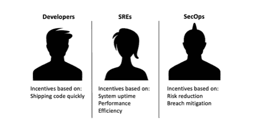

# 用可观察性固定风险分担

> 原文：<https://devops.com/fixing-risk-sharing-with-observability/>

sre、SecOps 和应用程序开发人员之间的激励不匹配。这些不匹配给孤岛式团队之间如何共享信息以及共享哪些信息带来了挑战。这种不对称的信息产生了道德风险，一个团队可以将部署风险转移给另一个团队，而不对发起团队负责。风险转移会导致不稳定的应用程序、低效的基础架构、安全问题和糟糕的客户体验。所有这些都会影响你公司的底线。

## 缩小信息差距

[可观察性](https://devops.com/?s=observability)被定位为弥补这些不同群体之间信息差距的一种方式。可观察系统允许用户以开放的方式询问关于他们行为的问题，不像更严格的监控系统。SREs 和 SecOps 团队已经从可观察性中获益，但是不匹配的激励限制了它的有效性。满足 IT 领导者对可观察性的期望需要跨应用程序、基础架构和第三方软件的普及工具。由于激励不匹配，以及人力和基础设施成本，提供这种水平的仪器仍然遥不可及。

开发人员的主要动机是以合理的质量水平快速交付代码，这意味着低错误数。这与 sre 形成对比，sre 的激励对象是正常运行时间、性能和效率，而 SecOps 团队的激励对象是风险降低和违规缓解。

由于 SREs 和 SecOps 团队不了解开发人员更改了什么，因此很容易将性能或安全问题抛给运营部门。全新的代码推送可能只包含较小的更改，对现有操作无害。或者，它可以替换整个代码库中的大块逻辑，包括添加对外部和第三方应用程序的调用。对于勇敢的 SRE 和赛科普团队来说，一个变化看起来和其他变化没什么不同。由于不匹配的激励机制，他们无法看到幕后的情况。DevOps 希望快速部署。等待其他团队的批准会减慢部署速度，因此无法进行全面的审查。这并不意味着 DevOps 团队故意试图破坏合作伙伴团队。他们只是根据自己的动机，按照自己的利益行事。

挑战在于一方，即开发者，比其他方拥有更多的信息。信息不对称造成了不平衡的风险分担。应对信息不对称导致了各种新的合作模式，从 DevOps 开始，发展到 DevSecOps 和其他排列，如 [BizDevSecOps](https://devops.com/?s=BizDevSecOps) 。

真正的合作很难实现。早期的开发运维工作通常是成功的，但是扩展到五到七个团队是困难的，因为团队缺乏 IT 运营经验的广度或者 SRE 能力来为多个产品团队配备人员。DevOps 团队能够实现的变化速度通常远远大于 SREs 和 SecOps 能够吸收的速度，这使得信息不对称更加严重。

如果团队不能保持高水平的协作和沟通，就必须开发另一种选择。可观察性实践，如收集所有事件、指标、跟踪和日志，允许 SREs 和 SecOps 团队询问应用程序的行为，而不知道他们想提前问哪些问题。然而，只有当应用程序和它们所依赖的基础设施被检测时，可观察性才起作用。这就产生了另一个问题:谁来执行检测？

期望 DevOps 团队将工具嵌入到他们的代码中，作为开发过程的一部分。虽然这是一个好主意，但有四个原因导致它不尽人意。首先，仪器的质量参差不齐。许多日志语句都很简洁，只有编写它们的开发人员才能理解。消息“在功能 xyx123 中！”对 SRE 挖掘最新版本中出现的性能问题没有帮助。

其次，插装库因实现而异，在不同的语言绑定中产生不一致的结果。OpenTelemetry 试图改善这一点，但进展缓慢，仍然需要开发者做更多的工作，老实说，这对他们没有好处；这对 SREs 和 SecOps 都有好处。现在我们又回到了那些讨厌的不匹配激励和信息不对称问题。

仪器的第三个问题是数据量。每个被检测的应用程序每天都会产生数万亿字节的数据。当您拥有强大的仪器时，数据量可能会非常庞大，并且分析和存储成本极高。

最后，插装被隔离到您的团队编写的代码中。这代表了您所依赖的代码的一小部分。供应商提供的服务和 API 仍然是一个黑箱，限制了您对这些组件的观察。

解决团队间的信息不对称需要两件事:

1.  不需要开发人员参与的针对所有代码的普遍的、可插入的插装能力，以及
2.  一个可观察性管道，用于过滤、编辑和丰富数据，然后将其发送到您选择的分析平台。

## 普适仪器

运营团队需要插装，而不必回到开发人员那里，请求他们将插装添加到现有代码中。他们需要根据需要打开和关闭它，并且他们需要易于使用的数据。他们还  需要他们能得到的每一份数据，包括数据包有效载荷、对加密数据的洞察等等。这远远超出了当今仪器选项的能力范围。

最新发布的开源项目 [AppScope](https://appscope.dev) ，是对仪器仪表的新担当。AppScope 介于应用程序线程和系统库之间，跟踪文件系统访问、网络和 HTTP 活动以及 CPU 和进程活动等。它还提供有效载荷数据，因为它位于应用程序和加密库之间，所以它还提供对用户明文数据的访问。因为它适用于任何 Linux 二进制文件，SREs 和操作团队可以检测任何东西，甚至不是他们编写的代码。

## 可观测流水线

普适测量的挑战是处理应用程序生成的所有数据。网络、文件系统和其他系统数据很容易淹没目标 APM 和日志分析平台，抬高许可和基础架构成本。虽然工具数据对于重新平衡组织中的风险分担至关重要，但是您需要一种方法来智能地管理这些数据，以便从中获得价值。这就是可观察性管道的用武之地。

可观测性管道位于可观测性数据源和其目标之间。通过充当战略控制点，管道使用户能够控制数据在被路由到一个或多个目的地之前如何被格式化、过滤、丰富和编辑。

可观察性管道通过将低价值数据路由到低成本存储(如 S3)来帮助 sre 和运营团队处理仪器数据的洪流，而高价值信息则进入 APM 和日志分析工具。稍后，如果您决定需要存储在 S3 的数据来为您的分析添加更多的上下文，您可以通过管道重放它并丰富您的数据集。

不断变化的业务优先级加快了组织间技术部署的步伐，团队面临着更快交付的压力。这种更快的交付速度增加了运营和安全团队的部署风险，他们缺乏对开发人员在复杂的分布式系统中所做更改的可见性。这种信息不对称还会增加业务风险，因为随着时间的推移，应用程序变得越来越不可预测和不可靠。

解决信息不匹配的传统方法不起作用，因为跨团队的激励不一致。采用普遍的工具和可观察性实践将使 sre 和运营团队能够深入了解快速变化的应用和基础设施环境，而不会中断开发人员的体验和流程。