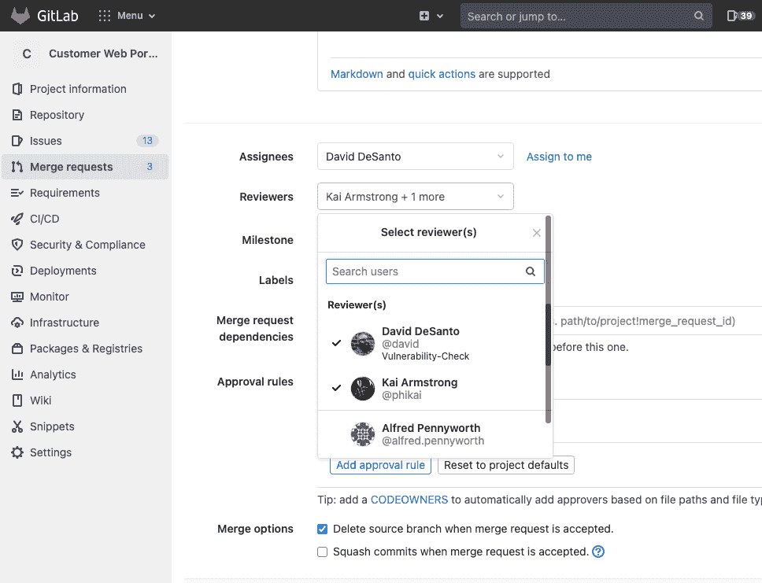

# GitLab 收购 UnReview 以实现进一步的人工智能目标

> 原文：<https://devops.com/gitlab-acquires-unreview-to-further-ai-ambitions/>

GitLab 本周宣布,[收购了 UnReview](https://www.globenewswire.com/news-release/2021/06/02/2240671/0/en/GitLab-Acquires-UnReview-to-Expand-its-Open-DevOps-Platform-with-Machine-Learning-Capabilities.html) ,这是一家工具提供商，该工具采用机器学习算法，根据专家代码评审员之前的工作质量和当前的工作量来确定将他们分配到一个项目。

GitLab 产品管理高级总监 David DeSanto 表示，收购 UnReview 是人工智能战略的最新一步，除了优化 DevOps 流程，最终还将统一机器学习操作( [MLOps](https://devops.com/?s=MLOps) )和 DevOps 工作流。

通过 GitLab 平台的开发部分访问，UnReview 也将用于管理整个代码评审过程。

DeSanto 表示，GitLab 致力于采用人工智能技术来自动化工作流程，并压缩 DevSecOps 生命周期所有阶段的周期时间。DeSanto 指出，我们的目标不是消除对 DevOps 团队的需求，而是消除阻碍生产力的低级任务，同时提高应用程序的安全性。

DevOps 平台的提供商现在陷入了两条不同战线的人工智能军备竞赛。他们每个人都清楚地看到了利用机器学习算法和其他形式的人工智能来自动化广泛过程的机会。与此同时，显然 MLOps 平台的提供商正在大量借鉴 DevOps 最佳实践来管理 AI 模型的开发。然而，从 DevOps 团队的角度来看，AI 模型只是另一种类型的软件工件。DeSanto 说，与其部署两个不同的平台，不如将构建人工智能模型的数据科学家纳入更大的 DevOps 社区。

当然，当前的挑战是开发运维团队和数据科学团队的工作节奏。数据科学团队可能需要六个月或更长时间来构建和验证需要嵌入应用程序的人工智能模型。如果两个团队对彼此的工作流都没有任何有意义的可见性，那么将人工智能模型的时间表与应用程序开发生命周期对齐是很难完成的。随着人工智能模型开发速度的稳步提高，对齐问题只会变得更加紧迫。

展望未来，很难想象任何应用程序中不会嵌入某种人工智能模型。问题是，就像任何其他软件工件一样，人工智能模型需要更新。随着新的数据源变得可用，人工智能模型很可能会偏离预期的参数。商业环境的快速变化也可能需要更换整个人工智能模型。DevOps 团队应用于更新任何软件工件的相同过程也可以应用于 AI 模型。

目前还不清楚 DevOps 和 MLOps 不可避免地发生某种类型的融合需要多长时间，因为组织正在寻找更有效的方法来管理将成为数以千计的人工智能模型。有一件事是肯定的，努力的时间越长，克服已经形成的组织惰性就越困难。