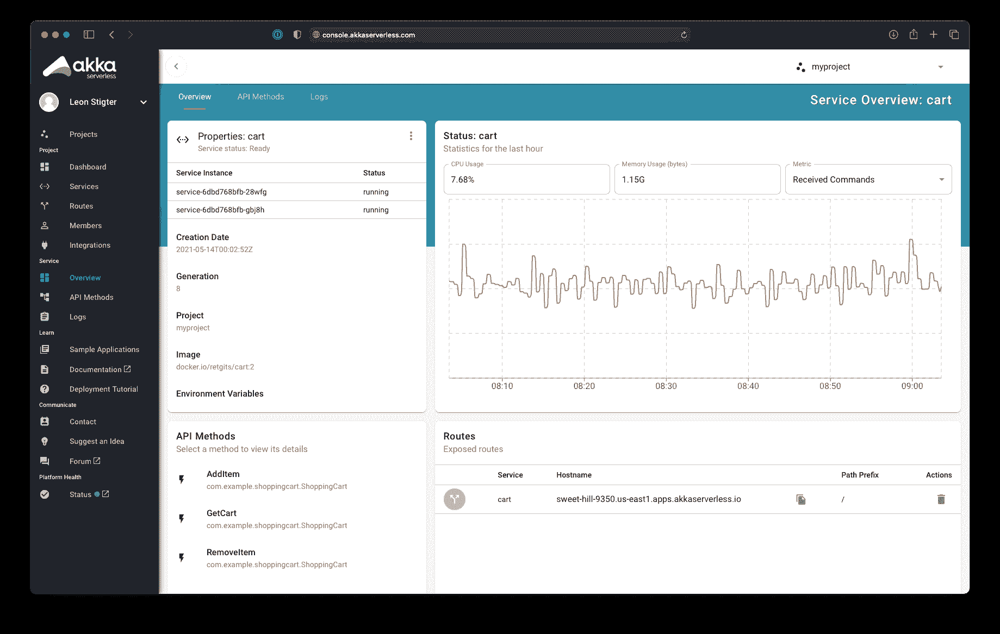

# Lightbend 推出无服务器托管开发运维服务

> 原文：<https://devops.com/lightbend-launches-serverless-managed-devops-service/>

[Lightbend](https://www.lightbend.com/akka-serverless) 今天[推出了基于](https://www.globenewswire.com/news-release/2021/06/10/2245154/0/en/Lightbend-Launches-Akka-Serverless-a-New-Class-of-Cloud-Native-Development-Platform-as-a-Service.html)[无服务器](https://devops.com/?s=serverless)框架的云服务，该框架为开发者提供了一个托管的 DevOps 平台，以构建可根据需要动态扩展资源的应用。

Lightbend 负责战略的执行副总裁布拉德·默多克(Brad Murdoch)表示， [Akka Serverless](https://www.lightbend.com/akka-serverless) 通过基于 gRPC 协议的声明式应用编程接口(API)提供了对其 Java 开发平台环境的访问，该环境运行在 Kubernetes 之上。默多克补充说，对其他开放 API 的支持，如 GraphQL，正在计划中。

与此同时，Lightbend 今天透露，Jonas Bonér 已经取代 Mark Brewer 担任首席执行官一职。Bonér 是 Akka 项目的前 CTO 和创始人，他是 reactive manifesto 的合著者，该宣言定义了使用反应式编程模型构建应用程序所需的核心原则。

Akka Serverless 可通过一个开放的测试程序获得，该程序提供对有限存储量的访问，计划于第四季度在谷歌云平台(GCP)上全面推出，并计划支持其他云服务。

默多克指出，这项服务之所以成为可能，是因为 Lightbend 扩展了现有的开源 Cloudstate 无服务器框架，以创建一个平台即服务(PaaS)环境，来支持开发人员用来构建应用程序的大量分布式有状态数据。Murdoch 补充说，这种能力克服了现有功能即服务方法的性能限制，这些方法基于其他不支持有状态应用程序开发的无服务器计算框架。

默多克说，事实上，无服务器框架的采用迄今为止受到限制的原因之一是无法在需要大量数据访问的有状态应用程序的上下文中使用。

Lightbend 解决了这个问题，它支持事件源实体将每个状态更改作为 Akka Serverless 写入日志的事件来保存。该日志可用于重放事件以重建特定时间的状态、调试或提供审计。在运行时，一个键将每个实体实例与所有其他实体实例区分开来。

Akka Serverless 是一系列托管 DevOps 服务中的最新产品，可随着开发人员请求新资源而自动扩展。开发人员无需配置和管理构建应用程序的数据库。默多克说，许多组织正在迁移到这些服务，因为他们宁愿将时间和精力集中在构建应用程序上，而不是管理 DevOps 平台。

尚不清楚组织将在多大程度上接受托管开发运维服务，这些服务开始出现在各种云平台上。然而，这意味着通过选择这些类型的服务，组织可能不需要雇佣很多的站点可靠性工程师(sre)。然而，未来的挑战是，在大多数组织例行使用多个云的时候，大多数托管 DevOps 平台目前都绑定到特定的云服务。

当然，开发人员将需要继续管理持续集成(CI)流程，但是，随着时间的推移，DevOps 等式的持续交付方面可能会被纳入托管服务。无论前进的道路如何，随着开发运维流程的自动化程度不断提高，应用部署的速度将会大大加快。