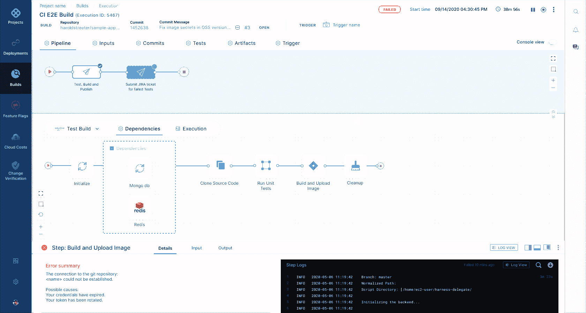

# Harness 采用 ML 来简化开发运维工作流程

> 原文：<https://devops.com/harness-employs-ml-to-streamline-devops-workflows/>

在在线 [{Unscripted} 2021 年会议](https://www.cvent.com/c/abstracts/9cb8680d-1621-4d20-a797-d9261321acb5)上，Harness 今天宣布了对其同名 DevOps 平台的更新，包括对功能标志的支持，这些功能标志向选定数量的用户展示新功能以进行测试，以及根据应用程序可能失败的可能性来优先运行这些测试的能力。

此外，Harness 正在添加统一的管道功能，使 DevOps 团队能够简化组成工作流的多个工具的管理，并更新了其云成本管理模块，使 DevOps 团队能够自动停止闲置工作负载。这种能力是基于该公司最近收购 Lightwing 所获得的技术。

Harness 首席营销官史蒂夫·伯顿表示，Harness 现在正在使用机器学习算法来识别应用程序最有可能失败的测试。该测试智能模块使 DevOps 团队能够首先运行这些测试，而不是[测试](https://devops.com/?s=testing)一个应用程序，直到该工作接近尾声时才发现应用程序需要更新，然后重新测试。Burton 指出，花在测试上的时间大大减少了。

Burton 说，总体而言，Harness 正在减少维护 DevOps 管道和工作流所花费的时间和精力。

随着整体环境变得更加复杂，维护 DevOps 平台的成本自然会有所不同。可能不清楚 DevOps 团队在测试上花费了多少时间，但是这个过程越快，应用程序在部署到生产环境之前就越有可能得到彻底的测试。当然，在应用程序部署到生产环境后对其进行修复要昂贵得多。

同时，随着同时构建的应用程序数量的增加，消耗的云资源量也在增加。然而，开发人员通常不会密切关注哪些工作负载正在消耗哪些云资源，这可能会在云服务提供商的月度账单到期时导致令人不快的意外。

总体而言，伯顿表示，机器学习算法和其他形式的人工智能(AI)将很快成为任何 DevOps 平台提供商的筹码。伯顿指出，预计该平台将例行采用人工智能来简化流程并降低总成本。

随着机器学习算法的使用越来越普遍，DevOps 团队为维护 DevOps 平台而定期执行的许多手动任务将越来越自动化。尚不清楚组织会在多大程度上放弃传统的 DevOps 平台来利用这些功能。然而，随着时间的推移，随着装有机器学习算法的下一代 DevOps 平台的安装，一些组织将比其他组织花费更多的时间来构建和部署应用程序。

与此同时，DevOps 团队可能希望列出他们今天执行的手动任务，作为确定他们浪费了多少时间的努力的一部分，否则这些时间可能会花在对组织更有价值的任务上。