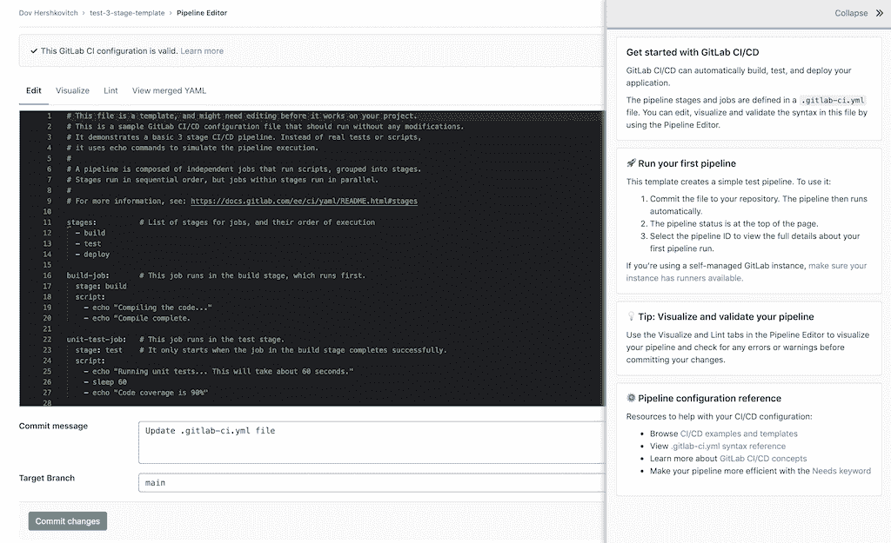

# GitLab 更新集成 DevOps 工作流的方法

> 原文：<https://devops.com/gitlab-updates-approach-to-integrating-devops-workflows/>

GitLab 今天发布了其持续集成/持续交付(CI/CD)平台的重大更新，该平台在工作流程中嵌入了分析工具，以确定效率低下的根本原因，以及其他附加功能。

GitLab 的产品管理高级总监 David DeSanto 表示，该功能是正在进行的努力的一部分，旨在将价值流分析纳入核心 GitLab 14 平台，作为收购和部署单独平台的替代方案。还有其他图表和仪表板，使开发运维团队能够发现一段时间内的瓶颈。

此外，GitLab 宣布，它正在通过添加与开源 Semgrep 和 Trivy 漏洞扫描工具的集成来扩展该平台的安全功能，作为使组织能够在工作流中采用 DevSecOps 最佳实践的努力的一部分。GitLab 还增加了对通过收购 Fuzzit 和 Peach Tech 获得的 fuzz 测试工具的支持，使 DevOps 团队能够更彻底地测试应用程序安全性，同时提供额外的仪表板来跟踪安全指标。

作为使组织能够更好地保护其软件供应链的努力的一部分，GitLab 还增加了对不可变管道定义的支持，在没有授予特定级别的权限的情况下，不能更改这些管道定义。DeSanto 指出，这种能力还使 DevOps 团队能够更容易地实现对任何数量的监管框架的遵从。

该公司还增加了一个管道编辑器，提供创建、管理和可视化管道的可视化工具。该工具旨在使新手更容易访问 DevOps，并为有经验的 DevOps 团队提供一种替代工具来管理管道，而不需要他们编写额外的代码。

最后，作为其全面开发运维方法的一部分，GitLab 还为 Kubernetes 集群提供代理软件，以消除组织获取单独开发运维平台的需求，从而构建和部署基于使用容器构建的微服务的云原生应用。该公司现在为 IT 组织提供了使用无代理或基于代理的方法为 Kubernetes 创建 GitOps 工作流的选项。

Gitlab 认为，随着 DevOps 的不断发展和成熟，越来越多的组织将倾向于替换他们需要的各种工具，以将自己与降低 DevOps 总成本的平台集成在一起。Gartner 预测，到 2023 年，40%的组织将从多点解决方案转换到 DevOps 价值流交付平台，以简化应用交付，而 2020 年只有不到 10%的组织使用这样的平台。据 Gartner 称，如今只有 10%的组织采用这样的平台。

还应该有更多的组织采用 DevOps 工作流来构建应用程序。各种规模的组织现在都意识到他们是多么依赖软件来推动广泛的数字业务转型计划。在许多情况下，软件安全开发和更新的速度是他们竞争能力的核心。问题是找到一种方法来实现这一目标，而不需要构建一个最终会耗费时间和资源来构建安全软件的平台。