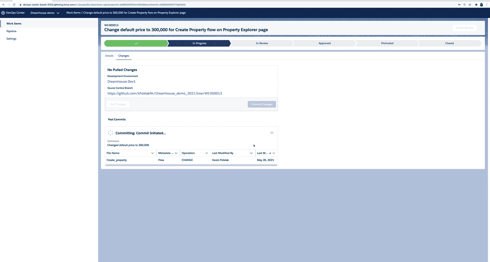

# DevOps 计划的 Salesforce 试点系列

> 原文：<https://devops.com/salesforce-pilots-series-of-devops-initiatives/>

在其在线 [TrailheaDX 2021](https://www.salesforce.com/trailheadx/) 会议上，Salesforce 今天推出了 DevOps 中心试点项目，该项目提供了一个门户网站，组织可以通过该网站跟踪和管理 Salesforce 应用程序的更改，并为其所有应用程序提供统一的命令行界面(CLI)。

此外，Salesforce 计划添加 Salesforce 功能，使开发人员能够在无服务器环境中部署代码。

该公司还承诺扩展其低代码应用程序构建工具，以包括对动态交互的支持，这一功能使专业和公民开发者能够向任何应用程序添加可重用的组件。该公司还增加了一个客户身份增强工具，使开发人员能够整合和管理客户身份。

最后，Salesforce 正在添加一个 Einstein Automate 工具，该工具采用机器学习算法来集成数据和自动化工作流，例如，该工具可以调用现有的 MuleSoft Composer 工具来集成使用 Flow Orchestrator 的应用程序，该工具将在今年夏天作为试点项目推出。MuleSoft 是 [Salesforce](https://devops.com/?s=Salesforce&__cf_chl_jschl_tk__=6a60f0a1c80824cedca6b92ba7dc08d28508525d-1624448418-0-AaE8mbOsfneAGT4uxzNdg99N1YgVKh1HbaUSV9d1kwtAJVft5TvcK9f01hIcLqbu5xtBo5IHS6Ozpn30-0URfwLI7sMNTgu8kO7RqkOct3W7qe6ziJptWhKZY4ejPIXt6evtcMDuY5gpIYz71ocRMI6I7omkAvypVc9-PRedNaHf6QIvHC15IzYAxsyUHtAamfi2h0-PHt-LMNMHpWRxIkwkQ9E0tQFjjJTSlgiCD8o7kqrrUifZKwBzh86TvgQeNvAQOKKYufyoD4dkQkBPblaK83ghfkK1dNiVCZEim6PKiys4xDRSDZqCl5s8hPpU-hpMKbGO80LZmjfaewu5jzlg2uYrNpC6BZbLbqD7b3kopCyUoqPVRvNIAaZEFCTJt7cXdiK06E0tNxOMgIYjvXY6l3RlKsUyS9XJIuZFunu2NQCUykqCwkJscq8gP_pJF29uXROljHRmu2FQeki1QwZ2mIvOWyBDX-nUNb1L2g4Z) 的子公司。现在还有一个爱因斯坦数据检测工具，通过使用机器学习算法来发现开发人员何时可能无意中暴露了敏感数据，从而确保组织遵守数据隐私法。

动态交互、Salesforce 功能和 CLI 统一预计将于明年冬天全面推出，而 Einstein 功能预计将于今年夏天推出。

Salesforce 平台产品管理高级副总裁 Ryan Ellis 表示，该公司正在共同努力，通过 DevOps Center 门户网站促进协作，使专业和公民开发者更容易在同一环境下构建应用程序，该门户网站预计将于 2022 年春天全面上市。今天，任何公民开发人员能够运用的技能通常都是有限的，这主要是因为他们通常不知道如何构建一个设计良好、安全的、能够真正在企业 IT 环境中扩展的应用程序。

然而，随着越来越多的人工智能(AI)能力被添加到低代码工具中，所提供的开发者指导的数量将随着时间的推移而增加。Ellis 指出，额外的指导将使公民开发者能够更可靠地构建健壮的应用程序。

与此同时，低代码工具的主要受益者仍然是专业开发人员，他们使用这些工具构建应用程序的速度比使用过程化代码要快。

总的来说，Ellis 表示，在由 Salesforce 管理的软件即服务(SaaS)平台上构建和部署定制应用程序的组织的相对 DevOps 成熟度持续稳定增长。在新冠肺炎疫情之后，许多组织选择扩展 Salesforce 提供的现有 SaaS 应用程序，以使用低代码工具加速数字业务转型计划，而不是使用过程代码从头开发每个应用程序。

当然，随着这些应用程序的构建速度不断加快，下一个重大挑战是在部署后管理应用程序的生命周期。

尚不清楚使用低代码工具和过程化代码构建的应用程序的最终组合是什么。埃利斯指出，数百万行代码现在被定期部署在 Salesforce 平台上。Salesforce 能够将 DevOps 最佳实践引入所有代码可能还需要一段时间，但从今天开始，旅程已经开始。