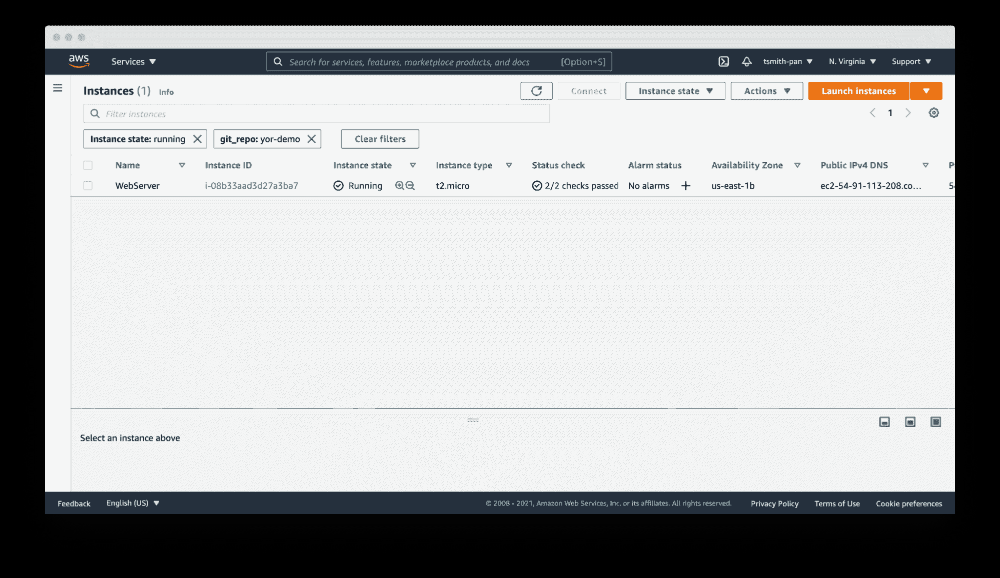
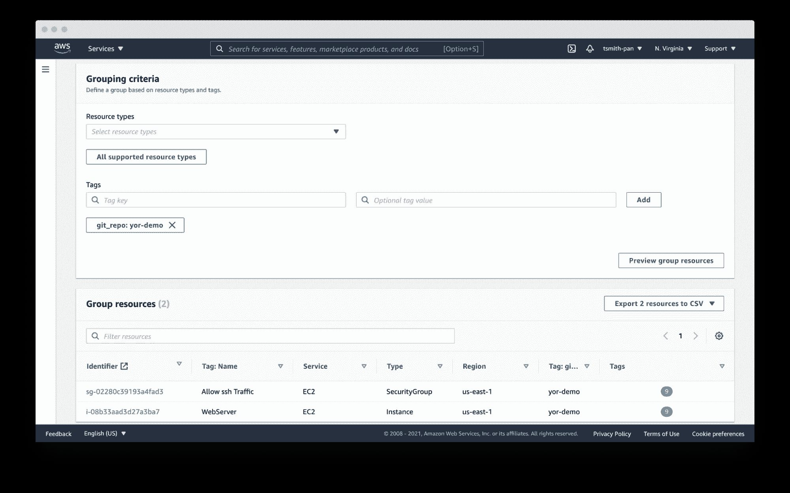
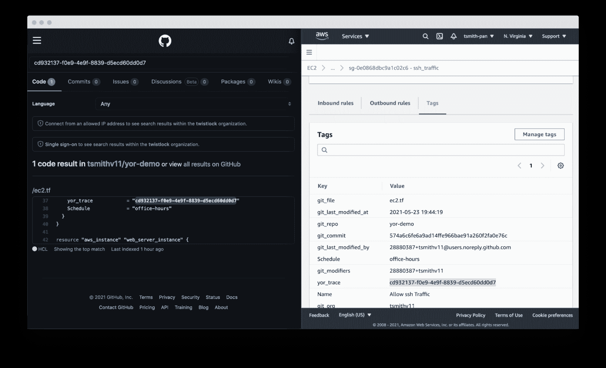
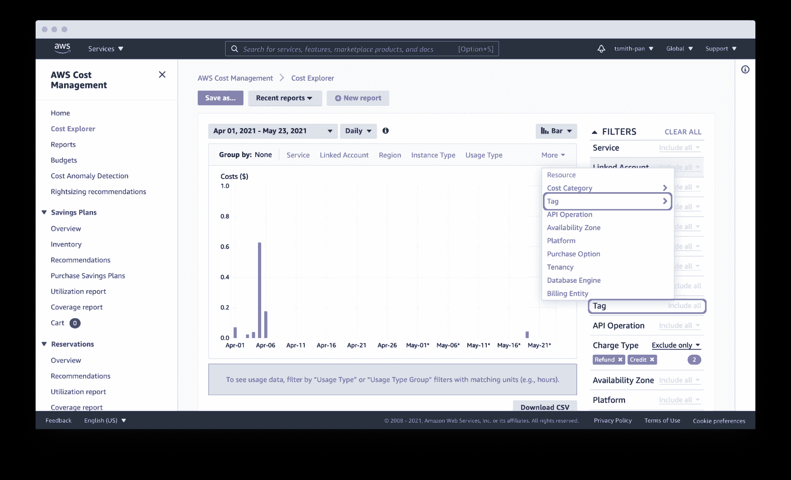
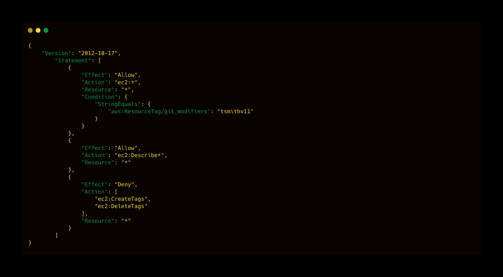
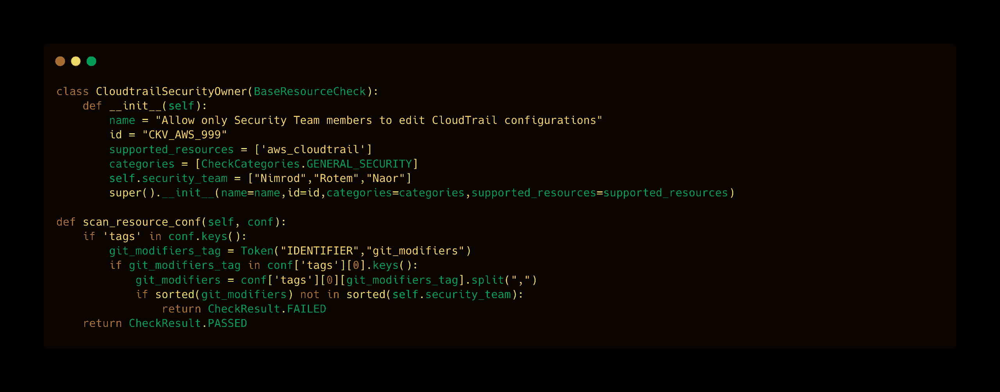
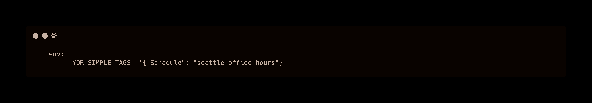
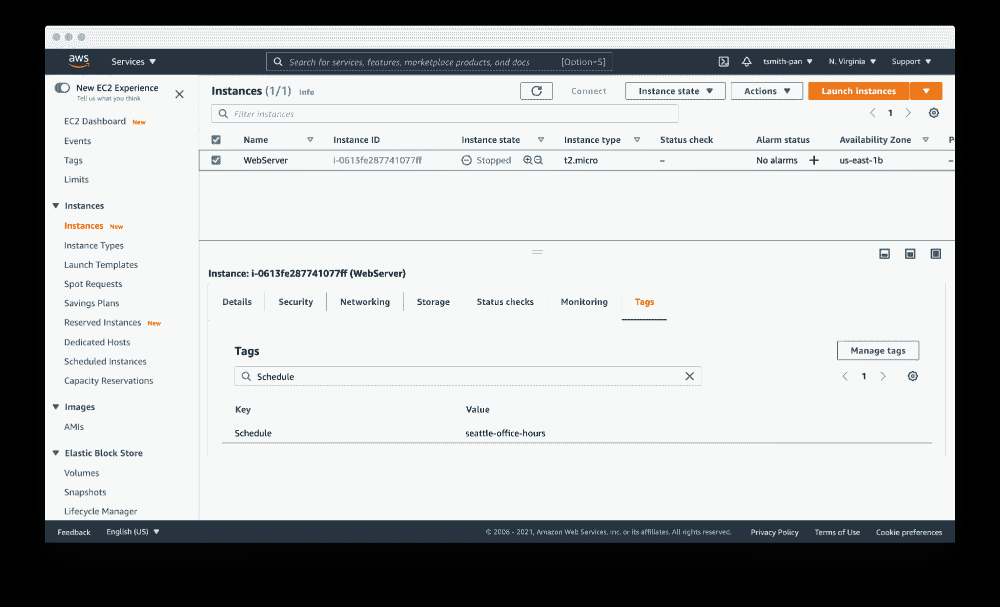

# 用 Yor 标记 AWS 的最佳实践

> 原文：<https://devops.com/best-practices-for-aws-tagging-with-yor/>

从表面上看，AWS 资源标签很简单，是信息性的 key:value 元数据，可以分配给大多数 AWS 资源。它们还有许多隐藏的好处，正如本 [AWS 标记最佳实践](https://d1.awsstatic.com/whitepapers/aws-tagging-best-practices.pdf) 指南中所概述的，用于改进云运营。作者布莱恩·约斯特特别指出了六个用例:

1.  AWS 控制台组织和资源组
2.  运营支持
3.  成本分配
4.  访问控制
5.  自动化
6.  安全风险管理

总之， [tags](https://devops.com/?s=resource+tag) 可以简化运营流程、改善安全状况、加快平均问题解决时间(MTTR ),如果持续一致地实施，甚至可以节省资金。但是，不幸的是，在大型组织中，这是一个冗长且经常出错的过程。

为了帮助团队克服这一挑战并充分利用云资源标签， [Bridgecrew](https://bridgecrew.io) (最近被帕洛阿尔托网络公司收购)最近推出了一款新的开源工具， [Yor](https://github.com/bridgecrewio/yor) 。Yor 旨在从 Terraform、CloudFormation 和无服务器框架开始，自动向基础设施即代码(IaC)模板添加一致、有用的标签。如果在本地运行或添加到持续集成(CI)管道中，y or 将向 IaC 资源添加标签，如 git 组织和存储库、唯一的跟踪 ID 和提交修饰符细节，这些都将延续到云资源。例如，使用 Yor，您可以在 Terraform 中标记您的 **aws_instance** 代码块，这些标记将出现在您正在运行的 EC2 实例中。

这篇文章将探讨如何利用 Yor 来实现 AWS 标记最佳实践指南中概述的六个标记用例。

## AWS 控制台组织和资源组

使用标签来组织和过滤资源是标签最简单也是最常见的用例。如果您向资源(如 EC2 实例或数据库资源)添加标签，您可以基于这些标签进行过滤。

如果您的 AWS 帐户在一个地区有成千上万的资源，那么过滤是管理这些资源所必需的。例如，如果您有数百个 web 服务器，那么可以通过添加的 **git_repo** 标签进行过滤，以便快速过滤到您的应用程序的 web 服务器。

同样，您可以设置资源组来基于标记跨 AWS 服务组织多个资源。例如，如果您想要搜索由 Terraform 存储库创建的 VPC、EC2、互联网网关或数据库，请使用 y or 的 **git_repo** 标记将多个资源组合成一个资源组。

## 运营支持

Yor 擅长简化和加速操作支持。用布赖恩·约斯特的话说，“例如，当监控系统触发警报时，第 1 级支持团队可以使用标签来指导工作流并执行业务服务映射，作为分类过程的一部分。”Yor 自动用 git 组织和云资源的修饰符来标记资源。这使得确定合适的团队和用户来修补问题变得更加容易。

如果你在 GitOps 组织工作，这一点就更关键了。遵循 GitOps 最佳实践意味着所有更改都应该在 IaC 模板中执行，而不是直接在云资源上执行。因此，如果您的安全团队在运行时使用策略代码或 CSPM 工具(如[【Bridgecrew】](http://bridgecrew.io))识别出一个开放端口 22，Yor 的标签将使找到 IaC 模板的所有者变得更加容易和快速，降低 MTTR。

Yor 更进一步。通过添加 repository、file 和 trace 标签，Yor 不仅可以帮助团队识别代码所有者，还可以识别导致资源错误配置的文件和资源块。

## 成本分配

大公司的每个业务部门通常有不同的损益表(P&L)。在报告期结束时，例如一个财政季度，财务团队将整个公司的支出分配到各个成本中心。

对于传统的 IT 团队来说，这通常涉及非常广泛的、一般的估计。例如，如果两个组织共享一个服务器机架，您可以根据虚拟 CPU 时间或磁盘空间来分摊成本。一旦扩展到几十个组织和短暂的工作负载，分配就会变得更加困难。云成本同样难以分摊。如果您有成千上万种类型的资源(虚拟机、无服务器、托管 Kubernetes 工作负载、托管数据库、流、cdn 等。)由于不同的生命周期和寿命，将这些资源成本与成本中心联系起来是很困难的。

云标签简化了这一过程。假设每个团队都有一个 git 组织，Yor 将自动用 **git_org** 标记资源，或者自定义标记可以将 **git_modifiers** 分组到成本中心标记中，AWS Cost Explorer 将让您通过这些标记进行过滤，从而轻松分配成本。您还可以按标签将这些成本导出到 CSV 文件中，以便导入到其他工具中进行分析。

Yor 可靠且一致地应用这些标记，这样财务团队就不需要挖掘不同的组织名称版本，例如组合 dev_team_one 和 devTeam1 ，或者手动对未标记的资源进行分类。

## 访问控制

AWS 身份和访问管理(IAM)策略支持使用标签 限制资源控制的 [能力。这简化了团队使用复杂的 IAM 规则划分资源。](https://docs.aws.amazon.com/IAM/latest/UserGuide/access_iam-tags.html)

例如，如果您希望开发人员只访问他们提供的 EC2 实例，您可以使用 Yor 添加的 **git_modifiers** 标记。Yor 将自动用编辑 IaC 代码的 git 用户来标记资源。然后，Yor 将添加一个 AWS IAM 策略，根据该标签限制访问。  您还需要添加一个策略来拒绝动作，比如 **ec2:CreateTags** 和**ec2:delete tags**这样用户就不能将自己添加到其他资源中。

这就是可以利用开源策略代码工具 [Checkov](http://checkov.io) 进行额外控制的地方。Yor 可以丰富 Checkov 检查的上下文，支持更细粒度的策略控制。例如，Yor 将填充修改 IaC 模板的用户标识，Checkov 可以确保只有经过批准的团队成员才能修改代码。下面是一个自定义检查的示例，以确定只有安全人员修改了 CloudTrail 设置。

如果 Yor 添加的 **git_modifier** 标记不是“Nimrod”、“Rotem”或“Naor”，Checkov 将显示该资源的自定义检查的失败策略检查。

## 自动化

通过将标签与其他工具(如 Lambda 函数和备份计划)结合使用，您可以将自动化应用于特定资源，如针对资源进行归档、更新或删除。

《AWS 标记最佳实践指南》以非营业时间关闭开发资源的情况为例。AWS 最近发布了一个名为 [实例调度器](https://aws.amazon.com/solutions/implementations/instance-scheduler/) 的工具，就是为了这样一个用例。它是一个 CloudFormation 堆栈，具有 Lambda 函数和 DynamoDB 实例，可以根据预定义的时间表自动启动和停止 EC2 和 RDS 实例。

实例调度程序采用一个带有**键:值**对的标签；例如，“schedule”(或自定义键)作为键，Schedule 作为值。这些时间表可以是 DynamoDB 表中预先配置的时间表之一，如**办公时间、**，也可以是自定义的时间表。

在 Yor 中使用简单的 [定制标签](https://github.com/bridgecrewio/yor/blob/main/CUSTOMIZE.md) ，您可以通过使用环境变量(例如将以下内容添加到 Yor GitHub Action YAML 文件中)为存储库中的每个资源添加一个时间表标签:

这导致标记被添加到 IaC 目录中的每个资源。使用**Seattle-office-hours**标记，实例调度程序将在太平洋时间下午 5:00 关闭 EC2 实例，并在太平洋时间周一到周五上午 9:00 再次打开。这通过在停机期间自动停止实例来节省资金。

另一个流行的自动化用例是备份和归档计划。AWS 可以根据应用于资源(如存储和数据库资源)的标签，自动应用不同的备份计划。例如，如果某些组织(如处理财务数据的组织)需要永久存档，但其他组织只需要一年的备份，则应用备份计划可以将短期存储转移到更便宜的选项(如 Glacier ),并最终按计划删除它们。

## 安全风险管理

最后一个用例是风险管理。云资源的风险级别根据它们是处于测试环境还是生产环境以及这些资源处理和保存的数据的敏感性而有所不同。这是另一个领域，你可以使用简单的标签如 **git_repo** 来过滤处理敏感数据的应用程序的存储库。您还可以利用复杂的自定义标签。例如，附加到名称中带有“customer”的数据库的 EC2 实例将获得一个**data _ level:sensitive**标签。

IT 服务管理工具可以应用更高的优先级来修补和更新带有表示敏感数据的标签的资源。这是另一个领域，您可以利用 Checkov 基于图形的检查结合 Yor 标记，为带有敏感数据标记或生产环境标记的资源的策略违规分配更高的严重级别。分配优先级有助于集中开发人员的注意力，并更快地降低风险。

这六个标记用例只是几个例子，说明如何利用标记来提高效率，并改善 AWS 中的云安全状况。Yor 的跟踪能力使开发和操作团队能够一起工作，而不需要复杂的分类来找到正确的人和 IaC 模板。凭借[【Yor】](https://yor.io/)的可扩展性和定制标签功能，我们迫不及待地想看看社区还会出现什么样的用例！