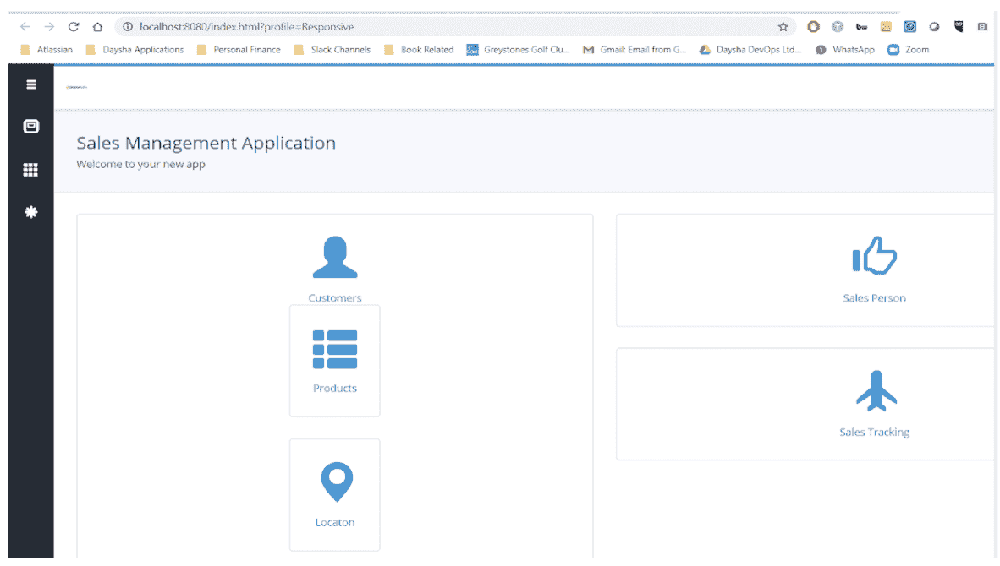
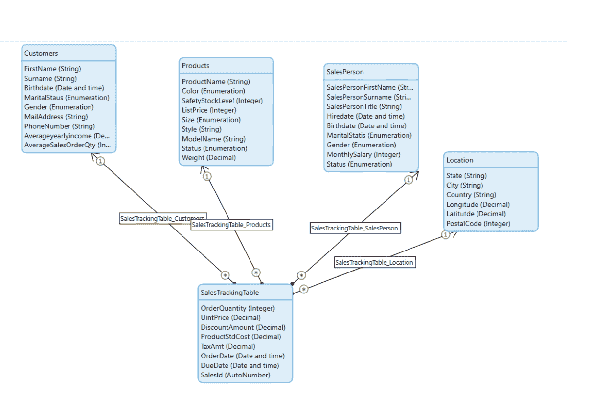
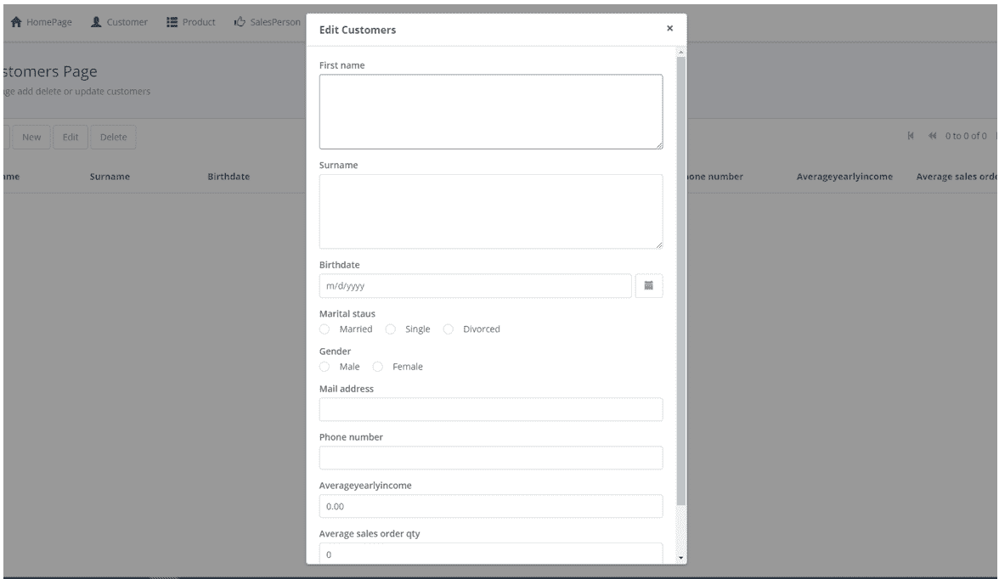
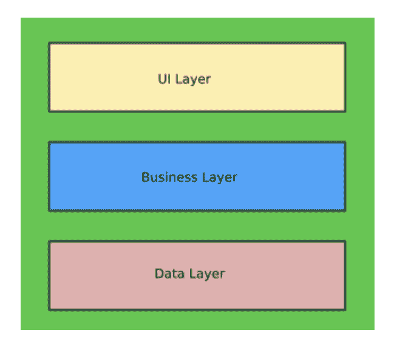
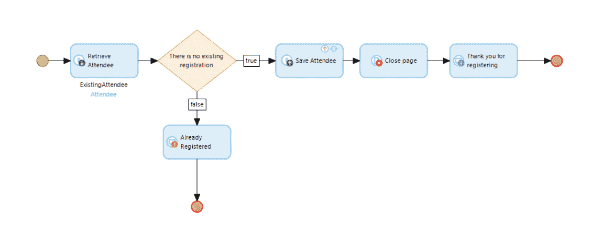
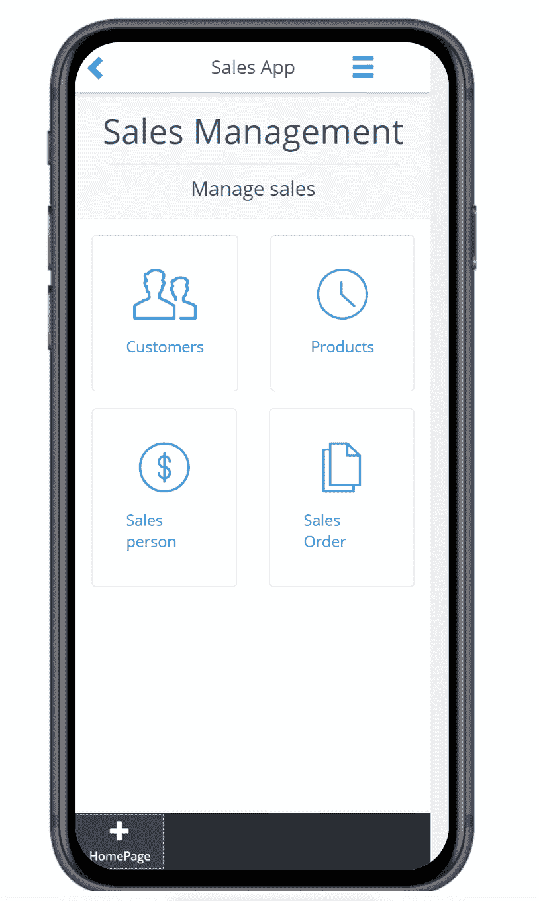

# 低代码之旅的经验教训

> 原文：<https://devops.com/lessons-learned-on-a-low-code-journey/>

随着组织追求创造“公民开发者”的承诺，低代码/无代码工具的流行程度正在上升使用这些工具来增强非技术开发人员的能力和/或将开发团队从逐行编写代码中解放出来的想法无疑是令人信服的。

大约一年前，一位朋友问我是否愿意评论他正在写的一本关于公民发展的书。当时，这种表达对我来说是新的，但在阅读和评论这本书后，我被吸引住了。这促使我开始了我自己的公民开发者探索。我想分享几个我在这个过程中学到的有用的经验。

## 好奇:公民开发者工具与开发团队

我好奇的部分是试图理解这些工具是否会消除对昂贵的开发团队的需求。之前那些善意的尝试并没有兑现他们的承诺——以 20 世纪 90 年代的计算机辅助软件工程(CASE)为例。

大约在这个时候，我和一个进步客户的 CTO 讨论了这个话题。当他的企业用户需要应用程序来解决持续存在的问题时，他们不会等待技术资源。他很快指出低代码比影子更好。这些低代码/无代码工具的架构意味着数据库管理掌握在他的团队手中。他支持业务部门构建具有清晰业务案例的小型战术功能，并在可能的情况下通过培训和为数据集成和其他功能的项目分配资源来支持他们。

## 挑战:编写应用程序

受到鼓舞，我决定在一个周末挑战自己，看看我是否能写一个商业应用程序。我在 20 世纪 80 年代学习过 Fortran 和 C 之类的编程语言，但我从未做过开发人员，也从未写过商业代码。

## 第一天开始

我随机选择了一个低代码工具。然而，我建议公民开发人员与 IT 团队合作，而不是随意选择，因为大多数低代码/无代码工具都有底层编程语言。例如，如果您的组织是一个 Java 商店，那么选择一个具有相同语言的工具是有意义的——在本例中是 Java——在它的源代码中。

我在 YouTube 上花 20 美元买了一个 6 小时的培训课程。这将被证明是一个明智的决定。学习我选择的工具并不简单，但培训课程允许我暂停教程，倒带和重复，以确保我理解概念，并可以跟随“如何做”

第一项任务:写“你好，世界”我推荐公民开发者从这里开始。如果你能做到这一点，那么很有可能你能构建更复杂的东西。

三个小时后(其中两个是系统错误)…完成了。

点击绿色按钮产生了下面的屏幕。

在这一点上，我的问题仍然多于答案。开发工具的 GUI 在 Windows 目录结构中是点击式的。没有命令行编辑器。我更受鼓舞了。会这么简单吗？

注意:虽然完成“Hello World”任务只花了不到一个小时，但我遇到了一个 Windows 系统错误，它指向一个服务器端口错误。供应商的帮助台在周末没有运行，但是他们的文档是足够的；又花了两个小时才解决这个问题，因为我的 Windows Surface Pro 既是客户端又是服务器。

一个“普通”的公民开发者能够克服这个问题吗？我不确定。我建议在尝试低代码/无代码工具时，也尝试一下帮助台，即使你需要付费。虽然许多软件工具公司试图迫使软件工程师通过维基解决问题，但公民开发者可能需要更多的帮助。

下一步是构建一个应用程序。大多数非技术人员倾向于从图形的角度和业务功能来描述应用程序。这与我接下来两个小时的工作方式非常一致，此时“主页”看起来是这样的:

使用我们内部电子表格中的数据，我相对容易地创建了下面的数据模型。我相信一个公民开发者会从请一个内部的数据库专家来审查这个“设计”中受益，以便在以后维护应用程序时节省时间。

这项工作是在我构建第二层页面来修改数据的同时进行的。例如，自动生成的客户页面允许用户搜索、添加、编辑和删除客户记录，如下所示:

这是在四小时内完成的。一旦用正确的列创建了表，就可以自动创建 web 页面。事实上，它变得重复，我发现很容易失去我的注意力和犯错误。

我正在学习保存每一个小的变化，以确保实时 web 和移动应用程序的构建能够正常工作。专业开发人员会将此视为公民开发人员持续集成的一种形式。

我不建议让公民开发人员团队一起工作，至少在一开始，因为这会引入分支和版本控制以及“打破构建”的概念此时需要咨询专业开发人员。

## 第一天结束

第一天结束时，我有一种真正的成就感，并热切期待着第二天。公民开发人员应该注意到，在这一点上，我已经制作了开发人员所说的原型。到了这一步，就有可能联系 It 部门指派一名开发人员来完成这项工作。如果它没有能力，那么继续前进。

## 第二天开始

设计完屏幕和数据库后，下一个任务是添加业务逻辑。

使用规则创建工作流是一项更吸引人的任务，但仍然是通过拖放或点击来完成的。像 if- then- else 这样的布尔逻辑操作符允许我快速构建逻辑，并将其附加到网页的视觉元素上。

这是一个事件注册流程，在此流程中，从网页接受数据，并根据响应的真或假进行不同的处理。

和以前一样，第一个工作流需要一些时间来学习。有许多方法既可以触发一个动作，又可以指导后续的工作。又过了半天，我已经产生了足够的工作代码，我觉得我可能不能再学习更多了，这个应用程序已经可以上路了。

从那时起，创建移动版本的应用程序就像按一个按钮一样简单。一开始，我为移动部署设置了一个开关。web 版和移动版总是同步的，GUI 会针对部署平台进行自动调整。公民开发者应该检查 web 和移动应用部署配置的内部标准，并确保他们选择的工具支持它们。

## 第二天结束

### 从我的发现中得到的教训

希望采用低代码或无代码工具的组织需要确保为希望自助满足其应用程序开发需求的业务用户提供 IT 支持和培训。我建议尽早参与，并经常与 IT 同事进行回顾。

业务职能部门应考虑“容易的”和战术性的试点机会。

分配一段不受干扰的时间来专注于任务。在周末学习一种新工具也是一个好主意。除了我妻子端着咖啡进来聊天之外，没有任何上下文切换。

我建议公民开发者在这些活动中尽量灵活一点。使用“计划、执行、检查、行动”的方法意味着你并不是“全情投入”——你只是采取小而分散的步骤，看看你是否能比等待更有效地解决问题。

专业开发人员应该确保任何低代码/无代码工具生成的代码可以导入到他们的标准 IDE 中，并且公民开发人员的代码不会被锁定到工具中。

* * *

*作为 [DevOps Institute 大使](https://www.devopsinstitute.com/about-us/ambassadors/)，O'Reilly 通过 SKIL 框架帮助 DevOps Institute 社区成员提高技能、知识、想法和学习能力。点击了解更多关于奥赖利在 DevOps [的工作。](https://dayshadevops.co.uk/)*