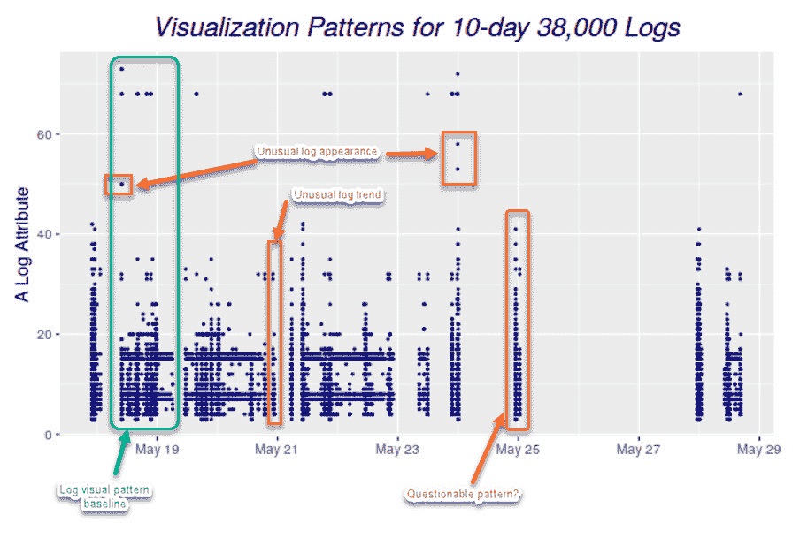

# 可视化日志以从数据中获取更多价值

> 原文：<https://devops.com/visualize-logs-to-get-more-value-from-data/>

你为什么要写日志？不管我们谈论的是哪种类型的[日志](https://devops.com/?s=logs)，您保留它们是因为您期望它们为组织提供一些价值。也许日志会帮助你提高盈利能力；也许它们会帮助您从停机中恢复过来，或者它们会提醒您正在发生的安全事件。如果您是系统管理员或负责基础设施可靠性和维护的人，您会同意日志是至关重要的。它们代表了您获取服务器状态和活动、网站流量、应用程序性能等信息的真实来源。

无论日志的预期目的是什么，或者如何使用它们，这些日志中的信息都应该易于访问和解释。当今复杂的系统会生成大量的日志数据，这使得在原始文本文件中挖掘大量数据来寻找重要信息几乎是不可能的。在文本日志中找到有价值的信息非常困难，但在视觉世界中却不是。这正是日志可视化发挥作用的地方。如果日志中的数据可以转换成图形形状和图案会怎么样？从日志数据中破译信息并更好地理解它不是更容易、更快吗？

## 什么是日志，它们是用来做什么的？

在进一步讨论之前，让我们确保每个人都了解日志的含义。日志是带有时间戳的文本记录，它告诉我们发生了什么以及何时发生的。DevOps 工程师必须依靠来自各种系统组件和数据源的日志组合来了解事件发生的原因，甚至可能预测未来的事件。

您可以将从日志数据中提取的知识分为四个关键组:已知-已知、已知-未知、未知-已知和未知-未知。手动和编程日志搜索、仪表板、警报和报告手动提取的日志字段是提取和分析已知信息的常用方法。这些方法假设工程师已经熟悉数据，并且知道在哪里寻找答案。您可以使用统计或其他数学方法来从算法上解决已知-未知的问题，例如搜索词和阈值。使用 AI/ML/DL 技术来处理未知的已知，这些技术可以生成日志洞察，如事件相关性、日志模式聚类和已知异常检测。但是那些未知的东西呢？

## 揭开未知-未知

使用原始文本日志，工程师在遇到某些特定错误或特定类型的行为时进行机器搜索或设置警报相对简单。但是，要搜索日志甚至设置警报参数，您需要知道自己在寻找什么。如果您不知道需要提醒哪种错误或阈值限制，则不可能设置这些。

现代应用程序极其复杂，人们无法真正理解它们如何工作的一切，甚至无法在出错时总是提出正确的问题。但是，如果一名工程师在查看日志时甚至不知道要搜索什么，那么如果没有像专门构建的日志可视化解决方案这样的辅助工具，就不可能找到答案。

在很大程度上，用来揭示日志数据的已知、未知和未知的技术都不能帮助揭示未知的未知。解开它们的一个有效方法是依靠人类的智慧去探索未知的空间。用专门构建的日志可视化工具来补充人类的智慧，可以极大地帮助分析未知的东西。一旦你认识到未知的未知，你可以快速地将这些知识反馈到适当的、不太深奥的组(已知的已知，已知的未知和未知的已知)，并从你的日志数据中获得更多的价值。

一个好的日志可视化工具可以帮助从未知中收集知识，并可以通知主动日志分析或快速反应日志分析用例。当前的测井分析实践以反应性为中心；重点是在问题发生后最小化和解决问题。使用日志可视化工具，您可以通过可视化从日志数据生成的模式，并在事件发生之前探索未知的未知情况，来快速隔离系统中细微和异常的变化。

当前的日志可视化在显示日志计数分布及其变化方面受到限制。它们不会显示其他日志属性或日志组合属性。

所有显示的用户界面都有相似的功能用法和显示。深入一个 UI 窗口的例子，给人一种典型的日志分析实践的感觉。下图在带标签的方框区域标注了不同的日志分析功能。非可视化日志分析功能(如搜索、标记和日志显示)都是必需的时间范围输入。

理想的日志可视化工具不应该只依赖于一种信息类型。日志数据是多方面的。只有当日志可视化工具让您关注尽可能多的日志数据方面时，它才开始有价值。

## 对数视觉模式辨别

日志可视化的力量来自人类识别视觉模式的能力。很难在原始日志数据中找出一种模式，但是一旦可以可视化这些数据，就变得容易多了。

当有经验的 DevOps 操作员查看日志可视化时，他们可以很容易地看到异常在哪里，即使之前不了解系统如何工作或异常可能来自哪里。

可视化使工程师能够识别视觉模式，并快速了解系统中正在发生的事情——无论是正在进行的黑客攻击还是导致用户体验不佳的错误。可视化是引人注目的，因为它们有助于揭示重要的事件，即使工程师不知道去哪里看或者根本不知道有黑客正在进行。

例如，考虑一个复杂系统每天生成数百万条日志的场景。假设我们要建立一个系统正常运行时将生成的日志数量的基线。在这种情况下，我们必须在几周内，或者至少一个月内每天计数，以推断出足够好的基线。

即使我们得出了一个可接受的基线，我们也必须记录每天的计数，并与这个基线进行比较，以检测异常情况。这样做可能很耗时，而且会适得其反，因为当你发现异常时，采取任何行动都已经太晚了。

一旦我们将每天的日志绘制在图表上，我们就可以通过视觉观察立即计算出基线。一旦我们直观地建立了一个基线，当我们看到标绘在该基线之上或之下的值时，我们可以立即识别异常。下图显示了 10 天内接收到的日志，说明了建立基线和识别系统异常行为是多么简单。该图可以推断出基线大约为 38，000 条日志记录，任何高于该值的记录都表示系统中的异常行为。

## 更好的日志可视化

创建良好的[日志可视化](https://www.capterra.com/sem-compare/log-management-software)分析有几个基本标准。它们是:

**使用原始日志数据。**数据策略很重要。默认情况下，大多数日志数据是非结构化的，许多组织倾向于在对其进行任何操作之前将其转换为结构化数据。这样做是错误的，因为在这个过程中你可能会丢失重要的信息。好的可视化应该直接基于系统产生的日志。

**日志数据一致性。**可视化的格式应该是一致的，因为如果有不断变化的变量，参与其中的人就很难发现模式。

选择可靠的日志属性并明智地使用它们。不要只使用一个测井属性进行可视化(如时间分布测井密度)，您应该考虑可视化更多方面。这样做可以让分析师更好地掌握和直观地理解日志数据集。例如，从不同角度拍摄的大象的多张照片比只给他们看一张从一个角度拍摄的大象的照片更能帮助人们了解大象。类似地，如果我们按照日志的每个属性对日志进行分解，然后绘制出它们的频率，我们可以更好地可视化系统的性能。但是，您选择的属性对于提供有价值的可视化效果至关重要。

随着现代系统变得越来越复杂，破译日志和发现未知的未知将不再容易。是时候引入新的测井可视化技术来处理这些未知的未知情况了。随着日志可视化变得更加用户友好，您不再需要指望人们熟悉日志解释或了解统计、数学或人工智能技术来分析日志数据。可视化日志数据不仅有助于人类智能的决策，区分什么是可接受的，什么是不可接受的，并快速识别和补救问题-从解开未知-未知中获得的知识也有助于推进用于确定日志数据已知的 AI/ML 和自动化技术。