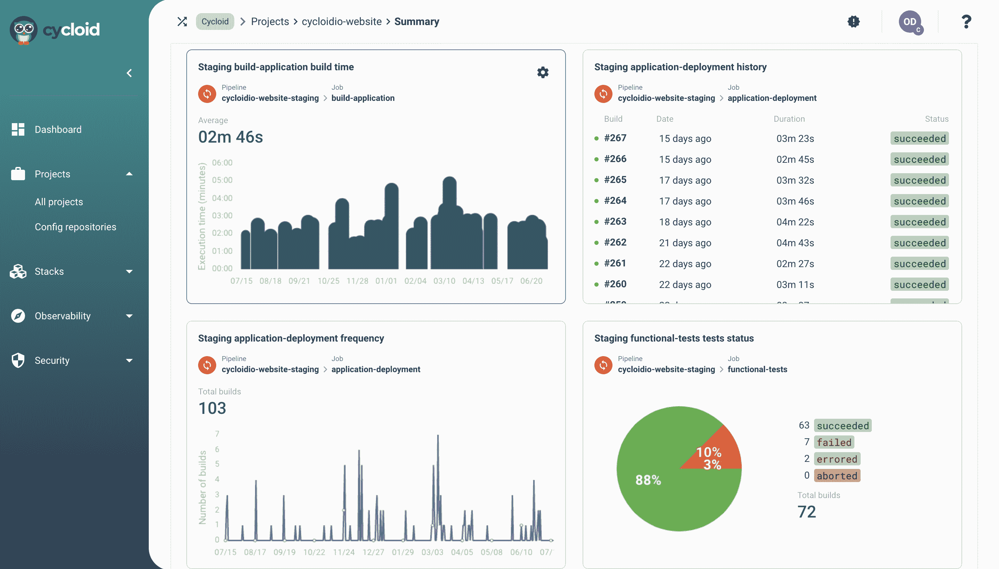

# 摆线为美国和英国带来了开放的 DevOps 框架

> 原文：<https://devops.com/cycloid-brings-open-devops-framework-to-the-us-and-uk/>

总部位于法国巴黎的摆线公司是一家用于实现 DevOps 最佳实践的开放框架的提供商，今天宣布将把业务扩展到美国和英国。

摆线的创始人 Benjamin Brial 说，摆线框架提供了一种轻量级的方法，在使开发人员能够使用他们喜欢的工具和集中治理的需要之间取得平衡。该框架允许预定义角色和策略以确保治理，同时使用一组拖放式可视界面将服务目录用于部署软件。还有一套管理工具和功能，可为开发运维工作流提供额外的可见性、自动化、监控和财务控制。

Brial 补充说，实际上，摆线提供的管理这些工作流的门户网站也有助于更广泛的 IT 专业人员更容易访问 DevOps。

许多采用 DevOps 的组织最终构建了自己的定制门户来实现相同的功能。Brial 说，摆线维护和更新了一个门户平台，可以跨开发人员喜欢的任何工具组合使用，而不是投入资源来构建和维护这样一个门户。Brial 指出，其他 DevOps 框架经常被拒绝，因为它们要求开发人员采用一套特定的工具。没有开发者的支持，大规模采用 DevOps 最佳实践几乎是不可能的，他补充道。

经过十多年的倡导，大多数组织对 DevOps 的采用仍然参差不齐。[缺乏采用](https://devops.com/?s=adoption)的一个重要因素是涉及技能组合的文化问题。许多 IT 管理员缺乏以编程方式管理开发运维工作流所需的编程技能。摆线试图建立一个中间地带，使 IT 运营团队能够管理和治理 DevOps 工作流，而不必掌握编程技能。Brial 说，我们的目标是让开发者和 it 运营团队的合作变得更简单。

尚不清楚这种方法会在多大程度上增加企业 It 组织对 DevOps 最佳实践的采用。然而，很明显，雇佣和保留一小群站点可靠性工程师(sre)来大规模管理 it 环境的成本对于许多组织来说通常是高得令人望而却步的。

并不缺少 DevOps 框架，但是大多数组织通常会制作自己的框架，作为定制 DevOps 工作流以满足其特定需求的努力的一部分。然而，如果有一个现成的高度可定制的框架，摆线打赌更多的组织宁愿购买而不是自己构建和维护整个框架。Brial 说，否则，DevOps 团队将花费一半的时间反复执行相同的重复性手工任务。

无论如何，DevOps 作为构建和部署应用程序的方法需要变得更容易访问。DevOps 的支持者在近十年的大部分时间里为这种方法提供了一个案例，取得了喜忧参半的成功。挑战仍然是找到一种在整个企业范围内扩展 DevOps 流程的方法，而不是让每个单独的开发团队定义应用程序开发和部署流程，这些流程如今在效率方面差异很大。