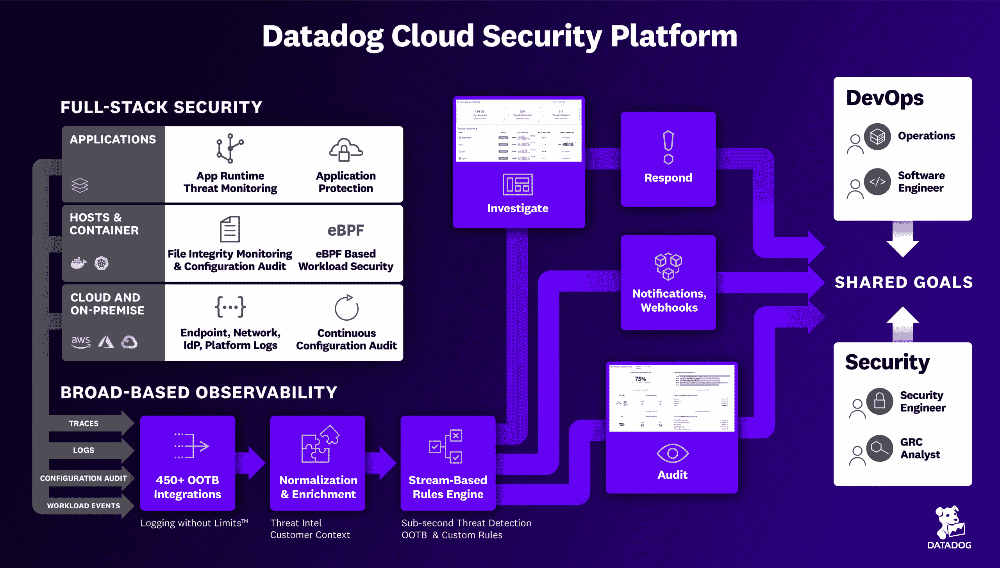

# Datadog 云安全平台推进了 DevSecOps

> 原文：<https://devops.com/datadog-cloud-security-platform-advances-devsecops/>

Datadog 已经推出了一个 [Datadog 云安全平台](https://www.datadoghq.com/about/latest-news/press-releases/datadog-launches-cloud-security-platform-to-provide-security-teams-with-unprecedented-observability-capabilities/)，该平台承诺通过使用许多 DevOps 团队已经依赖的相同代理软件来识别潜在威胁，从而推进 DevSecOps。

Datadog 产品高级副总裁 Renaud Boutet 表示，依赖 Datadog 软件即服务(SaaS)平台的组织现在可以更容易地调用基于用于观察应用程序的相同数据模型的安全服务。

Datadog 提供的安全服务包括云安全状态管理(CSPM)产品，该产品可识别错误配置和不符合支付卡行业数据安全标准(PCI DSS)等行业标准的应用程序。

同时，云工作负载安全(CWS)产品通过监控文件和流程活动来检测对生产工作负载的威胁，而监控工具则通过分析操作和安全日志来识别对云环境的威胁。它还提供易于扩展和定制的集成和威胁检测规则。

最后，有一个应用程序安全工具，目前处于测试阶段，它可以识别和阻止针对代码级漏洞的攻击，如 SQL 注入和跨站点脚本(XSS)利用。

Boutet 指出，许多 DevOps 团队不愿意推出需要他们在整个应用环境中部署、管理和更新一组额外代理的安全平台。Boutet 补充说，Datadog 现在有效地统一了应用程序的可观察性和安全性，使那些 DevOps 团队更容易接受 DevSecOps 最佳实践。

Boutet 指出，在某些情况下，Datadog 推出的仪表板将被承担网络安全责任的 DevOps 团队采用，作为将更多应用程序安全责任进一步转移到左侧的努力的一部分。他补充说，在其他情况下，网络安全团队将能够查看与其 DevOps 同事共享的相同警报。

在一系列高调的软件[供应链](https://devops.com/?s=supply+chain)违规事件之后，解决开发安全问题的压力越来越大。虽然大多数组织都没有被攻破，但随着对应用程序安全性的担忧日益增加，现在有人在董事会层面提出了一些问题。许多组织都在考虑是否应该放慢应用程序开发的速度，以确保更好的安全性，以及降低到什么程度。

不管前进的道路如何，人们对应用程序安全性的认识从未如此之高。拜登总统发布的行政命令呼吁改善安全状况，这不仅会对政府机构产生连锁反应，也会对与这些机构有业务往来的组织产生连锁反应。无论如何，DevOps 团队和网络安全专家将需要更加紧密地合作。面临的挑战是在安全性和生产力之间找到合适的平衡。大多数开发人员永远不会成为世界级的安全专家。相反，大多数安全专家对编码几乎一无所知。然而，这并不意味着不应该尽可能地教育这两个阵营。毕竟，当大多数针对应用程序的攻击不是特别复杂时，即使是少量的培训也会产生深远的影响。