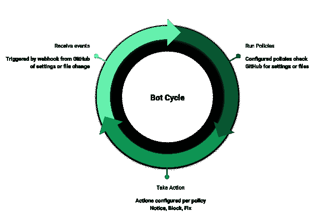

# 谷歌推出工具以更好地保护 GitHub 回购

> 原文：<https://devops.com/google-unveils-tool-to-better-secure-github-repos/>

Google [今天发布了一款 GitHub 应用](https://openssf.org/blog/2021/08/11/introducing-the-allstar-github-app/),为 GitHub 项目提供自动持续的安全最佳实践。

谷歌开源软件安全产品经理金·莱万多夫斯基(Kim Lewandowski)表示，Allstar 应用程序使 IT 团队能够评估 GitHub 上的任何项目，以检查安全政策的遵守情况。此外，Allstar 设置所需的强制执行操作，并在存储库中的设置或文件更改触发时自动应用这些规则。

Lewandowski 说，我们的目标是为开源社区提供一种工具，使组织对软件供应链中使用的[开源](https://devops.com/?s=open+source)软件更有信心。

Allstar 旨在作为[安全记分卡](https://github.com/ossf/scorecard)的配套应用，安全记分卡是谷歌去年推出的一种工具，用于评估，例如，一个开源项目是否采用分支保护来确保恶意软件不会无意中进入项目。Allstar 根据 IT 组织定义的安全策略和强制措施，不断检查预期的 GitHub API 状态和存储库文件内容。Lewandoski 说，在检测到违反策略后，该工具可以配置为简单地发送警报或自动执行特定策略来补救问题。具体来说，她说可用的选项是在不采取任何额外行动的情况下记录安全策略违规，打开 GitHub 问题或修改 GitHub 设置以匹配最初的 Allstar 配置。

Lewandowski 说，目前，Allstar 提供有限数量的安全政策检查，但在未来几个月内将提供更多的安全政策检查。当前的安全策略检查包括分支保护、漏洞披露、访问控制和无法扫描的二进制工件检测。将添加的其他检查包括自动依赖关系更新和冻结依赖关系。

Lewandowksi 表示，Allstar 和安全记分卡是谷歌正在进行的努力的一部分，以回馈开源社区，这些社区正被试图破坏软件供应链的网络犯罪分子所瞄准。在某种程度上，现在几乎每个应用程序都依赖于开源组件。然而，这些项目的维护者并不总是拥有检查被注入代码库的恶意软件所需的工具或专业知识，她指出。

总的来说，Lewandoski 指出，实现 DevSecOps 最佳实践将需要更多的应用程序安全性自动化。不可能每个开发者都成为世界级的网络安全专家。面临的挑战是找到一种方法，将自动化尽早引入应用程序开发过程，她指出，在许多情况下，这是从应用程序中包含的开源组件开始的。

每个开源项目的维护者都可能需要一段时间来修改将代码添加到项目中的过程。然而，持续审查软件变得越容易，使用它的组织对它的安全性就越有信心。事实上，这些项目的维护者应该预料到软件的下游用户会问一些尖锐的问题，这些问题是关于在最近一系列高调的软件供应链违规事件之后如何管理安全性的。