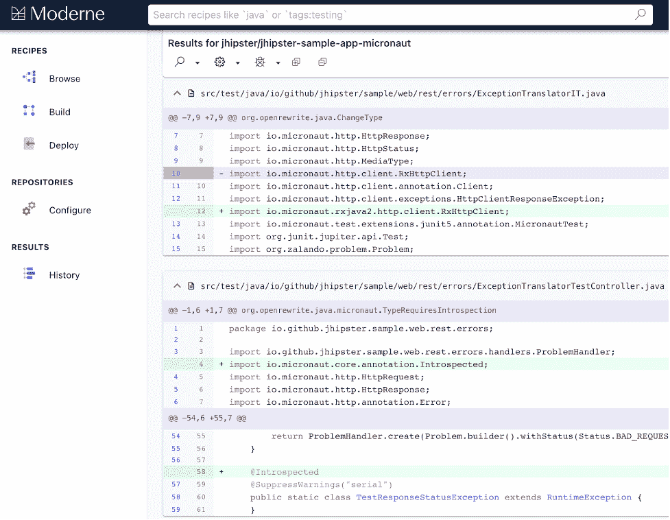

# Micronaut 利用 Moderne 自动更新 Java 框架

> 原文：<https://devops.com/micronaut-taps-moderne-to-automate-java-framework-updates/>

Micronaut 是一家基于微服务和无服务器计算平台构建应用程序的框架提供商，它今天透露，它正在与一家代码重构工具提供商 Moderne 合作，创建一个自动更新 Micronaut 框架的“配方”。

Moderne 首席执行官 Jonathan Schneider 表示，最初在网飞开发的开源代码重构工具 OpenRewrite 使自动更新代码库、修复漏洞成为可能，并为高级构建模块提供了基础，这将使创作定制转换更加简单。这种方法最终会被应用程序开发框架的其他提供商所接受。

刚刚筹集了 470 万美元的初始资金， [Moderne](https://digitalanarchist.com/videos/featured-guests/openrewrite-moderne) 通过软件即服务(SaaS)平台提供 OpenRewrite，使 IT 团队能够在几分钟内搜索和转换数百万行代码。OpenRewrite 目前支持 Java，但该公司正在努力增加对其他语言的支持，包括[基础设施即代码](https://devops.com/?s=IaC) (IaC)工具，如 Kubernetes、YAML 和 XML。

Moderne 还为常见的搜索和重构操作开发了“配方”,这些配方可以组合成更复杂的框架迁移配方，例如，从 Java 8 升级到 Java 11。Micronaut 是第一个使用 OpenRewrite 为自己的框架创建配方的开发框架提供商。

在应用程序比以往更加分散的时代，更新代码库是一项重大挑战。事实上，进行这些迁移所涉及的人工工作是许多组织继续使用旧版本框架(如 Java 8)的主要原因之一。Schneider 说，OpenRewrite 旨在大规模自动化这一过程，让个体开发人员决定他们希望或参与的程度，或者他们是否更喜欢让 DevOps 团队代表他们管理升级过程。

从长远来看，Schneider 表示，他希望能够创造出解决所有问题的方法，从大规模迁移到修复整个代码库的特定类型的漏洞。

过度依赖遗留开发框架通常会阻碍创新。例如，最新版本的 Java 旨在让开发者更容易构建基于微服务的应用。

DevOps 团队会在多大程度上接受自动化来升级代码，这还有待观察。许多开发人员不愿意依赖任何种类的自动化工具。然而，考虑到大多数开发人员需要花费更多的时间来编写新代码，他们中的大多数人接受更新现有代码的自动化方法只是时间问题。

同时，随着组织开始更快地迁移他们的代码库，支持遗留框架的成本应该会下降。企业中有这么多技术债务的原因之一是因为不同的开发团队倾向于在不同的时间采用不同的框架版本。DevOps 团队会发现他们被要求同时支持同一个框架的多个版本。这些框架可能总是有多个版本，但是，随着时间的推移，随着升级周期变得更加自动化，DevOps 团队最终应该会看到大部分部署的应用程序都使用相同的框架。